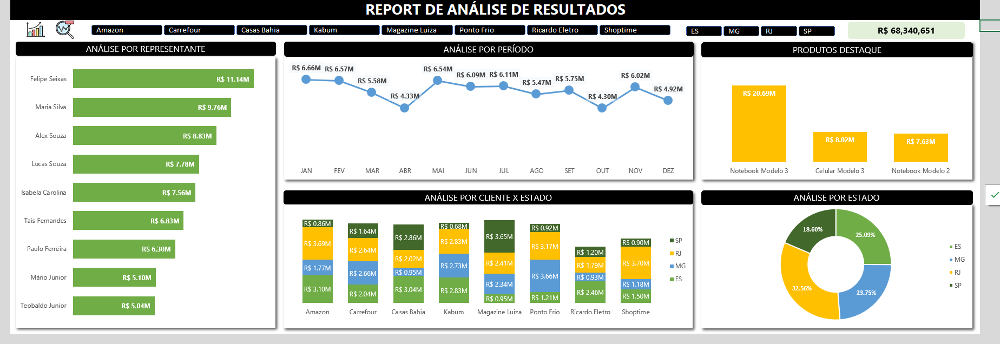

# Simplifica Excel Express   

### Repository: [course](../../../)
### Platform: <a href="../../">simplifica_trein   </a>
### Software/Subject: <a href="../">excel   </a>
### Course: <a href="./">curso_059 (Simplifica Excel Express)   </a>

#### <a href="https://github.com/PedroHeeger/main/blob/main/cert_ti/05-particip/data/excel/(23-06-17)%20Cert%20Excel%20PH%20Simplif%20Trein%20(Simplifica%20Express).pdf">Certificate</a>
##### Para conferir outros reports e dashboards de outros projetos consulte meu repositório principal na sub-pasta de report clicando [aqui](https://github.com/PedroHeeger/main/tree/main/report).

---

### Theme:
- Data Analysis
- Business Intelligence (BI)
### Used Tools:
- BI Tool: 
  - Excel 
- Integrated Development Environment (IDE):
  - VS Code   
- Versioning: 
  - Git   
- Repository:
  - GitHub   
- Others:
  - Google Drive 
  - Brandmark 

---

### Objective:
O objetivo desse projeto prático foi introduzir as principais ferramentas e fórmulas do software **Microsoft Excel**, além do desenvolvimento de um report do zero sobre a temática **vendas**.

### Structure:
A estrutura (Imagem 01) é composta por:
- Quatro pastas, cada pasta para uma das quatro aulas. As pastas são compostas apenas por arquivos de **Excel** e imagens que foram utilizadas como ícones na construção do report. 
- A pasta **0-aux**, pasta auxiliar com imagens utilizadas na construção desse arquivo de README. 
- Obs.: A logomarca do curso foi criada apenas para fins didáticos, utilizando o site de inteligência artificial **Brandmark**.

<figure>
     
    <figcaption>Imagem 01.</figcaption>
</figure>
 

### Development:
Este projeto foi desenvolvido em quatro aulas. 

#### Class 1
Na primeira aula, foram apresentados alguns recursos e fórmulas principais do **Excel**, como: **Autopreenchimento**, Referência Absoluta e Relativa, **Pincel de Formatação**, **Preenchimento Relâmpago**, **Ir para Especial**, **Subtotal**, **Localizar** e **Substituir**, Tipos de Formatação Personalizadas, Atalhos, Fórmulas (`IF`, `SUM`, `AVERAGE`, `LARGE`, `SMALL`).

#### Class 2
Na segunda aula, foram exibidas as fórmulas (`VLOOKUP`, `UPPER`, `PROPER`, `TEXT`, `TEXTJOIN`, `CONCAT`, `TRIM`, `LEFT`, `FIND`) e as ferramentas (**Formatação Condicional**, **Classificar**, **Filtrar**, **Macro**, **Texto para Colunas**)

#### Class 3
Já na terceira aula, com a introdução às ferramentas (**Tabela**, **Tabela Dinâmica**, **Segmentação de Dados**) e a partir de uma base de dados fornecida, foram desenvolvidas seis tabelas dinâmicas para construção do report de vendas. Neste report, foi realizada algumas análises como: **análise de vendas por representante** (Gráfico de Barras), **análise de vendas por período** (Gráfico de Linha), **análise dos produtos top 3 de vendas** (Gráfico de Coluna), **análise de vendas por cliente e estado** (Gráfico de Coluna Empilhada) e a **análise por estado** (Gráfico de Rosca). A imagem 02 a seguir exibe o report.

<figure>
     
    <figcaption>Imagem 02: Report Vendas.</figcaption>
</figure>
 

#### Class 4
Na última aula, foram utilizadas outras fórmulas do **Excel** como: `IF` simples e composto; `IF` com `AND` e `IF` com `OR`; `SUMIFS` e `COUNTIF`; `AVERAGEIFS`; `VLOOKUP`; `INDEX` e `MATCH`. Além da ferramenta **Validação de Dados**.