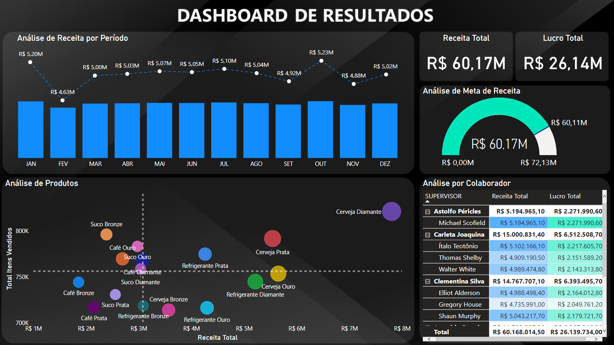

# Simplifica Treinamentos   

### Repository: [course](../)
### Platform: <a href="./">simplifica_trein   </a>
### Software/Subject: <a href="./">power_bi   </a>
### Course: <a href="./curso_043">curso_043 (Simplifica Power Excel)   </a>

---

### Theme:
- Data Analysis

### Used Tools:
- BI Tool: 
  - Excel 
  - Power BI   
  - Power Query 
- Integrated Development Environment (IDE):
  - VS Code   
- Versioning: 
  - Git   
- Repository:
  - GitHub   
- Others:
  - Google Drive 
  - Brandmark 
  - Linguagem M e Expressões DAX

---

### Objective:
- O objetivo desse projeto prático foi introduzir as principais ferramentas e fórmulas do software **Microsoft Excel** e **Microsoft Power BI**, desenvolvendo dois reports, um para cada software. A temática do report foi a mesma para os dois casos que consistiu em um cenário hipotético de atendimentos de uma clínica de saúde nos anos de 2020 e 2021.

### Structure:
- A estrutura (Imagem 01) é composta por três sub-pastas, cada pasta para uma das quatro aulas, sendo que as aulas 1 e 2 foram realizadas no mesmo arquivo, ou seja, na mesma sub-pasta.
- A pasta **aula_01_02** possui arquivos de **Excel** (base de dados, arquivos de construção do report), um arquivo em **Word** com o roteiro do projeto e uma sub-pasta com as imagens que foram utilizadas como ícones no desenvolvimento do report.
- A pasta **aula_03** contém apenas um arquivo em **Excel** com a base de dados, um arquivo em **Power BI** com o report construído e também uma sub-pasta com os arquivos de criação do plano de fundo do report (arquivos de imagens e **Power Point**)
- A pasta **aula_04** tem duas bases de dados em **Excel**, um arquivo de imagem e um de **Power Point** para construção do plano de fundo, e o arquivo de **Power BI** com o report desenvolvido.
- A pasta **0-aux** é a pasta auxiliar com imagens utilizadas na construção desse arquivo de README. A logomarca do curso foi criado apenas para fins didáticos utilizando o site de inteligência artificial **Brandmark**.

<div align="Center"><figure>
    <br>
    <figcaption>Imagem 01.</figcaption>
</figure></div><br>

### Development:
Este projeto foi desenvolvido em quatro aulas. 

#### Class 1 and 2
Na primeira aula com um arquivo de **Excel** em branco, foi utilizado o Power Query para criar três Queries para cada aba da base de dados também em **Excel**. As consultas criadas foram **Atendimentos**, **Médicos** e **Tabela de Valores**, as quais foram submetidas a um processo de ETL para realização das transformações necessárias e carregamento em uma tabela no arquivo em branco.

Após o carregamento foram criadas tabelas dinâmicas que serviram como base para construção deste report. A partir das tabelas dinâmicas foram criados gráficos dinâmicos dos seguintes tipos: Número de Atendimentos por Médico (Gráfico de Barra); Número de Atendimentos por Especialidade (Gráfico de Barra); Número de Atendimentos por Período (Gráfico de Linha); Número de Atendimentos por Tipo de Pagamento (Gráfico de Rosca); Receita por Tipo de Pagamento (Gráfico de Rosca).

Esses gráficos foram posicionados em uma nova aba do arquivo em branco, onde foi construído um plano de fundo com uso das formas do **Excel**. Foi realizado toda configuração de layout, inserção dos ícones, configuração dos gráficos, inserção de botões em imagens para movimentar de uma aba para outra e também inserção das segmentações de dados. Também foi criado uma aba exclusiva para o menu do report. A seguir é exibido a imagem 02 de como ficou o report.

<div align="Center"><figure>
    <br>
    <figcaption>Imagem 02: Report.</a></figcaption>
</figure></div><br>

#### Class 3
Na terceira aula foi desenvolvido o mesmo report em **Excel** mas para **Power BI**. O processo inicial foi pareceido, pois também foi utilizado o Power Query para extrair as três Queries do arquivo de base de dados, depois transformá-las para carregá-las para dentro do **Power BI**.

O plano de fundo foi criado no **Power Point** e foi exportado como imagem para ser utilizado na construção do report. No **Power BI** foi criado uma tabela de medidas com apenas duas medidas que foram **Receita Total** e **Qtd Atendimentos**. Essas medidas, que são exibias abaixo, foram elaboradas com o uso das **Expressões DAX**.

```
Receita Total = CALCULATE(Sum(Atendimentos[Valor]), Atendimentos[Tipo Atendimento]<>"Retorno")
```

```
Qtd Atendimentos = Distinctcount(Atendimentos[Cod Consulta])
```

A partir dessas medidas foram construídos os mesmos gráficos do report em **Excel**. Para construção desses gráficos foi necessário a criação de uma nova Query vazia para elaboração da tabela **Calendário**. Também foi construído quatro visuais de cartões para exbição das seguintes informações: Número de Atendimentos, Número de Consultas, Número de Exames e Número de Retornos.

Por fim, foi construído um painel lateral com a segmentação de dados e botões interativos para navegar entre as páginas do report. Além da página principal (Page 2) do report, foi criado uma página de menu e uma outra com o visual de tabela para exibição das informações mais completa dos dados. A página 2 do report é exbido a seguir na imagem 03 e pode ser acessado em uma página da web.

<div align="Center"><figure>
    <br>
    <figcaption><a href="https://app.powerbi.com/view?r=eyJrIjoiNDlkYmU5ZWMtODZjZS00NmE1LWFjZDktZmY5NjA1YTY2MGE3IiwidCI6ImI1NTJmZWJlLWFkMjgtNGI4Ny1iZjI5LTFlODhiYmZkY2I4ZiJ9">Imagem 03: Report.</a></figcaption>
</figure></div><br>

#### Class 4
Na última aula foi desenvolvido um outro report com a temática diferente, desta vez referente a **vendas**.

Foi utilizado dois arquivos em **Excel** como base de dados. Do primeiro arquivo foram criadas quatro Queries, sendo três tabelas dimensão (**dCalendario**, **dProdutos**, **dVendedores**) e uma tabela fato (**fVendas**). Essas tabelas não precisaram ser tratadas no **Power Query**. Já do segundo arquivo foi gerado apenas uma Query, os dados foram extraídos bastante bagunçados, justamente para que fosse feito um tratamento no **Power Query**.

Todas as tabelas foram carregadas no **Power BI** e em seguida, foi realizado automaticamente o relacionamento entre as tabelas fato e dimensão. As medidas foram todas criadas numa Query vazia para funcionar como tabela de medidas. Essas medidas foram elaboradas com o uso das **Expressões DAX** que foram **Receita Total**, **Lucro Total**, **Total Itens Vendidos**, **Meta Total**, **Valor Maximo** e **Cor do Velocimetro**.

```
Receita Total = Sum(fVendas[RECEITA_PEDIDO])
```

```
Lucro Total = sum(fVendas[LUCRO_PEDIDO])
```

```
Total Itens Vendidos = sum(fVendas[QTDE_ITENS])
```

```
Meta Total = SUM(fMetas[META])
```

```
Valor Maximo = [Meta Total]*1.2
```

```
Cor do Velocimetro = 
Switch(
    TRUE(),
    [Receita Total] >= [Meta Total], "#00E6BB",
    [Receita Total] < [Meta Total], "#e6002b")
```

As duas últimas **Expressões DAX** serviram apenas para construir o gráfico de velocímetro para análise de meta de receita de vendas. A medida **Valor Maximo** para determinar o valor máximo da meta que no caso foi 120%. Enquanto a medida **Cor do Velocimetro** para criar uma condição que foi usada na formatação condicional da cor do gráfico, no qual se a receita total estivesse abaixo da meta o gráfico seria colorido de vermelho, se fosse acima ou igual, seria colorido de verde.

Além do gráfico já citado, foram desenvolvidos dois visuais de cartões com receita total e lucro total das vendas. Também, dois gráficos, um de linha e outro de coluna para a análise da receita por período. Um outro gráfico de dispersão que realiza várias análises simultânea (analisa os produtos vendidos por quantidade vendida, receita total e lucro total, sendo o lucro representado pelo tamanho das bolhas). Por último, um visual de matriz que analisa a receita total e lucro total por colaborador e supervisor.

Na criação do plano de fundo também foi utilizado um arquivo **Power Point** que foi exportado como imagem e inserido no report. A imagem 04, em seguida, ilustra o projeto finalizado e pode ser acessado através de uma página da web no link da legenda. Para conferir outros reports e dashboards de outros projetos, consulte meu repositório principal na sub-pasta de report clicando [aqui]().

<div align="Center"><figure>
    <br>
    <figcaption><a href="https://app.powerbi.com/view?r=eyJrIjoiNDRlNmU5NTMtYjk0ZC00NGI2LTkyYTMtZTdmOWQ2NjhiNDRkIiwidCI6ImI1NTJmZWJlLWFkMjgtNGI4Ny1iZjI5LTFlODhiYmZkY2I4ZiJ9">Imagem 04: Report.</a></figcaption>
</figure></div><br>