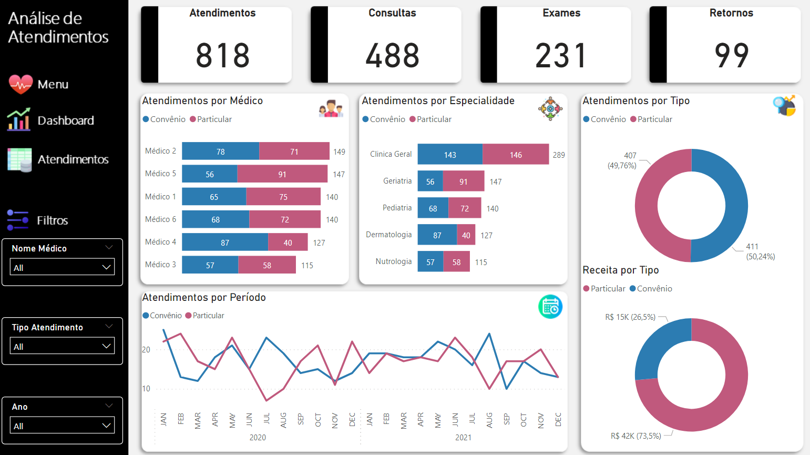

# Simplifica Power Excel   

### Repository: [course](../../../)
### Platform: <a href="../../">simplifica_trein   </a>
### Software/Subject: <a href="../">power_bi   </a>
### Course: <a href="./">curso_043 (Simplifica Power Excel)   </a>

#### <a href="https://github.com/PedroHeeger/main/blob/main/cert_ti/05-particip/data/power_bi/(23-05-22)%20Cert%20Power%20BI%20e%20Excel%20PH%20Simplifica%20Trein.pdf">Certificate</a>
#### <a href="https://app.powerbi.com/view?r=eyJrIjoiYTYyZmZlNjctYjhkYS00MGFmLWIyZWMtMjgxODM2YTdiNTE5IiwidCI6ImI1NTJmZWJlLWFkMjgtNGI4Ny1iZjI5LTFlODhiYmZkY2I4ZiJ9">Power BI Report Aula 3</a>
#### <a href="https://app.powerbi.com/view?r=eyJrIjoiNDRlNmU5NTMtYjk0ZC00NGI2LTkyYTMtZTdmOWQ2NjhiNDRkIiwidCI6ImI1NTJmZWJlLWFkMjgtNGI4Ny1iZjI5LTFlODhiYmZkY2I4ZiJ9">Power BI Report Aula 4</a>
##### Para conferir outros reports e dashboards de outros projetos consulte meu repositório principal na sub-pasta de report clicando [aqui](https://github.com/PedroHeeger/main/tree/main/report).

---

### Theme:
- Data Analysis
- Business Intelligence (BI)

### Used Tools:
- BI Tool: 
  - Excel 
  - Power BI   
  - Power Query 
- Integrated Development Environment (IDE):
  - VS Code   
- Versioning: 
  - Git   
- Repository:
  - GitHub   
- Others:
  - Google Drive 
  - PowerPoint 
  - Brandmark 
  - Linguagem M e Expressões DAX

---

### Objective:
O objetivo desse projeto prático foi introduzir as principais ferramentas e fórmulas dos softwares **Microsoft Excel** e **Microsoft Power BI**, desenvolvendo três reports, um para **Excel** e outros dois para **Power BI**, sendo um do mesmo tema do **Excel**. A temática do report igual para os dois, consistiu em um cenário hipotético de **atendimentos de uma clínica de saúde** nos anos de 2020 e 2021. Já o tema do segundo report de **Power BI** foi referente a um cenário hipotético de **vendas**.

### Structure:
A estrutura (Imagem 01) é composta por três sub-pastas, cada pasta para uma das quatro aulas, sendo que as aulas 1 e 2 foram realizadas no mesmo arquivo, ou seja, na mesma sub-pasta.
- A pasta **aula_01_02** possui arquivos de **Excel** (base de dados, arquivos de construção do report), um arquivo em **Word** com o roteiro do projeto e uma sub-pasta com as imagens que foram utilizadas como ícones no desenvolvimento do report.
- A pasta **aula_03** contém apenas um arquivo em **Excel** com a base de dados, um arquivo em **Power BI** com o report construído e também uma sub-pasta com os arquivos de criação do plano de fundo do report (arquivos de imagens e **Power Point**).
- A pasta **aula_04** tem duas bases de dados em **Excel**, um arquivo de imagem e um de **Power Point** para construção do plano de fundo, e o arquivo de **Power BI** com o report desenvolvido.
- A pasta **0-aux**, pasta auxiliar com imagens utilizadas na construção desse arquivo de README. 
- Obs.: A logomarca do curso foi criada apenas para fins didáticos com o uso do site de inteligência artificial **Brandmark**.

<div align="Center"><figure>
    <br>
    <figcaption>Imagem 01.</figcaption>
</figure></div><br>

### Development:
Este projeto foi desenvolvido em quatro aulas. 

#### Class 1 and 2
Nas duas primeiras aulas, em um arquivo de **Excel** em branco, foi utilizado o **Power Query** para criar três Queries para cada aba da base de dados também em **Excel**. As consultas criadas foram **Atendimentos**, **Médicos** e **Tabela de Valores**, as quais foram submetidas a um processo de **ETL** (Extração, Transformação e Carregamento) para realização das transformações necessárias e carregamento das tabelas.

Após o carregamento, foram criadas tabelas dinâmicas que serviram como base para construção deste report. A partir das tabelas dinâmicas, foram gerados gráficos dinâmicos dos seguintes tipos: **Número de Atendimentos por Médico** (Gráfico de Barra), **Número de Atendimentos por Especialidade** (Gráfico de Barra), **Número de Atendimentos por Período** (Gráfico de Linha), **Número de Atendimentos por Tipo de Pagamento** (Gráfico de Rosca) e **Receita por Tipo de Pagamento** (Gráfico de Rosca).

Esses gráficos foram posicionados em uma nova aba do arquivo em branco, onde foi construído um plano de fundo com uso das formas do **Excel**. Foi realizado toda a configuração de layout, inserção dos ícones, configuração dos gráficos, inserção de botões em imagens para movimentar de uma aba para outra e também inserção das segmentações de dados. Também foi criado uma aba exclusiva para o menu do report. A seguir é exibido a imagem 02 de como ficou a página principal do report.

<div align="Center"><figure>
    <br>
    <figcaption>Imagem 02: Report Atendimentos.</figcaption>
</figure></div><br>

#### Class 3
Na terceira aula foi desenvolvido o mesmo report em **Excel**, mas para o **Power BI**. O processo inicial foi pareceido, pois também foi utilizado o **Power Query** para extrair as três Queries do arquivo de base de dados, depois transformá-las para carregá-las para dentro do **Power BI**.

O plano de fundo foi criado no **Power Point** e foi exportado como imagem para ser utilizado na construção do report. No **Power BI**, foi criado uma tabela de medidas, em uma Query vazia, com apenas duas medidas que foram **Receita Total** e **Qtd Atendimentos**. Essas medidas, que são exibidas abaixo, foram elaboradas com o uso das **Expressões DAX**.

```
Receita Total = CALCULATE(Sum(Atendimentos[Valor]), Atendimentos[Tipo Atendimento]<>"Retorno")
```

```
Qtd Atendimentos = Distinctcount(Atendimentos[Cod Consulta])
```

A partir dessas medidas foram construídos os mesmos gráficos do report em **Excel**. Na ocasião, foi necessário a criação de uma nova Query vazia para elaboração da tabela **Calendário**. Também foi construído quatro visuais de cartões para exibição das seguintes informações: **Número de Atendimentos**, **Número de Consultas**, **Número de Exames** e **Número de Retornos**.

Por fim, foi construído um painel lateral com a segmentação de dados e botões interativos para navegar entre as páginas do report. Além desta página principal (Page 2) do report, foi criado uma página de menu e uma outra com o visual de tabela para exibição das informações dos dados detalhadamente. A página 2 do report é exibido a seguir na imagem 03.

<div align="Center"><figure>
    <a href="https://app.powerbi.com/view?r=eyJrIjoiYTYyZmZlNjctYjhkYS00MGFmLWIyZWMtMjgxODM2YTdiNTE5IiwidCI6ImI1NTJmZWJlLWFkMjgtNGI4Ny1iZjI5LTFlODhiYmZkY2I4ZiJ9"><br>
    <figcaption>Imagem 03: Report Atendimentos.</figcaption></a>
</figure></div><br>

#### Class 4
Na última aula foi desenvolvido um outro report com a temática diferente, desta vez referente a **vendas**. Foram utilizados dois arquivos em **Excel** como base de dados. Do primeiro arquivo, foram criadas quatro Queries, sendo três tabelas dimensão (**dCalendario**, **dProdutos**, **dVendedores**) e uma tabela fato (**fVendas**). Essas tabelas não precisaram ser tratadas no **Power Query**, pois já estavam prontas para uso. Já do segundo arquivo, foi gerado apenas uma Query, onde os dados foram extraídos bastante bagunçados justamente para que fosse feito um tratamento no **Power Query**.

Todas as tabelas foram carregadas no **Power BI** e em seguida, foi realizado automaticamente o relacionamento entre as tabelas fato e dimensão. As medidas foram criadas em uma Query vazia para funcionar como tabela de medidas. As seguintes medidas foram elaboradas com o uso das **Expressões DAX**: **Receita Total**, **Lucro Total**, **Total Itens Vendidos**, **Meta Total**, **Valor Maximo** e **Cor do Velocimetro**.

```
Receita Total = Sum(fVendas[RECEITA_PEDIDO])
```

```
Lucro Total = sum(fVendas[LUCRO_PEDIDO])
```

```
Total Itens Vendidos = sum(fVendas[QTDE_ITENS])
```

```
Meta Total = SUM(fMetas[META])
```

```
Valor Maximo = [Meta Total]*1.2
```

```
Cor do Velocimetro = 
Switch(
    TRUE(),
    [Receita Total] >= [Meta Total], "#00E6BB",
    [Receita Total] < [Meta Total], "#e6002b")
```

As duas últimas **Expressões DAX** serviram apenas para construir o gráfico de velocímetro para análise da meta da receita de vendas. A medida **Valor Maximo** determinou o valor máximo da meta que no caso foi 120%. Enquanto a medida **Cor do Velocimetro** foi elaborada para criar uma condição para o uso na formatação condicional da cor do gráfico, no qual se a receita total estivesse abaixo da meta, o gráfico seria colorido de vermelho, se fosse acima ou igual, seria colorido de verde.

Além do gráfico já citado, foram desenvolvidos dois visuais de cartões com **receita total** e **lucro total** das vendas. Também dois gráficos, um de linha e outro de coluna para uma **análise da receita por período**. Um outro gráfico de dispersão que realiza várias análises simultânea (**analisa os produtos vendidos por quantidade vendida, receita total e lucro total**, sendo o lucro representado pelo tamanho das bolhas). Por último, um visual de matriz que **analisa a receita total e lucro total por colaborador e supervisor**.

Na criação do plano de fundo, também foi utilizado um arquivo **PowerPoint** que foi exportado como imagem e inserido no report. A imagem 04, em seguida, ilustra o projeto finalizado.

<div align="Center"><figure>
    <a href="https://app.powerbi.com/view?r=eyJrIjoiNDRlNmU5NTMtYjk0ZC00NGI2LTkyYTMtZTdmOWQ2NjhiNDRkIiwidCI6ImI1NTJmZWJlLWFkMjgtNGI4Ny1iZjI5LTFlODhiYmZkY2I4ZiJ9"><br>
    <figcaption>Imagem 04: Report Vendas.</figcaption></a>
</figure></div><br>