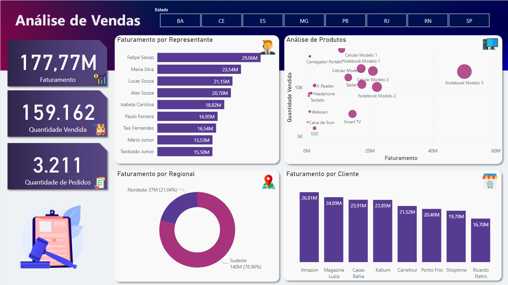
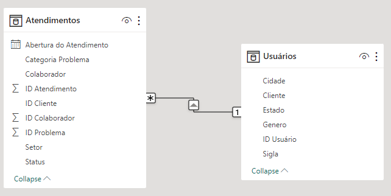

# Simplifica Power BI   

### Repository: [course](../../../)
### Platform: <a href="../../">simplifica_trein   </a>
### Software/Subject: <a href="../">power_bi   </a>
### Course: <a href="./curso_075">curso_075 (Simplifica Power BI)   </a>

#### <a href="https://github.com/PedroHeeger/main/blob/main/cert_ti/05-particip/data/power_bi/(23-05-22)%20Cert%20Power%20BI%20e%20Excel%20PH%20Simplifica%20Trein.pdf">Certificate</a>
#### <a href="https://app.powerbi.com/view?r=eyJrIjoiMDQ0MWEwNTMtZjQwMS00ODVhLWEyMGMtMGRlYTQ4ZTU5MWNlIiwidCI6ImI1NTJmZWJlLWFkMjgtNGI4Ny1iZjI5LTFlODhiYmZkY2I4ZiJ9&pageName=ReportSection">Power BI Report Aula 1</a>
#### <a href="https://app.powerbi.com/view?r=eyJrIjoiMDQ0MWEwNTMtZjQwMS00ODVhLWEyMGMtMGRlYTQ4ZTU5MWNlIiwidCI6ImI1NTJmZWJlLWFkMjgtNGI4Ny1iZjI5LTFlODhiYmZkY2I4ZiJ9">Power BI Report Aula 1 (Mobile)</a>
#### <a href="https://app.powerbi.com/view?r=eyJrIjoiNWIxMzJhYzktNTk5Yy00NGM0LWI0Y2QtOGFlNzI2MDM0OTQ1IiwidCI6ImI1NTJmZWJlLWFkMjgtNGI4Ny1iZjI5LTFlODhiYmZkY2I4ZiJ9">Power BI Report Aula 2</a>


#### <a href="https://app.powerbi.com/view?r=eyJrIjoiMDQ0MWEwNTMtZjQwMS00ODVhLWEyMGMtMGRlYTQ4ZTU5MWNlIiwidCI6ImI1NTJmZWJlLWFkMjgtNGI4Ny1iZjI5LTFlODhiYmZkY2I4ZiJ9&pageName=ReportSection">Power BI Report Aula 3</a>
#### <a href="https://app.powerbi.com/view?r=eyJrIjoiNDRlNmU5NTMtYjk0ZC00NGI2LTkyYTMtZTdmOWQ2NjhiNDRkIiwidCI6ImI1NTJmZWJlLWFkMjgtNGI4Ny1iZjI5LTFlODhiYmZkY2I4ZiJ9">Power BI Report Aula 4</a>
##### Para conferir outros reports e dashboards de outros projetos consulte meu repositório principal na sub-pasta de report clicando [aqui](https://github.com/PedroHeeger/main/tree/main/report).

---

### Theme:
- Data Analysis
- Business Intelligence (BI)

### Used Tools:
- BI Tool: 
  - Excel 
  - Power BI   
  - Power Query 
- Integrated Development Environment (IDE):
  - VS Code   
- Versioning: 
  - Git   
- Repository:
  - GitHub   
- Others:
  - Google Drive 
  - PowerPoint 
  - Brandmark 
  - Linguagem M e Expressões DAX

---

### Objective:
O objetivo desse projeto prático foi introduzir as principais ferramentas e fórmulas do software **Microsoft Power BI**, desenvolvendo três reports, com as seguintes temáticas: .

### Structure:
A estrutura (Imagem 01) é composta por três sub-pastas, cada pasta para uma das quatro aulas, sendo que as aulas 1 e 2 foram realizadas no mesmo arquivo, ou seja, na mesma sub-pasta.
- A pasta **aula_01** possui um arquivo de **Excel** (base de dados), um arquivo em **Word** com o roteiro do projeto, dois arquivos em **PowerPoint** com a construção do background para os formatos mobile e desktop, duas imagens com a exportação desses backgrounds e um arquivo em **Power BI** com o desenvolvimento do projeto.
- A pasta **aula_02** possui dois arquivo de **Excel** (base de dados), um arquivo em **Word** com o roteiro do projeto, um arquivo em **PowerPoint** com a construção do layout, uma imagem com a exportação desse layout e um arquivo em **Power BI** com o desenvolvimento do projeto.

- A pasta **aula_03** contém apenas um arquivo em **Excel** com a base de dados, um arquivo em **Power BI** com o report construído e também uma sub-pasta com os arquivos de criação do plano de fundo do report (arquivos de imagens e **Power Point**).
- A pasta **aula_04** tem duas bases de dados em **Excel**, um arquivo de imagem e um de **Power Point** para construção do plano de fundo, e o arquivo de **Power BI** com o report desenvolvido.
- A pasta **0-aux**, pasta auxiliar com imagens utilizadas na construção desse arquivo de README. 
- Obs.: A logomarca do curso foi criada apenas para fins didáticos com o uso do site de inteligência artificial **Brandmark**.

<div align="Center"><figure>
    <br>
    <figcaption>Imagem 01.</figcaption>
</figure></div><br>

### Development:
Este projeto foi desenvolvido em quatro aulas.

#### Class 1:
Na primeira aula do curso, foi desenvolvido um report da temática **vendas**. O projeto foi iniciado importando o arquivo **Excel** de base de dados para o **Power Query**, onde foi realizado um processo de **ETL** (Extração, Transformação e Carregamento). Nele, uma Query (**BASE_VENDAS**) foi criada com base na tabela disponível, com o mesmo nome, na única planilha do arquivo Excel. A estrutura dos dados dessa tabela era composta pelas colunas: **ID_Pedido**, **Data_Pedido**, **ID_Representante**, **Regional**, **ID_Produto**, **Nome_produto**, **Valor_Produto**, **Quantidade_Vendida**, **Valor_Total_Venda**, **Nome_Cliente**, **Cidade_Cliente** e **Estado_Cliente**.

Na etapa de transformação no **Power Query**, a coluna **Nome_Cliente** foi formatada para cada palavra capitalizada e na coluna **Estado_Cliente** foi substituido o dado `MINAS` por `MG`. Os dados foram carregados para uma tabela no **Power BI** de mesmo nome da Query. Não foi necessário criar medidas nesta aula.

Na construção do report, foram inseridos sete visuais, sendo três cartões (**Faturamento**, **Quantidade Vendida** e **Quantidade de Pedidos**), uma segmentação de dados para filtragem por **Estados** e quatro gráficos, sendo um de barra (**Análise de Faturamento por Representante**), um de rosca (**Análise de Faturamento por Regional**), um de coluna (**Análise de Faturamento por Cliente**) e o último de dispersão (**Análise dos Produtos por Faturamento e Quantidade Vendida**). Além dos gráficos, três **Tooltips** foram elaboradas, sendo um de **Análise de Faturamento por Mês** usado no gráfico de barra, um de **Análise de Faturamento por Estados** utilizado no gráfico de rosca e outro de **Análise de Faturamento e Quantidade Vendida por Cliente** vinculado ao gráfico de dispersão. Neste último, foi realizado uma formatação condicional nas duas colunas. A imagem 02 abaixo, apresenta o desenvolvimento do report.

<div align="Center"><figure>
    <a href="https://app.powerbi.com/view?r=eyJrIjoiMDQ0MWEwNTMtZjQwMS00ODVhLWEyMGMtMGRlYTQ4ZTU5MWNlIiwidCI6ImI1NTJmZWJlLWFkMjgtNGI4Ny1iZjI5LTFlODhiYmZkY2I4ZiJ9&pageName=ReportSection"><br>
    <figcaption>Imagem 02: Report Vendas.</figcaption></a>
</figure></div><br>

Neste mesmo projeto, foi criado uma outra página para exibição do report em formato mobile (1280x720px). Em ambos os formatos, o background foi fornecido como imagem e em arquivo **PowerPoint** para utilização na construção do relatório. A seguir, na imagem 03, o report em formato mobile.

<div align="Center"><figure>
    <a href="https://app.powerbi.com/view?r=eyJrIjoiMDQ0MWEwNTMtZjQwMS00ODVhLWEyMGMtMGRlYTQ4ZTU5MWNlIiwidCI6ImI1NTJmZWJlLWFkMjgtNGI4Ny1iZjI5LTFlODhiYmZkY2I4ZiJ9"><br>
    <figcaption>Imagem 03: Report Vendas (Mobile).</figcaption></a>
</figure></div><br>

#### Class 2:

Na aula 2, foi construído um report sobre o tema **atendimentos**. A partir da importação do arquivo de **Excel** de base de dados, os dados de duas tabelas foram utilizados para criação de duas Queries com o mesmo das tabelas no **Power Query**. A primeira tabela (**Usuários**) possuía a seguinte estrutura: **ID Usuário**, **Cliente**, **Genero**, **Sigla**, **Estado** e **Cidade**. Enquanto a tabela (**Atendimentos**) continha as colunas: **ID Atendimento**, **Abertura do Atendimento**, **ID Cliente**, **ID Colaborativo**, **Colaborador**, **Setor**, **ID Problema**, **Categoria Problema** e **Status**.

Nenhuma transformação foi necessária, então os dados foram carregados em duas tabelas no **Power BI** com mesmo nome das consultas. A tabela **Atendimentos** tornou-se uma tabela **fato**, enquanto a tabela **Usuários** tornou-se uma tabela **dimensão**. Assim foi possível relacionar as colunas **ID Cliente** da tabela fato com a coluna **ID Usuário** da tabela dimensão. O relacionamento entre as tabelas é apresentado na imagem 04 abaixo.

<div align="Center"><figure>
    <br>
    <figcaption>Imagem 04.</figcaption>
</figure></div><br>

Após o relacionamento, foi configurado o plano de fundo do report utilizando a imagem fornecida pela plataforma do curso. Em seguida, foi criada uma Query vazia para servir como tabela de **Medidas** que foram criadas com uso das **Expressões DAX**. A primeira medida elaborada é a **Qtde Atendimentos** que contabilizou a quantidade de atendimentos diferentes. Outra medida desenvolvida foi a **Qtde Usuários** que contabilizou a quantidade de usuários diferentes. Outras três medidas similares foram construídas (**Abertos**, **Em Atendimento** e **Encerrados**), essas utilizaram a expressão `Calculate` para contabilizar a quantidade de atendimentos abertos, em atendimento e encerrados, respectivamente.

```
Qtde Atendimentos = DISTINCTCOUNT(Atendimentos[ID Atendimento])
```

```
Qtde Usuários = DISTINCTCOUNT('Usuários'[ID Usuário])
```

```
Abertos = 
CALCULATE(
    [Qtde Atendimentos],
    Atendimentos[Status] = "Aberto"
)
```

```
Em Atendimento = 
CALCULATE(
    [Qtde Atendimentos],
    Atendimentos[Status] = "Em Atendimento"
)
```

```
Encerrados = 
CALCULATE(
    [Qtde Atendimentos],
    Atendimentos[Status] = "Encerrado"
)
```

Para construção do report foram inseridos alguns visuais. O primeiro deles, foi um gráfico de colunas empilhadas para uma **Análise Comparativa de Atendimentos por Setor e Período**. Abaixo desse, foi inserido um gráfico de área para **Análise de Atendimentos por Período** de forma geral. Também foram inseridos um visual de mapa de bolhas para **Análise de Clientes por Localização** e um visual de árvore de decomposição para uma **Análise de Atendimentos Pendentes**. Neste último, foi necessário realizar um filtro, selecionando apenas os status **Aberto** e **Em Atendimento**, pois estes formavam os atendimentos pendentes. Um gráfico de rosca foi adicionado na parte superior do report realizando uma **Análise de Atendimentos por Setor** e dentro dele um visual de cartão foi disposto com a quantidade de atendimentos.

Na lateral esquerda foi elaborado um tipo de menu com quatro segmentações de dados para filtragem dos seguintes dados: **Colaborador**, **Setor**, **Year** e **Month**. Um botão de limpar todos os filtros foi adicionado logo abaixo. Por último, foi inserido um visual de cartão com as três medidas criadas com a expressão `Calculate`. Um segundo arquivo de base de dados em **Excel** foi utilizado substituindo o arquivo anterior, com o objetivo de executar uma atualização dos dados. O resultado final do report é visualizado a seguir na imagem 05.

<div align="Center"><figure>
    <a href="https://app.powerbi.com/view?r=eyJrIjoiNWIxMzJhYzktNTk5Yy00NGM0LWI0Y2QtOGFlNzI2MDM0OTQ1IiwidCI6ImI1NTJmZWJlLWFkMjgtNGI4Ny1iZjI5LTFlODhiYmZkY2I4ZiJ9"><br>
    <figcaption>Imagem 05: Report Atendimentos.</figcaption></a>
</figure></div><br>

#### Class 3


<div align="Center"><figure>
    <a href="https://app.powerbi.com/view?r=eyJrIjoiYTYyZmZlNjctYjhkYS00MGFmLWIyZWMtMjgxODM2YTdiNTE5IiwidCI6ImI1NTJmZWJlLWFkMjgtNGI4Ny1iZjI5LTFlODhiYmZkY2I4ZiJ9"><br>
    <figcaption>Imagem 06: Report Atendimentos.</figcaption></a>
</figure></div><br>

#### Class 4


<div align="Center"><figure>
    <a href="https://app.powerbi.com/view?r=eyJrIjoiNDRlNmU5NTMtYjk0ZC00NGI2LTkyYTMtZTdmOWQ2NjhiNDRkIiwidCI6ImI1NTJmZWJlLWFkMjgtNGI4Ny1iZjI5LTFlODhiYmZkY2I4ZiJ9"><br>
    <figcaption>Imagem 07: Report Vendas.</figcaption></a>
</figure></div><br>