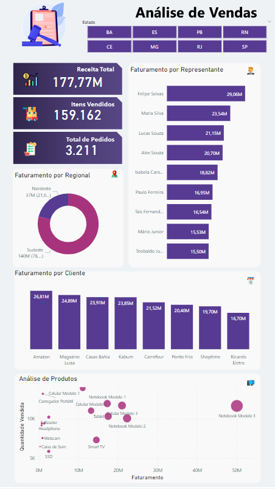

# Simplifica Power BI   

### Repository: [course](../../../)
### Platform: <a href="../../">simplifica_trein   </a>
### Software/Subject: <a href="../">power_bi   </a>
### Course: <a href="./">curso_075 (Simplifica Power BI)   </a>

#### <a href="https://github.com/PedroHeeger/main/blob/main/cert_ti/05-particip/data/power_bi/(23-05-22)%20Cert%20Power%20BI%20e%20Excel%20PH%20Simplifica%20Trein.pdf">Certificate</a>
#### <a href="https://app.powerbi.com/view?r=eyJrIjoiMDQ0MWEwNTMtZjQwMS00ODVhLWEyMGMtMGRlYTQ4ZTU5MWNlIiwidCI6ImI1NTJmZWJlLWFkMjgtNGI4Ny1iZjI5LTFlODhiYmZkY2I4ZiJ9">Power BI Report Aula 1</a>
#### <a href="https://app.powerbi.com/view?r=eyJrIjoiNWIxMzJhYzktNTk5Yy00NGM0LWI0Y2QtOGFlNzI2MDM0OTQ1IiwidCI6ImI1NTJmZWJlLWFkMjgtNGI4Ny1iZjI5LTFlODhiYmZkY2I4ZiJ9">Power BI Report Aula 2</a>
#### <a href="https://app.powerbi.com/view?r=eyJrIjoiMWZjZTIwNjktODQ3Ny00OTg2LWFlYjEtYzQ3MGMwMjM0NzhlIiwidCI6ImI1NTJmZWJlLWFkMjgtNGI4Ny1iZjI5LTFlODhiYmZkY2I4ZiJ9">Power BI Report Aula 3</a>
#### <a href="https://app.powerbi.com/view?r=eyJrIjoiY2Y5YTY4ODctZTA5Zi00Y2MyLThmMDYtMjE2MjI3Y2QwZDhmIiwidCI6ImI1NTJmZWJlLWFkMjgtNGI4Ny1iZjI5LTFlODhiYmZkY2I4ZiJ9">Power BI Report Aula 4</a>
##### Para conferir outros reports e dashboards de outros projetos consulte meu repositório principal na sub-pasta de report clicando [aqui](https://github.com/PedroHeeger/main/tree/main/report).

---

### Theme:
- Data Analysis
- Business Intelligence (BI)

### Used Tools:
- BI Tool: 
  - Excel 
  - Power BI   
  - Power Query 
- Integrated Development Environment (IDE):
  - VS Code   
- Versioning: 
  - Git   
- Repository:
  - GitHub   
- Others:
  - Google Drive 
  - PowerPoint 
  - Brandmark 
  - Linguagem M e Expressões DAX

---

### Objective:
O objetivo desse projeto prático foi introduzir as principais ferramentas e fórmulas do software **Microsoft Power BI**, desenvolvendo três reports, com as seguintes temáticas: **vendas**, **atendimentos**, **vendas** (Detalhada) e **análise de perfil**.

### Structure:
A estrutura (Imagem 01) é composta por três sub-pastas, cada pasta para uma das quatro aulas, sendo que as aulas 1 e 2 foram realizadas no mesmo arquivo, ou seja, na mesma sub-pasta.
- A pasta **aula_01** possui um arquivo de **Excel** (base de dados), um arquivo em **Word** com o roteiro do projeto, dois arquivos em **PowerPoint** com a construção do background para os formatos mobile e desktop, duas imagens com a exportação desses backgrounds e um arquivo em **Power BI** com o desenvolvimento do projeto.
- A pasta **aula_02** possui dois arquivos de **Excel** (base de dados), um arquivo em **Word** com o roteiro do projeto, um arquivo em **PowerPoint** com a construção do layout, uma imagem com a exportação desse layout e um arquivo em **Power BI** com o desenvolvimento do projeto.
- A pasta **aula_03** possui dois arquivos de **Excel** (base de dados), um arquivo em **Word** com o roteiro do projeto, um arquivo em **PowerPoint** com a construção do layout, uma imagem com a exportação desse layout e um arquivo em **Power BI** com o desenvolvimento do projeto.
- A pasta **aula_04** possui um arquivo de **Excel** (base de dados), um arquivo em **Word** com o roteiro do projeto, um arquivo em **PowerPoint** com a construção do layout do report e da capa, duas imagens com a exportação desse layout e um arquivo em **Power BI** com o desenvolvimento do projeto.
- A pasta **0-aux**, pasta auxiliar com imagens utilizadas na construção desse arquivo de README. 
- Obs.: A logomarca do curso foi criada apenas para fins didáticos com o uso do site de inteligência artificial **Brandmark**.

<div align="Center"><figure>
    <br>
    <figcaption>Imagem 01.</figcaption>
</figure></div><br>

### Development:
Este projeto foi desenvolvido em quatro aulas.

#### Class 1:
Na primeira aula do curso, foi desenvolvido um report da temática **vendas**. O projeto foi iniciado importando o arquivo **Excel** de base de dados para o **Power Query**, onde foi realizado um processo de **ETL** (Extração, Transformação e Carregamento). Nele, uma Query (**BASE_VENDAS**) foi criada com base na tabela disponível, com o mesmo nome, na única planilha do arquivo Excel. A estrutura dos dados dessa tabela era composta pelas colunas: **ID_Pedido**, **Data_Pedido**, **ID_Representante**, **Regional**, **ID_Produto**, **Nome_produto**, **Valor_Produto**, **Quantidade_Vendida**, **Valor_Total_Venda**, **Nome_Cliente**, **Cidade_Cliente** e **Estado_Cliente**.

Na etapa de transformação no **Power Query**, a coluna **Nome_Cliente** foi formatada para cada palavra capitalizada e na coluna **Estado_Cliente** foi substituido o dado `MINAS` por `MG`. Os dados foram carregados para uma tabela no **Power BI** de mesmo nome da Query. Não foi necessário criar medidas nesta aula.

Na construção do report, foram inseridos sete visuais, sendo três cartões (**Faturamento**, **Quantidade Vendida** e **Quantidade de Pedidos**), uma segmentação de dados para filtragem por **Estados** e quatro gráficos, sendo um de barra (**Análise de Faturamento por Representante**), um de rosca (**Análise de Faturamento por Regional**), um de coluna (**Análise de Faturamento por Cliente**) e o último de dispersão (**Análise dos Produtos por Faturamento e Quantidade Vendida**). Além dos gráficos, três **Tooltips** foram elaboradas, sendo um de **Análise de Faturamento por Mês** usado no gráfico de barra, um de **Análise de Faturamento por Estados** utilizado no gráfico de rosca e outro de **Análise de Faturamento e Quantidade Vendida por Cliente** vinculado ao gráfico de dispersão. Neste último, foi realizado uma formatação condicional nas duas colunas. A imagem 02 abaixo, apresenta o desenvolvimento do report.

<div align="Center"><figure>
    <a href="https://app.powerbi.com/view?r=eyJrIjoiMDQ0MWEwNTMtZjQwMS00ODVhLWEyMGMtMGRlYTQ4ZTU5MWNlIiwidCI6ImI1NTJmZWJlLWFkMjgtNGI4Ny1iZjI5LTFlODhiYmZkY2I4ZiJ9"><br>
    <figcaption>Imagem 02: Report Vendas.</figcaption></a>
</figure></div><br>

Neste mesmo projeto, foi criado uma outra página para exibição do report em formato mobile (1280x720px). Em ambos os formatos, o background foi fornecido como imagem e em arquivo **PowerPoint** para utilização na construção do relatório. A seguir, na imagem 03, o report em formato mobile.

<div align="Center"><figure>
    <a href="https://app.powerbi.com/view?r=eyJrIjoiMDQ0MWEwNTMtZjQwMS00ODVhLWEyMGMtMGRlYTQ4ZTU5MWNlIiwidCI6ImI1NTJmZWJlLWFkMjgtNGI4Ny1iZjI5LTFlODhiYmZkY2I4ZiJ9"><br>
    <figcaption>Imagem 03: Report Vendas (Mobile).</figcaption></a>
</figure></div><br>

#### Class 2:

Na aula 2, foi construído um report sobre o tema **atendimentos**. A partir da importação do arquivo de **Excel** de base de dados, os dados de duas tabelas foram utilizados para criação de duas Queries com o mesmo das tabelas no **Power Query**. A primeira tabela (**Usuários**) possuía a seguinte estrutura: **ID Usuário**, **Cliente**, **Genero**, **Sigla**, **Estado** e **Cidade**. Enquanto a tabela (**Atendimentos**) continha as colunas: **ID Atendimento**, **Abertura do Atendimento**, **ID Cliente**, **ID Colaborativo**, **Colaborador**, **Setor**, **ID Problema**, **Categoria Problema** e **Status**.

Nenhuma transformação foi necessária, então os dados foram carregados em duas tabelas no **Power BI** com mesmo nome das consultas. A tabela **Atendimentos** tornou-se uma tabela **fato**, enquanto a tabela **Usuários** tornou-se uma tabela **dimensão**. Assim foi possível relacionar as colunas **ID Cliente** da tabela fato com a coluna **ID Usuário** da tabela dimensão. O relacionamento entre as tabelas é apresentado na imagem 04 abaixo.

<div align="Center"><figure>
    <br>
    <figcaption>Imagem 04.</figcaption>
</figure></div><br>

Após o relacionamento, foi configurado o plano de fundo do report utilizando a imagem fornecida pela plataforma do curso. Em seguida, foi criada uma Query vazia para servir como tabela de **Medidas** que foram criadas com uso das **Expressões DAX**. A primeira medida elaborada é a **Qtde Atendimentos** que contabilizou a quantidade de atendimentos diferentes. Outra medida desenvolvida foi a **Qtde Usuários** que contabilizou a quantidade de usuários diferentes. Outras três medidas similares foram construídas (**Abertos**, **Em Atendimento** e **Encerrados**), essas utilizaram a expressão `Calculate` para contabilizar a quantidade de atendimentos abertos, em atendimento e encerrados, respectivamente.

```
Qtde Atendimentos = DISTINCTCOUNT(Atendimentos[ID Atendimento])
```

```
Qtde Usuários = DISTINCTCOUNT('Usuários'[ID Usuário])
```

```
Abertos = 
CALCULATE(
    [Qtde Atendimentos],
    Atendimentos[Status] = "Aberto"
)
```

```
Em Atendimento = 
CALCULATE(
    [Qtde Atendimentos],
    Atendimentos[Status] = "Em Atendimento"
)
```

```
Encerrados = 
CALCULATE(
    [Qtde Atendimentos],
    Atendimentos[Status] = "Encerrado"
)
```

Para construção do report foram inseridos alguns visuais. O primeiro deles, foi um gráfico de colunas empilhadas para uma **Análise Comparativa de Atendimentos por Setor e Período**. Abaixo desse, foi inserido um gráfico de área para **Análise de Atendimentos por Período** de forma geral. Também foram inseridos um visual de mapa de bolhas para **Análise de Clientes por Localização** e um visual de árvore de decomposição para uma **Análise de Atendimentos Pendentes**. Neste último, foi necessário realizar um filtro, selecionando apenas os status **Aberto** e **Em Atendimento**, pois estes formavam os atendimentos pendentes. Um gráfico de rosca foi adicionado na parte superior do report realizando uma **Análise de Atendimentos por Setor** e dentro dele um visual de cartão foi disposto com a quantidade de atendimentos.

Na lateral esquerda foi elaborado um tipo de menu com quatro segmentações de dados para filtragem dos seguintes dados: **Colaborador**, **Setor**, **Year** e **Month**. Um botão de limpar todos os filtros foi adicionado logo abaixo. Por último, foi inserido um visual de cartão com as três medidas criadas com a expressão `Calculate`. Um segundo arquivo de base de dados em **Excel** foi utilizado substituindo o arquivo anterior, com o objetivo de executar uma atualização dos dados. O resultado final do report é visualizado a seguir na imagem 05.

<div align="Center"><figure>
    <a href="https://app.powerbi.com/view?r=eyJrIjoiNWIxMzJhYzktNTk5Yy00NGM0LWI0Y2QtOGFlNzI2MDM0OTQ1IiwidCI6ImI1NTJmZWJlLWFkMjgtNGI4Ny1iZjI5LTFlODhiYmZkY2I4ZiJ9"><br>
    <figcaption>Imagem 05: Report Atendimentos.</figcaption></a>
</figure></div><br>

#### Class 3

Na terceira aula, o projeto desenvolvido foi novamente sobre a temática **vendas**, igual a primeira aula, porém com uma base de dados mais completa para análises de vendas de produtos detalhada. Nesta ocasião, foram importados dois arquivos em **Excel** de base de dados para o **Power Query**. O primeiro arquivo (**1 - Base de Dados**) era composto por quatro planilhas, sendo a primeira delas **Tabela de Vendas** composta pelas colunas: **ID_Pedido**, **Data_Pedido**, **ID_Representante**, **Regional**, **ID_Produto**, **Quantidade_Vendida**, **Valor_Produto**, **Nome_Cliente**, **Cidade_Cliente** e **Estado_Cliente**. A segunda planilha (**Funcionários**) tinha as colunas: **ID_Representante**, **Primeiro Nome**, **Segundo Nome**, **Nome Completo** e **Email**. Já a terceira planilha (**Produtos**), as colunas eram: **ID_Produto**, **Nome_Produto**, **Valor_Produto**, **Custo_Produto** e **URL**. Por fim, a última planilha (**Datas**) possuía uma única coluna de **Data**. No outro arquivo (**Metas**) tinha apenas uma planilha com três colunas (**ID_Produto**, **Nome_Produto** e **Meta**).

Dentro do **Power Query** foi realizado o processo de **ETL** (Extração, Transformação e Carregamento), sendo gerada quatro Queries com mesmo nome das planilhas do primeiro arquivo de base de dados. A primeira transformação realizada foi na Query **Tabela de Vendas**, onde foi construída uma nova coluna de nome **Receita_Pedido** que multiplicava a coluna **Quantidade_Vendida** por **Valor_Produto**. Em seguida, foi alterado o tipo para número decimal fixo as colunas **Valor_Produto** e **Receita_Produto** já que eram colunas com valores monetários. Na consulta **Produtos**, foi realizado o mesmo procedimento de alteração do tipo de dado para decimal fixo das colunas **Valor_Produto** e **Custo_Produto**. Também foram excluídas as linhas com dados vazios.

Na consulta **Funcionários** não houve necessidade de transformações. Já na de **Data** foram adicionadas algumas colunas a partir da coluna **Data**: **Trimestre**, **Mês**, **Nome do Mês**, **Nome do Dia** e **Ano**. Na coluna **Trimestre** foi adicionado um prefixo `TRI0` aos dados. Também foi criada uma coluna condicional **Semestre** no qual a condição consistia em se o número na coluna **Mês** fosse menor ou igual a seis, a saída seria `SEM01`, caso contrário a saída seria `SEM02`. Foi adicionado uma coluna de exemplo de nome **Mês Abreviado** que a partir de exemplos dado, eram gerado os valores com base na coluna **Nome do Mês**. Após essa etapa, as Queries foram renomeadas para **fVendas**, **dProdutos**, **dFuncionários** e **dCalendário**, sendo a letra `f` indicando que esta Query tornaria-se uma tabela **fato** e a letra `d` indicando que seria uma tabela **dimensão** no **Power BI**, onde foram carregadas.

Automaticamente o **Power BI** entendeu o relacionamento entre as tabelas fato e dimensão, faltando só relacionar a coluna **Data** da tabela **dCalendario** com a coluna **Data_Pedido** da tabela **fVendas**. Dando continuidade, foi elaborada uma Query vazia para servir como tabela de **medidas**, onde foi utilizado as **Expressões DAX** para criação das medidas. A primeira medida criada foi **Receita Total** que somava o total de receita. A medida **Itens Vendidos** somou a quantidade de itens que foram vendidos. Enquanto a medida **Total Pedidos** contabilizou o total de pedidos diferentes.

```
Receita Total = SUM(fVendas[Receita_Pedido])
```

```
Itens Vendidos = SUM(fVendas[Quantidade_Vendida])
```

```
Total Pedidos = DISTINCTCOUNT(fVendas[ID_Pedido])
```

Na etapa seguinte, foi extraído para o **Power Query** a planilha do segundo arquivo de base de dados (**Metas**) para criação de uma nova Query com nome **fMetas** já que ao ser carregada no **Power BI** tornaria-se uma tabela **fato**. Nesta consulta, não foi realizada nenhuma transformação. Ao ser carregada no **Power BI** foi gerado o relacionamento desta tabela com a tabela dimensão **dProdutos**. O relacionamento identificado era de um para um, porém, posteriormente, um mesmo produto, poderia ter mais de uma meta, logo, o relacionamento foi alterado de um para muitos (**dProdutos > fMetas**), com o filtro na direção única. A modelagem das tabelas é apresentada na imagem 06 a seguir.

<div align="Center"><figure>
    <br>
    <figcaption>Imagem 06.</figcaption>
</figure></div><br>

Com a tabela de meta, foi criada uma nova medida na tabela de **medidas**, cujo nome foi **Meta Total**, que calculava o somatório das metas.

```
Meta Total = SUM(fMetas[Meta])
```

Na construção do report, foi utilizado um plano de fundo fornecido pela plataforma do curso, tanto em imagem como em **PowerPoint**. Foram construídos quatro visuais de cartões exibindo as seguintes informações: **Receita Total**, **Meta Total**, **Itens Vendidos** e **Total Pedidos**. Dois gráficos de barra foram adicionados, um para **Análise de Receita por Estado** e outro para **Análise de Receita por Funcionário**. Foram adicionados dois visuais extras, sendo um **Waffle Chart** para **Análise de Meta** e outro **Simple Image** para seleção da imagem do produto. Neste último, foi necessário categorizar a coluna **URL** da tabela **dProdutos** para `Image URL`. Um visual de cartão foi inserido em cima da imagem contendo três informações básicas (**Nome do Produto**, **Valor Unitário** e **Custo Unitário**). Uma segmentação de dados também foi adicionada na parte superior do report, para filtragem dos dados por **Nome do Produto**. Por fim, foi inserido um visual de matriz que foi desenvolvindo um mapa de calor para **Análise de Receita Total por Cliente e Período**. Para este visual, foi necessário criar duas formatações condicionais idênticas nas cores da fonte e background dos valores, assim, eles iriam ficar com a mesma cor e o valor não iria aparecer, apenas a cor. Também, foi preciso desativar todas as quebras de textos e auto dimensionamento das colunas, para que a dimensão do visual não fosse alterada. O report resultante desta aula é visualizado logo abaixo (imagem 07).

<div align="Center"><figure>
    <a href="https://app.powerbi.com/view?r=eyJrIjoiMWZjZTIwNjktODQ3Ny00OTg2LWFlYjEtYzQ3MGMwMjM0NzhlIiwidCI6ImI1NTJmZWJlLWFkMjgtNGI4Ny1iZjI5LTFlODhiYmZkY2I4ZiJ9"><br>
    <figcaption>Imagem 07: Report Vendas (Visualização 1).</figcaption></a>
</figure></div><br>

Ainda foi criado um outro visual de tabela que realizava uma **Análise Detalhada** com algumas informações. Este visual ficou sobreposto a outros e foi utilizado a ferramenta de **Bookmarks** e **Selection** para criar de screenshot da tela em dois momentos. O primeiro momento com os primeiros visuais, e o segundo momento com o visual de tabela. Em cada situação foi necessário ocultar os visuais que não deveriam aparecer. Nesses dois bookmarks criados, foi desmarcada a opção `data` para que quando alternasse as visualizações, os filtros não fossem removidos. Após isso, foram adicionados dois botões em brancos e posicionados em cima de dois ícones do plano de fundo. Cada bookmark foi atribuído a um botão, assim, quando o usuário clicasse, seria alternado a visualização da tabela para as duas situações. Abaixo, na imagem 08, é exibido o mesmo report só que com a visualização da tabela.

<div align="Center"><figure>
    <a href="https://app.powerbi.com/view?r=eyJrIjoiMWZjZTIwNjktODQ3Ny00OTg2LWFlYjEtYzQ3MGMwMjM0NzhlIiwidCI6ImI1NTJmZWJlLWFkMjgtNGI4Ny1iZjI5LTFlODhiYmZkY2I4ZiJ9"><br>
    <figcaption>Imagem 08: Report Vendas (Visualização 2).</figcaption></a>
</figure></div><br>

#### Class 4

Na última aula, o report construído foi referente ao tema **análise de perfil**. O processo inicial foi o mesmo das aulas anteriores, com uma base de dados em **Excel**, os dados foram extraídos no **Power Query**, os quais foram submetidos a um processo de **ETL**. O arquivo de **Excel** era formado por quatro planilhas, a primeira delas de nome **Alunos** possuía as seguintes colunas: **Nome_Candidato**, **Idade**, **Gênero**, **Estado**, **Cidade**, **Cargo**, **Nível de Conhecimento**, **Avaliação** e **Fonte**. A segunda aba **Fonte** só tinha as colunas: **ID Site** e **Descrição**. A planilha **Áreas** formada pelas colunas: **ID Cargo** e **Área Desejada**. Por último, a planilha **Conhecimento** que tinha as colunas: **ID Nível** e **Descrição**.

Na etapa de tratamento dos dados no **Power Query**, cada planilha deu origem a uma Query, sendo elas renomeadas para **fCadastros**, **dÁreas**, **dConhecimento** e **dFonte**. Lembrando que `f` indica que será um tabela **fato** e `d` uma tabela **dimensão** no **Power BI**. As únicas transformações realizadas foram, uma na consulta **dConhecimento** na coluna **Descrição** que foi extraído apenas o texto após o delimitador especificado (`- `). Já a outra na Query **fCadastros**, onde foi criada uma coluna de exemplo da coluna **Idade** com o nome **Faixa Etária**, sendo indicado as faixas de idades que agruparam essas idades. Em seguida, os dados foram carregados para dentro do **Power BI**.

Um dos relacionamentos foi indetificado automaticamente, sendo necessário relacionar a coluna **ID Nível** da tabela dimensão **dConhecimento** com a coluna **Nível de Conhecimento** da tabela fato e, também, a coluna **ID Site** da tabela dimensão **dFonte** com a coluna **Fonte** da tabela fato. A modelagem final é exibida na imagem 09 a seguir.

<div align="Center"><figure>
    <br>
    <figcaption>Imagem 09.</figcaption>
</figure></div><br>

Foi criada uma consulta vazia para servir como tabela de **medidas**, sendo a única medida elaborada **Qtde de Alunos** que contabilizava a quantidade de alunos distintos. A medida **Média de Avaliação** calculou a média das avaliações. Já a medida **Valor Máximo** foi igual a `10` para que fosse utilizada no gráfico de velocímetro como avaliação máxima. Enquanto a medida **Média Alvo** seria a meta de avaliação neste mesmo gráfico. A medida **Cor do Velocímetro**, também para uso no gráfico, foi elaborada com utilização da **Expressão DAX** `SWITCH` que avaliou se uma das duas condições determinadas eram verdadeiras, caso fossem, iria selecionar a cor indicada pelo código hexadecimal.

```
Qtde de Alunos = DISTINCTCOUNT(fCadastros[Nome Candidato])
```

```
Média de Avaliação = AVERAGE(fCadastros[Avaliação])
```

```
Valor Máximo = 10
```

```
Média Alvo = 6
```

```
Cor do Velocímetro = 
 SWITCH(
     TRUE(),
     Medidas[Média de Avaliação] >= Medidas[Média Alvo], "#12239E",
     Medidas[Média de Avaliação] < Medidas[Média Alvo], "#FF0000"
 )
```

Na etapa de construção do report, foram desenvolvidos oito visuais. Um gráfico de rosca (**Análise da Quantidade de Alunos por Gênero**) com um visual de cartão dentro da rosca exibindo a quantidade total. Um gráfico de funil (**Análise da Quantidade de Alunos por Faixa Etária**) e um visual de mapa (**Análise da Quantidade de Alunos por Estado**). Na parte inferior, mais três gráficos: dois de coluna (**Análise da Quantidade de Alunos por Fonte** e **Análise da Quantidade de Alunos por Nível de Conhecimento**) e outro de barra (**Análise da Quantidade de Alunos por Área**). Um visual de mapa de ávore foi adicionado no canto superior direito para funcionar como um filtro por **Gênero**.

Em outra página, foi elaborado um **Tooltip** com gráfico de velocímetro para **Análise da Média de Avaliação**. Este foi atribuído a todos os seis visuais principais. Nele também foram adicionadas as medidas de **Valor Máximo**, **Média Alvo** e **Cor do Velocímetro**.

Por fim, foram adicionados botões em branco direcionado para minhas redes socias. O report pode ser visualizado na imagem 10 abaixo.

<div align="Center"><figure>
    <a href="https://app.powerbi.com/view?r=eyJrIjoiY2Y5YTY4ODctZTA5Zi00Y2MyLThmMDYtMjE2MjI3Y2QwZDhmIiwidCI6ImI1NTJmZWJlLWFkMjgtNGI4Ny1iZjI5LTFlODhiYmZkY2I4ZiJ9"><br>
    <figcaption>Imagem 10: Report Análise de Perfil.</figcaption></a>
</figure></div><br>