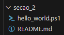
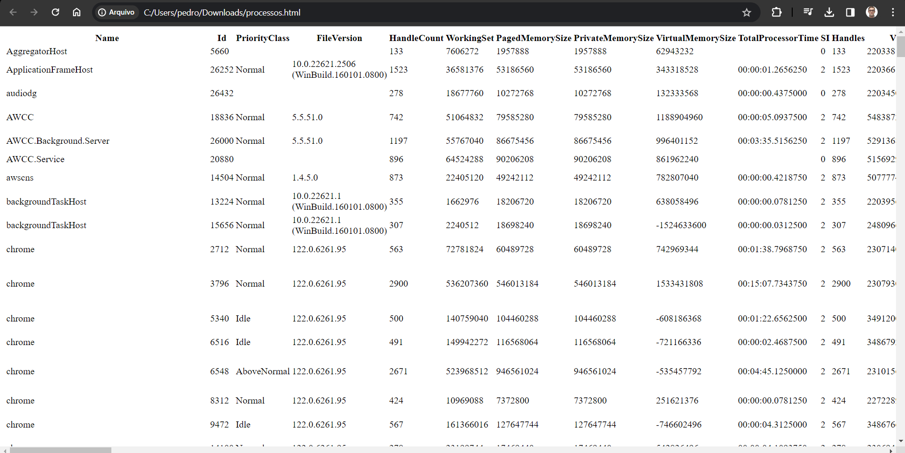
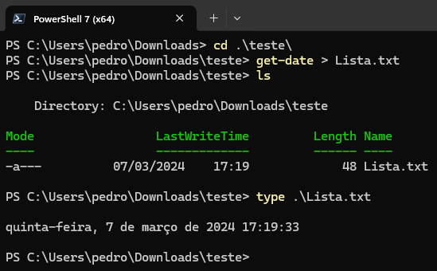
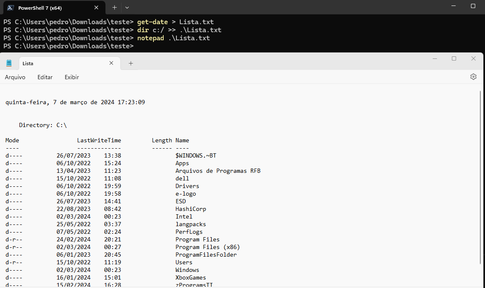
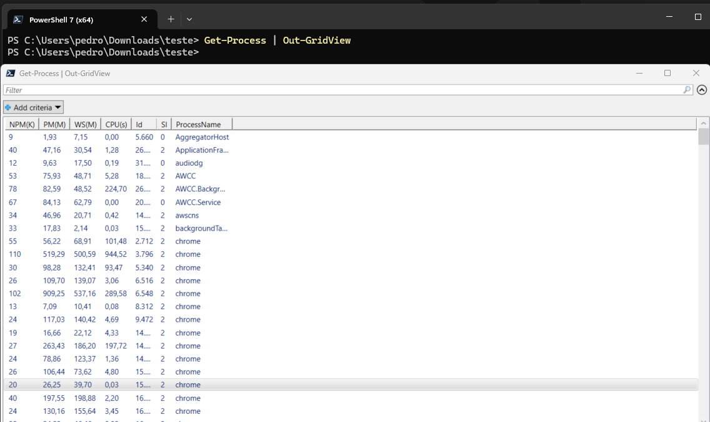

# Aprenda PowerShell do zero - Módulo 2   

### Repository: [course](../../../../)
### Platform: <a href="../../../">udemy   </a>
### Software/Subject: <a href="../../">powershell   </a>
### Course: <a href="../">curso_119 (Aprenda PowerShell do zero)   </a>
### Module: 2. Seção 2: Essencial do PowerShell

---

### Theme:
- Programming
- Shell Script

### Used Tools:
- Operating System (OS): 
  - Windows 11 
- Cloud:
  - Amazon Web Services (AWS)   
- Cloud Services:
  - Amazon Elastic Compute Cloud (EC2)   
  - Google Drive 
- Language:
  - HTML   
  - Markdown   
- Integrated Development Environment (IDE) and Text Editor:
  - Visual Studio Code (VS Code)   
  - Windows PowerShell ISE   
- Versioning: 
  - Git   
- Repository:
  - GitHub   
- Command Line Interpreter (CLI):
  - AWS Command Line Interface (CLI)   
  - Windows PowerShell   

---

### Course Module 2 Strcuture:
2. <a name="item02">Seção 2: Essencial do PowerShell</a><br>
  2.1 <a href="#item02.01">Iniciando o Powershell</a><br>
  2.2 <a href="#item02.02">Command-Lets</a><br>
  2.3 <a href="#item02.03">Me dá um help please?</a><br>
  2.4 <a href="#item02.04">Cmdlets, funções e Alias</a><br>
  2.5 <a href="#item02.05">Controlando a exibição (saída) de informações</a><br>
  2.6 <a href="#item02.06">Filtrando Resultados com Where-Object</a><br>
  2.7 <a href="#item02.07">Módulos do PowerShell</a><br>
  2.8 Atualize seu Bookmark<br>

---

### Objective:
O objetivo desse segundo módulo do curso foi apresentar o essencial do **Windows PowerShell**, explicando alguns conceitos básicos e mostrando alguns comandos. Também foi apresentado o **Windows PowerShell ISE** que é uma Interface Development Environment (IDE) para construção de scripts em **PowerShell**.

### Structure:
A estrutura deste módulo é formada por:
- Este arquivo de README.md.
- O arquivo [hello_world.ps1](./hello_world.ps1)

<div align="Center"><figure>
    <br>
    <figcaption>Imagem 01.</figcaption>
</figure></div><br>

### Development:
O desenvolvimento deste módulo do curso foi dividido em oito aulas. Abaixo é explicado o que foi desenvolvido em cada uma dessas aulas.

<a name="item02.01"><h4>2.1 Iniciando o Powershell</h4></a>[Back to summary](#item02)

Na primeira aula deste módulo foi explicado sobre o software **PowerShell** ou **Windows PowerShell** que é um shell de linha de comando. Um shell é uma interface que vai permitir que o usuário possa interagir com o sistema operacional. Existem duas possibilidades, tem o Shell interativo que é chamado de *Command Line Interface (CLI)*, ou Interface de Linha de Comando, e também tem uma parte na interface gráfica através do *Integrated Scripting Environment (ISE*) que é um ambiente de programação, onde é possível criar os scripts, salvá-los e carregá-los posteriormente.

O **PowerShell** utiliza uma linguagem de script expressiva, ou seja, expressões regulares e para isso pode ser utilizado: o *.NET Framework*, o *Windows Management Instrumentation (MSI*), o *Component Object Model (COM)*, o *Registro do Windows* e muito mais.

Durante a parte prática desta aula foram executados os comando `$PSVersionTable.PSVersion` e `(Get-Host).Version` que são duas formas de verificar a versão do **PowerShell** que está sendo utilizada. A diferença é que a segunda forma consegue verificar a versão do **PowerShell** no ambiente corrente, ou seja, caso seja realizado um acesso remoto a uma maquina, este comando vai informar a versão do **PowerShell** da maquina remota. Um outro comando utilizado foi o `Get-Host` que exibia informações do host, ou seja, da maquina hospedeira, a maquina que estava sendo utilizada.

<a name="item02.02"><h4>2.2 Command-Lets</h4></a>[Back to summary](#item02)

O **PowerShell** também executa os comandos nativos como se fosse o prompt de comando. Esses são comandos padrões que são utilizados desda época do MS-DOS (`dir`, `clear`). O PowerShell executa também alguns comandos básicos do **Linux**, como: `cd`, `ls`, `cls`. Porém o **PowerShell** também utilizado os *Commands-Lets (cmdlets)*, que são comandos especiais que utilizam uma convenção muito simples onde se baseiam num padrão de verbo-substantivo. O comando `Get-Command` é um exemplo de cmdlet e ele é utilizado para listar todos comandos de todos os tipos. Existem três tipos, o *Cmdlet*, o *Alias* que é um apelido para um comando, e o *Function* que é uma função. Os comandos de cada tipo podem ser listados com adição de um parâmetro de filtro, por exemplo: `Get-Command -CommandType Cmdlet`, `Get-Command -CommandType Alias` e `Get-Command -CommandType Function`.

Um outro cmdlet é o `Get-ChildItem` que lista todos os arquivos no diretório corrente, caso não seja especificado um caminho de um diretório ou arquivo. No **Windows PowerShell ISE**, aberto como administrador, foi criado um arquivo de nome [hello_world.ps1](./hello_world.ps1). O conteúdo desse arquivo, exibido abaixo, limpa o buffer com o comando `clear`, em seguida exibe a mensagem `Hello World` com o comando `Write-Host "Hello World"` e então lista todos os arquivos e pastas do diretório raíz (`c:\`) através do comando `Get-ChildItem c:\`.

```ps1
# Apenas um teste inicial
clear
Write-Host "Hello World"
Get-ChildItem c:\
```

Um ponto importante foi que para executar o arquivo de script elaborado, além de abrir o **PowerShell ISE** como administrador, foi necessário verificar as políticas com o comando `Get-ExecutionPolicy` que estava `RemoteSigned` e modificá-las com o comando `Set-ExecutionPolicy Unrestricted` para irrestritas. Assim foi concedido permissão para executar o arquivo.

<a name="item02.03"><h4>2.3 Me dá um help please?</h4></a>[Back to summary](#item02)

O Help do **PowerShell** basicamente é um livro. Ele é muito completo e atualizável. Para utilizá-lo foi necessário atualizá-lo primeiro com o comando `Update-Help`. Em seguida, com o comando `Get-Help Write-Host` foi exibida a ajuda para o comando `Write-Host`. Com adição do parâmetro `-Example` ao comando foi mostrado exemplos de como utilizar o comando `Write-Host`. Já com o parâmetro `-Online`, a ajuda foi exibida no site da **Microsoft** através do navegador. Utilizando os parâmetros `-ForegroundColor` e `-BackgroundColor` foi possível determinar uma cor para a fonte e uma cor para o fundo durante a exibição da ajuda. Uma outra possibilidade foi a utilização do parâmetro `-ShowWindow` que exibiu a ajuda em uma outra janela na própria maquina.

<a name="item02.04"><h4>2.4 Cmdlets, funções e Alias</h4></a>[Back to summary](#item02)

Cmdlets é uma pequena unidade de funcionalidade relacionada a um conjunto de recursos. Eles são escritos em uma linguagem, o C Sharp (C#). As Functions podem fazer o mesmo que cmdlets, executar uma fucionalidade. Elas são um conjunto de comandos que utilizam a própria linguagem do PowerShell. Já as Alias são como apelidos para os cmdlets e funções. Ao utilizar o `| more` ao comando `Get-Command -CommandType cmdlet | more` foi definido que a exibição fosse realizada pausadamente.

Com o comando `Get-Command -CommandType cmdlet *eventlog*` foi listado apenas as informações que contivessem a palavra `eventlog`. O comando `Get-ChildItem Function:\Clear-Host` foi utilizado para listar a função `Clear-Host` que é uma função que limpa o buffer. Observe que o `Get-ChildItem` não lista só arquivos e pastas, pode ser utilizado para listar comandos. Acrescentando o parâmetro `| type` foi mostrado o conteúdo da função. Por fim, também foi possível criar alias com o comando `Set-Alias Limpar Clear-Host` e exibir os processos com o comando `Get-Process`.

<a name="item02.05"><h4>2.5 Controlando a exibição (saída) de informações</h4></a>[Back to summary](#item02)

Com relação a exibição das saídas de informações, existem as seguintes estruturas: `|` (Pipe ou Pipeline), `>`, `>>`, `2>`, `2>>` e `2>&1`. A primeira passa a saída para o comando subsequente para o processamento. A segunda e a terceira redirecionam a saída padrão, representada por `1`, para um arquivo. Também pode ser ocultado o número `1`. A quarta e quinta redirecionam a saída de erro, representada por `2` para um arquivo. Tanto na saída padrão quanto na saída de erro, o uso de um sinal de `>` indica que o arquivo deve substituir o conteúdo caso esse arquivo já exista. Já o sinal duplicado, `>>`, indica que o arquivo deve adicionar o novo conteúdo ao já existente. Por fim, a sexta estrutura determina que deve ser redirecionada a saída de erro para a saída padrão.

Os comando `Format-List` exibe as informações em formato de lista. Já os comandos `ConvertTo-Csv` e `ConvertTo-Html` convertem as informações em arquivo **CSC** ou **HTML** respectivamente. Com o comando `Get-Process | ConvertTo-Html | Out-File processos.html` foi criado um arquivo **HTML** com os processos extraído através do comando `Get-Process`, a imagem 02 evidencia essa execução. Com o comando `Get-Date > Lista.txt` a data atual foi direcionada para o arquivo que foi exibida com o comando `type .\Lista.txt`, conforme imagem 03.

<div align="Center"><figure>
    <br>
    <figcaption>Imagem 02.</figcaption>
</figure></div><br>

<div align="Center"><figure>
    <br>
    <figcaption>Imagem 03.</figcaption>
</figure></div><br>

Agora com os comandos `Get-Date > Lista.txt` e `dir c:/ >> Lista.txt` foi adicionado duas informações ao mesmo arquivo, sem que uma substituisse a outra. O arquivo foi aberto com o software **Notedpad** através do comando `notepad Lista.txt`, conforme imagem 04. Já com o comando `Get-Process | Out-GridView`, as informações dos processos foram enviadas para uma tabela interativa em uma janela separada, conforme imagem 05. Existem outras seis formas de obter uma saída de informação, além do comando `Out-GridView`, existem: `Out-File` que envia a saída para um arquivo, `Out-Default` que envia a saída para o formatador padrão e o cmdlet de saída padrão, `Out-Host` que envia a saída para a linha de comando, `Out-Printer` que envia a saída para uma impressora, `Out-String` que envia a saída para uma serie de strings e `Out-Null` que apaga a saída, em vez de enviá-la para o console.

<div align="Center"><figure>
    <br>
    <figcaption>Imagem 04.</figcaption>
</figure></div><br>

<div align="Center"><figure>
    <br>
    <figcaption>Imagem 05.</figcaption>
</figure></div><br>

<a name="item02.06"><h4>2.6 Filtrando Resultados com Where-Object</h4></a>[Back to summary](#item02)

Nesta aula, foi apresentado o comando `Get-Service` para listar todos os serviços. Com a adição do comando `Where-Object` foi possível realizar filtros específicos, como por exemplo: `Get-Service | Where-Object {$_.DisplayName -like "*Security*"}` e `Get-Service | Where-Object {$_.Status -eq "Running"}`. Também foi mostrado os seguintes tipos de operadores relacionais: `-lt` (Menor que), `-le` (Menor ou Igual), `-gt` (Maior que), `ge` (Maior ou igual), `eq` (Igual), `ne` (Não Igual) e `-like` que utilizada wildcards para comparar padrões.

<a name="item02.07"><h4>2.7 Módulos do PowerShell</h4></a>[Back to summary](#item02)

Módulo é uma peça fundamental para que seja possível estender a capacidade do PowerShell. Muitas vezes é necessário instalar o módulo e ele possui a extensão psm1. O comando `Get-Module -ListAvailable` exibiu todos os módulos disponíveis no sistema. O comando `Get-Command -Module PSReadLine` mostrou todos os comandos do módulo de nome determinado. O comando `Get-Module` apresentou apenas os módulos instalados na maquina e carregados na sessão do **PowerShell**, enquanto o comando `Get-InstalledModule` mostrou todos os módulos instalados na maquina.

Para baixar um módulo utilizou-se o comando `Install-Module module_name` e para importá-lo para a sessão atual do **PowerShell** o comando foi o `Import-Module module_name`. Também foi possível desinstalar um módulo e atualizá-lo com os respectivos comandos `Uninstall-Module module_name` e `Update-Module module_name`. Os módulos podem ser baixados manualmente pelo navegador da web ou através de repositórios. Com o comando `Get-PSRepository` foi listado todos os repositórios, que no caso só tinha o **PSGallery** que é um repositório padrão do **PowerShell**. Foi escolhido um módulo que possibilita fazer downloads de vídeos do **Youtube** e este foi baixado com o comando `Install-Module -Name PSDownr`. Observe que foi questionado sobre a confiança neste módulo, isso aconteceu pois o **PSGallery** estava definido como `Untrusted`, ou seja, não era confiável.

Com `Get-YoutubeVideo -Syntax` foi possível verificar a sintaxe do comando `Get-YoutubeVideo -Uri https://youtu.be/Ryi9n4dIZk4 -DownloadPath C:\Users\pedro\Downloads\teste\`, que baixava um vídeo do youtube para o diretório determinado.