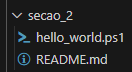

# Aprenda PowerShell do zero - Módulo 3   

### Repository: [course](../../../)
### Platform: <a href="../../">udemy   </a>
### Software/Subject: <a href="../">powershell   </a>
### Course: <a href="./">curso_119 (Aprenda PowerShell do zero)   </a>
### Module: 3. Seção 3: Scripts no Powershell

---

### Theme:
- Programming
- Shell Script

### Used Tools:
- Operating System (OS): 
  - Windows 11 
- Cloud:
  - Amazon Web Services (AWS)   
- Cloud Services:
  - Amazon Elastic Compute Cloud (EC2)   
  - Google Drive 
- Language:
  - HTML   
  - Markdown   
- Integrated Development Environment (IDE) and Text Editor:
  - Visual Studio Code (VS Code)   
  - Windows PowerShell ISE   
- Versioning: 
  - Git   
- Repository:
  - GitHub   
- Command Line Interpreter (CLI):
  - AWS Command Line Interface (CLI)   
  - Windows PowerShell   

---

### Course Module 3 Strcuture:
3. <a href="#item03">Seção 3: Scripts no Powershell</a> 
  3.1 <a href="#item03.01">Estrutura de um script</a> 
  3.2 <a href="#item03.02">Variáveis</a> 
  3.3 <a href="#item03.03">Arrays</a> 
  3.4 <a href="#item03.04">Hash Table</a> 
  3.5 <a href="#item03.05">Operadores Condicionais e Lógicos</a> 
  3.6 <a href="#item03.06">Select-String</a> 
  3.7 <a href="#item03.07">Expressões Regulares (REGEX)</a> 
  3.8 <a href="#item03.08">Expressões Regulares (REGEX)</a> 
  3.9 <a href="#item03.09">Expressões Regulares (REGEX)</a> 
  3.10 <a href="#item03.10">Expressões Regulares (REGEX)</a> 
  3.11 <a href="#item03.11">Expressões Regulares (REGEX)</a> 
  3.12 <a href="#item03.12">Expressões Regulares (REGEX)</a> 
  3.13 <a href="#item03.13">Expressões Regulares (REGEX)</a> 
  3.14 <a href="#item03.14">Expressões Regulares (REGEX)</a> 

---

### Objective:
O objetivo desse primeiro módulo do curso foi apresentar o essencial do **Windows PowerShell**, explicando alguns conceitos básicos e mostrando alguns comandos. Também foi apresentado o **Windows PowerShell ISE** que é uma Interface Development Environment (IDE) para construção de scripts em **PowerShell**.

### Structure:
A estrutura deste módulo é formada por:
- Este arquivo de README.md.
- O arquivo [hello_world.ps1](./hello_world.ps1)

<figure>
     
    <figcaption>Imagem 01.</figcaption>
</figure>
 

### Development:
O desenvolvimento deste módulo do curso foi dividido em oito aulas. Abaixo é explicado o que foi desenvolvido em cada uma dessas aulas.

<a name="item03.01"><h4>3.1 Estrutura de um script</h4></a>[Back to summary](#item03)

Este módulo foi iniciado com a explição de como escrever um arquivo de script no **PowerShell ISE**. O arquivo de nome [new_script.ps1](./new_script.ps1) foi elaborado pelo **Notepad** com o comando `notepad new_script.ps1` e executado no **PowerShell**, ele apenas exibiu uma mensagem determinada. Após isso, esse arquivo foi salvo no diretório [scripts](./scripts/) deste módulo.

<a name="item03.02"><h4>3.2 Variáveis</h4></a>[Back to summary](#item03)

O assunto abordado nessa aula foi variáveis que, em programação, é um objeto situado na memória que representa um valor ou expressão. Dentro da pasta `scripts` foi construído o arquivo [02-variable.ps1](./script/02-variable.ps1) com alguns exemplos de como utilizar variáveis e alguns métodos que elas podem ter.

<a name="item03.03"><h4>3.3 Arrays</h4></a>[Back to summary](#item03)

Nesta aula foi criado um outro arquivo de nome [03-arrays.ps1](./scripts/03-arrays.ps1) onde foi desenvolvido um array com dois elementos, sendo cada um deles um DNS da **Google**. Em seguida foi realizado a contagem de quantos elementos tinha no array e após a mensagem impressa foi realizado um teste de conexão em cada um dos dois DNS, conforme mostrado na imagem 02 abaixo.

<figure>
     
    <figcaption>Imagem 02.</figcaption>
</figure>
 

<a name="item03.04"><h4>3.4 Cmdlets, funções e Alias</h4></a>[Back to summary](#item03)

<a name="item03.05"><h4>3.5 Operadores Condicionais e Lógicos</h4></a>[Back to summary](#item03)

<a name="item03.06"><h4>3.6 Select-String</h4></a>[Back to summary](#item03)

<a name="item03.07"><h4>3.7 Expressões Regulares (REGEX)</h4></a>[Back to summary](#item03)

