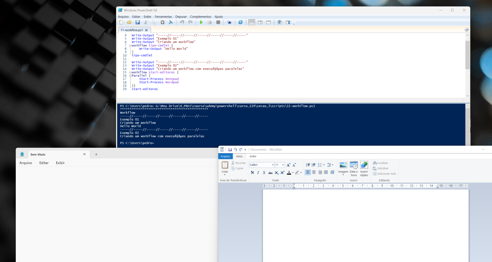

# Aprenda PowerShell do zero - Módulo 3   

### Repository: [course](../../../../)
### Platform: <a href="../../../">udemy   </a>
### Software/Subject: <a href="../../">powershell   </a>
### Course: <a href="../">curso_119 (Aprenda PowerShell do zero)   </a>
### Module: 3. Seção 3: Scripts no Powershell

---

### Theme:
- Programming
- Shell Script

### Used Tools:
- Operating System (OS): 
  - Windows 11 
- Cloud Services:
  - Google Drive 
- Language:
  - HTML   
  - Markdown   
- Integrated Development Environment (IDE) and Text Editor:
  - Visual Studio Code (VS Code)   
  - Windows PowerShell ISE   
- Versioning: 
  - Git   
- Repository:
  - GitHub   
- Command Line Interpreter (CLI):
  - Windows PowerShell   

---

### Course Module 3 Strcuture:
3. <a name="item03">Seção 3: Scripts no Powershell</a> 
  3.1 <a href="#item03.01">Estrutura de um script</a> 
  3.2 <a href="#item03.02">Variáveis</a> 
  3.3 <a href="#item03.03">Arrays</a> 
  3.4 <a href="#item03.04">Hash Table</a> 
  3.5 <a href="#item03.05">Operadores Condicionais e Lógicos</a> 
  3.6 <a href="#item03.06">Select-String</a> 
  3.7 <a href="#item03.07">Expressões Regulares (REGEX)</a> 
  3.8 <a href="#item03.08">IF...ELSE</a> 
  3.9 <a href="#item03.09">Looping com For, ForEach e While</a> 
  3.10 <a href="#item03.10">Criando Funções</a> 
  3.11 <a href="#item03.11">Workflows</a> 
  3.12 <a href="#item03.12">Job e Scheduled Jobs</a> 
  3.13 <a href="#item03.13">New-Object - Usando o Wscript.Shell</a> 
  3.14 <a href="#item03.14">GitHub - Repositório para scripts</a> 

---

### Objective:
O objetivo do terceiro módulo do curso foi aprofundar nos comandos e estruturas da linguagem de script do **Windows PowerShell**, abordando assuntos como: script, variáveis, arrays, hash tables, operadores, expressões regulares, estruturas de condição e de repetição, funções, e outros conteúdos básicos.

### Structure:
A estrutura deste módulo é formada por:
- Este arquivo de README.md.
- A sub-pasta [scripts](./scripts/) contendo os arquivos de scripts em **PowerShell**.

<figure>
     
    <figcaption>Imagem 01.</figcaption>
</figure>
 

### Development:
O desenvolvimento deste módulo do curso foi dividido em quatorze aulas. Abaixo é explicado o que foi desenvolvido em cada uma dessas aulas. A maior parte das aulas foi realizada através do **Visual Studio Code (VS Code)**, porém em alguns casos específicos foi utilizado o **Windows PowerShell ISE** e também o **Windows PowerShell** pelo **Windows Terminal**.

<a name="item03.01"><h4>3.1 Estrutura de um script</h4></a>[Back to summary](#item03)

Este módulo foi iniciado com a explição de como escrever um arquivo de script no **PowerShell ISE**. O arquivo de nome [01-new_script.ps1](./scripts/01-new_script.ps1) foi elaborado pelo **Notepad** com o comando `notepad new_script.ps1` e armazenado no diretório [scripts](./scripts/) deste módulo. Ele foi executado tanto no **PowerShell** como no **PowerShell ISE** e apenas exibiu uma mensagem determinada, conforme apresentado na imagem 02.

<figure>
     
    <figcaption>Imagem 02.</figcaption>
</figure>
 

<a name="item03.02"><h4>3.2 Variáveis</h4></a>[Back to summary](#item03)

O assunto abordado nessa aula foi variáveis que, em programação, é um objeto situado na memória que representa um valor ou expressão. Dentro da pasta `scripts` foi construído o arquivo [02-variable.ps1](./scripts/02-variable.ps1) com alguns exemplos de como utilizar variáveis e alguns métodos que elas podem ter. Esse arquivo foi executado no **Visual Studio Code (VS Code)**, conforme mostrado na imagem 02 abaixo.

<figure>
     
    <figcaption>Imagem 03.</figcaption>
</figure>
 

<a name="item03.03"><h4>3.3 Arrays</h4></a>[Back to summary](#item03)

Nesta aula foi criado um outro arquivo no **VS Code**, de nome [03-arrays.ps1](ss/03-arrays.ps1), onde foi desenvolvido um array com dois elementos, sendo cada um deles um DNS da **Google**. Em seguida foi realizado a contagem de quantos elementos tinha no array e após a mensagem impressa foi realizado um teste de conexão em cada um dos dois DNS, conforme ilustrado na imagem 04 abaixo.

<figure>
     
    <figcaption>Imagem 04.</figcaption>
</figure>
 

<a name="item03.04"><h4>3.4 Hash Table</h4></a>[Back to summary](#item03)

O Hash Table também é uma matriz assim como os Arrays, porém essa matriz é um pouco diferente, ela permite armazenar os dados aos pares. O arquivo [04-hash_table.ps1](./scripts/04-hash_table.ps1) foi elaborado para criação de Hash Tables, sendo no segundo exemplo utilizando o comando `[ordered]` na frente, para ordenar os elementos do Hash Table. No 03 e 04 exemplo foi mostrado como adicionar e remover elementos ao Hash Table. No exemplo 05 foi exibido como contar quantos elementos tinha no Hash Table e os valores que esses elementos possuíam. Enquanto no exemplo 06 foi mostrado como acessar um elemento do Hash Table, no qual nesse caso foi acessado um elemento para testar a conexão com o comando `Test-Connection`. A imagem 05 abaixo evidencia a execução desse arquivo. Já a imagem 06 mostra o último exemplo.

<figure>
     
    <figcaption>Imagem 05.</figcaption>
</figure>
 

<figure>
     
    <figcaption>Imagem 06.</figcaption>
</figure>
 

<a name="item03.05"><h4>3.5 Operadores Condicionais e Lógicos</h4></a>[Back to summary](#item03)

Nesta aula foi apresentado todos os operadores, não só os condicionais. O operador de atribuição é o `=` que serve para atribuir a uma variável um valor. Este pode ser acrescido de um operador matemático aritmético para realizar uma atribuição com uma operação aritmética, os operadores combinados são: `+=` (atribuição com adição), `-+` (atribuição com subtração), `*=` (atribuição com multiplicação), `/=` (atribuição com divisão) e `%=` (atribuição com módulo). Os operadores matemáticos aritméticos são os: `+` (adição), `-` (subtração ou negação no sentido de tornar o número negativo), `*` (multiplicação), `/` (divisão) e `%` (módulo que é o resto da divisão). 

Com relação aos operadores condicionais existem dois grupos, os operadores lógicos ou Booleanos que são: `AND` (conjunção), `OR` (disjunção não exclusiva), `NOT` (negação) e `XOR` (disjunção exclusiva). Já o outro grupo são os operadores relacionais ou de comparação, sendo os principais: `-lt` (menor que), `-le` (menor ou igual), `-gt` (maior que), `-ge` (maior ou igual), `-eq` (igual) e `ne` (não igual). Além desses, é possível considerar alguns outros como operadores relacionais já que eles realizam comparações, são eles: `like` (como), `-notlike` (não como), `-contains` (contém), `-notcontains` (não contém), `-match` (coincide) e `-notmatch` (não coincide). 

Também existe os operadores unários que são: `+` (transforma o valor em positivo), `-` (transforma o valor em negativo), `++` (incrementação), `--` (decrementação) e `!` (operador de negação lógico). No arquivo [05-operator.ps1](./scripts/05-operator.ps1) foram executados comandos exemplificando cada um dos operadores e o output desse arquivo é apresentado na imagem 07 abaixo.

<figure>
     
    <figcaption>Imagem 07.</figcaption>
</figure>
 

<a name="item03.06"><h4>3.6 Select-String</h4></a>[Back to summary](#item03)

Antes de explicar o comando `Select-String`, dentro do **PowerShell** foi executado o comando `Get-Content .\01-new_script.ps1` com um arquivo da pasta `script` para visualizar o conteúdo deste arquivo. Em seguida, este comando foi executado redirecionando a saída para o próximo comando que era o `Select-String` e conjunto de caractere que desejavasse procurar no arquivo, ficando da seguinte forma `Get-Content .\01-new_script.ps1 | Select-String Write`. Uma outra opção foi executar o comando `Get-ChildItem | Select-String Exemplo` que procurava a palavra `Exemplo` em todos os arquivo do diretório corrente, que no caso era o `script`. Também foi possível utilizar o comando `Select-String -Path 05-operator.ps1 -Pattern Operador` para localizar a palavra determinada no arquivo indicado. O parâmetro `-CaseSensitive` indicava que deveria ser diferenciado letras maiúsculas e minúsculas. O parâmetro `-Context` era possível especificar uma quantidade de linhas antes e depois da linha com a informação procurada. Já o parâmetro `-NotMatch` retornava tudo, exceto as linhas com a informação procurada. Na imagem 08 é exibido alguns dos comandos utilizados.

<figure>
     
    <figcaption>Imagem 08.</figcaption>
</figure>
 

<a name="item03.07"><h4>3.7 Expressões Regulares (REGEX)</h4></a>[Back to summary](#item03)

Expressões Regulares (Regex) é uma técnica ou linguagem para realizar correspondência de padrões em texto. No **PowerShell** elas estão relacionadas às expressões regulares do **.NET Framework**. Existem expressões regulares para inúmeras linguagens, muitas delas são similares, mas é capaz que existam diferenças entre uma ou outra. O site [regexlib](https://regexlib.com/Default.aspx) exibe todas expressões regulares.

Na pasta de `script` foi desenvolvido, pelo **VS Code**, o arquivo [07-regex.ps1](./scripts/07-regex.ps1) que a partir de uma entrada do usuário, verifica se o email informado atendia um padrão estabelecido com expressões regulares (Regex). O resultado é visualizado na imagem 09 abaixo.

<figure>
     
    <figcaption>Imagem 09.</figcaption>
</figure>
 

<a name="item03.08"><h4>3.8 IF...ELSE</h4></a>[Back to summary](#item03)

Nesta aula foi ensinado através do arquivo [08-if_else.ps1](./scripts/08-if_else.ps1) como estruturar condicionais no **PowerShell** com os comandos `If` e `Else`. No caso da utilização só com o `If` é uma estrutura condicional com uma única condição. Já com o uso do `Else` uma segunda condição é definida para quando a condição anterior não for atendida. Também foi possível criar estruturas condicionais com mais de 2 condições, no qual a última sempre será para quando nenhuma das outras atenderem. Neste caso, foi utilizado o comando `Elseif` para criação de condições intermediárias. Todos esses exemplos são mostrados na imagem 10 a seguir.

<figure>
     
    <figcaption>Imagem 10.</figcaption>
</figure>
 

<a name="item03.09"><h4>3.9 Looping com For, ForEach e While</h4></a>[Back to summary](#item03)

Na aula 9 deste módulo foi mostrado os três tipos de estrutura de repetição (`For`, `ForEach` e `While`) e como usar essas estruturas. Para isso, foi criado o arquivo [09-looping.ps1](./scripts/09-looping.ps1) com alguns exemplos e o output da execução desse arquivo é visualizado na imagem 11.

<figure>
     
    <figcaption>Imagem 11.</figcaption>
</figure>
 

<a name="item03.10"><h4>3.10 Criando Funções</h4></a>[Back to summary](#item03)

Funções são comandos em um script, que dura apenas durante a sessão em que estiver sendo executado. Na maioria das vezes, são longos comandos com tarefas repetitivas e utilização de parâmetros. Com o arquivo [10-functions](./scripts/10-function.ps1) foram construídas duas funções, uma de um comando executado anteriormente e outra com utilização de parâmetros. A imagem 12 exibe o output desse arquivo.

<figure>
     
    <figcaption>Imagem 12.</figcaption>
</figure>
 

<a name="item03.11"><h4>3.11 Workflows</h4></a>[Back to summary](#item03)

O Workflow é utilizado quando é necessário criar scripts de longa execução e que tenham que ser gerenciáveis. Usando um Workflow é possível: Interromper, Suspender, Reiniciar, Repetir e Execução paralela. Com o arquivo [11-workflow.ps1](./scripts/11-workflow.ps1) foi desenvolvido dois workflows, sendo o segundo com tipo de execução paralela. Esse arquivo foi executado pelo **Windows PowerShell ISE**, pois o **PowerShell** do **VS Code** era da versão `7.4.1` e a partir da versão `6`, essa funcionalidade foi removida. A imagem 13 mostra o arquivo de script sendo executado.

<figure>
     
    <figcaption>Imagem 13.</figcaption>
</figure>
 

<a name="item03.12"><h4>3.12 Job e Scheduled Jobs</h4></a>[Back to summary](#item03)

Jobs permitem a execução de comandos em background no computador local ou remoto. Já os Scheduled Jobs ou Trabalhos agendados são extremamente uteis quando existem tarefas que são executadas com maior frequência ou com recorrência e principalmente quando são atividades de longa duração. Para isso foi utilizado o arquivo [12-jobs.ps1](./scripts/12-jobs.ps1) onde foram desenvolvidos um job e um scheduled job. Na imagem 14 é exibido o primeiro job executado e algumas manipulações realizadas nele. Como esse job era de um workflow, teve que ser executado no **Windows PowerShell ISE**.

<figure>
     
    <figcaption>Imagem 14.</figcaption>
</figure>
 

No segundo exemplo, foi criado um scheduled job de nome `Backup` e três opções de triggers, uma diária, uma apenas uma vez e a outra semanal. A que era apenas uma vez, foi modificada alterando o método `AddHours(1)` para `.AddSeconds(5)` para que fosse realizada naquele momento. Ao registrar o scheduled job foi passada essa trigger de uma vez, um nome para o scheduled job, além do bloco de script que executava o comando `Copy-Item "C:\Users\pedro\Downloads\teste\*.*" "C:\Users\pedro\Downloads\teste2\" -Recurse -Force`. Este comando copiava recursivamente os arquivos de uma pasta de teste para uma outra pasta de teste, ambas dentro do diretório de `Downloads`. Após a criação do scheduled job, ele foi listado com o comando `Get-ScheduledJob`, enquanto sua trigger foi exibida pelo comando `Get-ScheduledJob | Get-JobTrigger`. Passado 25 segundos, o scheduled job foi removido com o comando `Get-ScheduledJob | Unregister-ScheduledJob`. A imagem 15 exibem três janelas, a do lado esquerdo é o **Windows PowerShell ISE**, que é divido em duas partes, sendo a parte superior o arquivo de script e a parte inferior o output do arquivo. Já do lado direito, na parte superior tem a pasta de `teste2` aberta no **Windows Explorer** evidenciando que ela recebeu os arquivos, enquanto na parte superior tem a janela do *Task Scheduler* aberta mostrando o job criado e executado com sucesso. 

<figure>
     
    <figcaption>Imagem 15.</figcaption>
</figure>
 

<a name="item03.13"><h4>3.13 New-Object - Usando o Wscript.Shell</h4></a>[Back to summary](#item03)

Com o WScript Shell é possível usar New-Object para trabalhar com componentes *Component Object Model (COM)*. Os componentes variam desde as várias bibliotecas incluídas no *Windows Script Host (WSH)* até aplicativos de *ActiveX* como o Internet Explorer que estão instalados na maioria dos sistemas. O WScript Shell é um objeto que faz parte do *Windows Script Host (WSH)* e é usado para manipular funcionalidades do sistema operacional e interagir com o ambiente do **Windows**.

Dentro do diretório `script` foi construído o arquivo [13-wshell.ps1](./scripts/13-wshell.ps1). Este criou uma instância do objeto WScript.Shell e executou alguns comandos como: exibir uma mensagem em um popup e abrir o **Notepad** e escrever uma outra mensagem. A imagem 16 evidencia a execução desse arquivo.

<figure>
     
    <figcaption>Imagem 16.</figcaption>
</figure>
 

<a name="item03.14"><h4>3.14 GitHub - Repositório para scripts</h4></a>[Back to summary](#item03)

Esta aula foi uma aula teórica ensinando como trabalhar com a plataforma **GitHub** e o software **Git**. Foi explicado as principais funcionalidades, como criar um repositório local e remoto e vinculá-los. Também foi apresentado o software **GitHub Desktop** que é uma maneira de trablhar com **Git** e **GitHub** localmente através de uma interface gráfica. Como esse curso já era versionado para o repositório `courses` do meu **GitHub** e o foco não era o **GitHub** e **Git**, não foi realizado parte prática. 