# Aprenda PowerShell do zero - Módulo 4   

### Repository: [course](../../../../)
### Platform: <a href="../../../">udemy   </a>
### Software/Subject: <a href="../../">powershell   </a>
### Course: <a href="../">curso_119 (Aprenda PowerShell do zero)   </a>
### Module: 4. Seção 4: Gerenciamento com PowerShell

---

### Theme:
- Programming
- Shell Script

### Used Tools:
- Operating System (OS): 
  - Windows 11 
- Cloud:
  - Amazon Web Services (AWS)   
- Cloud Services:
  - Amazon Elastic Compute Cloud (EC2)   
  - Google Drive 
- Language:
  - HTML   
  - Markdown   
- Integrated Development Environment (IDE) and Text Editor:
  - Visual Studio Code (VS Code)   
  - Windows PowerShell ISE   
- Versioning: 
  - Git   
- Repository:
  - GitHub   
- Command Line Interpreter (CLI):
  - AWS Command Line Interface (CLI)   
  - PowerShell Web Access (PSWA)   
  - Windows PowerShell   
- Tools:
  - Windows Management Instrumentation (WMI)   
- Network:
  - OpenSSH   
  - Windows Defender Firewall   
- - Remote Desktop Software:
  - Remote Desktop Protocol Client (RDP Client)   

---

### Course Module 4 Strcuture:
4. <a name="item04">Seção 4: Gerenciamento com PowerShell</a> 
  4.1 <a href="#item04.01">Executando o PowerShell remotamente</a> 
  4.2 <a href="#item04.02">Sessão persistente usando PSSession, Invoke-Command e Jobs</a> 
  4.3 <a href="#item04.03">PowerShell Remoto usando maquina fora do Domínio</a> 
  4.4 <a href="#item04.04">Salvando credenciais para scripts de acesso remoto</a> 
  4.5 <a href="#item04.05">Acessando o PowerShell através da WEB com o PSWA</a> 
  4.6 <a href="#item04.06">Renomear Computador</a> 
  4.7 <a href="#item04.07">Alterar endereço IP e adicionar computador ao domínio do Active Directory</a> 
  4.8 <a href="#item04.08">Gerenciando o Active Directory</a> 
  4.9 Módulos do PowerShell 

---

### Objective:
O objetivo do quarto e último módulo do curso foi introduzir as formas de acesso remoto com o **Windows PowerShell** e como utilizar o **PowerShel Web Access (PSWA)**. Também foi explicado como renomear o hostname, como alterar uma interface de rede, como adicionar uma maquina a um domínio do **Active Directory Domain Services (ADDS)** e como gerenciar o ADDS.

### Structure:
A estrutura deste módulo é formada por:
- Este arquivo de README.md.
- A sub-pasta [resources](./resources/) contendo o arquivo de script em **PowerShell** para instanciar uma maquina **Windows Server** no EC2 da cloud **AWS** e dois outros arquivos de scripts também em **PowerShell**.

<figure>
     
    <figcaption>Imagem 01.</figcaption>
</figure>
 

### Development:
O desenvolvimento deste módulo do curso foi dividido em oito aulas. Abaixo é explicado o que foi desenvolvido em cada uma dessas aulas.

<a name="item04.01"><h4>4.1 Executando o PowerShell remotamente</h4></a>[Back to summary](#item04)

O **PowerShell** é a melhor ferramenta para administração remota. Ele permite criar script e executar em vários servidores. Mas para isso é necessário habilitar o gerenciamento remoto. O *Remoting PowerShell* é construído sobre *Windows Remote Management (WinRM)* para fornecer acesso remoto a maquinas.  O *Windows Remote Management (WinRM)* é a implementação da **Microsoft** do protocolo *WS-Management (Web Services Management)* para sistemas **Windows**. Ele fornece uma infraestrutura para gerenciamento remoto baseada em web, permitindo a execução de operações de gerenciamento em sistemas **Windows** de forma segura e interoperável. O WinRM é frequentemente utilizado em conjunto com o *PowerShell Remoting* para possibilitar a execução remota de comandos **PowerShell**. Ele facilita a administração remota e a automação de operações em sistemas distribuídos.

Para trabalhar com o *Remoting PowerShell* é preciso verificar algumas questões. A primeira delas é a comunicação TCP-IP, tem que ter certeza que as duas maquinas estão na mesma rede e estão sob o mesmo Gateway, sendo esse caso apenas para comunicação de maquinas na mesma rede, também é possível concetá-las por redes diferentes. Outra questão importante é ter certeza se o Firewall está habilitado ou não. Ao habilitar o PowerShell remoto, ele automaticamente cria regra de firewall liberando o acesso. No **Windows**, por padrão, quem coordena o firewall é o software **Windows Defender Firewall**. Outra situação é verificar se as maquinas fazem parte de um mesmo domínio do **Active Directory**. Caso uma delas não faça parte do mesmo domínio, seja uma maquina Stand-Alone, é necessário criar uma lista de servidores de maquinas de computadores confiáveis para fazer a execução do acesso remoto.

O PowerShell suporta dois modos de acesso remoto, um é a sessão persistente ou sessão resiliente. Sessões de acesso remoto no PowerShell são de extrema importância para a execução de scripts de longa duração, como um job por exemplo. Porque por mais que haja uma queda na sessão, ela vai sempre tentar reconectar, impedindo que a sessão seja interrompida. Este tipo de acesso remoto é com os comandos do `PSSession`. Muito diferente do `Invoke-Command` que é um command-let que inicia uma sessão com o Servidor, executa aquele comando e imediatamente ele fecha essa sessão. A vantagem é que é possível ter as informações do que foi executado no console. O `Invoke-Command`, na verdade, é uma execução de comandos remotos, enquanto o acesso remoto de fato é realizado pelo `PSSession`. Também é possível utilizar a sessão criada no `PSSession` no `Invoke-Command` para executar um comando, dessa forma, a sessão não é encerrada, então ela seria uma sessão persistente. Para execução dos acessos remotos, é necessário utilizar o command line interface (CLI) através da linha de comando com o **PowerShell**, ou pode ser utilizado o próprio **PowerShell ISE** que permitem realizar um acesso remoto de um jeito muito fácil ou ainda através do **Server Manager** que é um recurso do **Windows Server**.

Prosseguindo, foi instanciada uma maquina **Windows Server** na cloud da **AWS** através do serviço **Amazon Elastic Compute Cloud (EC2)**. Para a instanciação foi utilizado o arquivo de script em **PowerShell** [ec2Instance.ps1](./resources/ec2Instance.ps1) armazenado na sub-pasta [resources](./resources/) deste módulo do curso. Esse arquivo utilizou comandos do **AWS CLI**, que já estava instalado na maquina física **Windows**, para interagir com as APIs dos serviços da **AWS**. A instância construída era um **Windows Server**, cuja imagem de maquina foi a `ami-0f9c44e98edf38a2b` e o tipo de instância foi `t2.micro`. Um volume no serviço **Amazon Elastic Block Storage (EBS)** foi desenvolvido no dispositivo `/dev/sda1` com `30` gigas de armazenamento do tipo `gp2`. Também foi passado o par de chaves `keyPairUniversal` que é um par de chaves padrão já elaborado para meus projetos. O grupo de segurança e a sub-rede utilizada foram os padrões da VPC padrão da região, sendo a sub-rede da zona de disponibilidade `us-east-1a`. Uma tag de nome com o valor `ec2Curso119Test1` foi definida para essa instância.

##### Acesso Remoto Gráfico - RDP Client

Após a instância da máquina, procedeu-se inicialmente à realização de um acesso remoto, com a possibilidade de interação através da interface gráfica. No console da **AWS** pelo navegador da maquina física, foi acessada a opção `Connect to instance`, no qual era possível realizar de três formas. A primeira através do *Session Manager* que é um recurso do serviço **AWS System Manager (SSM)**. Atráves do `EC2 serial console` e também do `RDP client`. O **Remote Desktop Protocol client (RDP client)**, é um software ou aplicativo que permite que um usuário se conecte a um computador remoto usando o protocolo RDP. O Remote Desktop Protocol (RDP) é um protocolo desenvolvido pela **Microsoft** que permite a conexão remota entre um computador cliente e um servidor, possibilitando o controle da interface gráfica do computador remoto.

A opção utilizada foi a `RDP client`, pois a conexão foi executada com um cliente RDP. Nesta página já eram exibidas algumas informações necessárias para a conexão como o DNS público e o username da maquina, apresentados na imagem 02. Assim foi aberto o software **Remote Desktop Protocol Client (RDP Client)**, também chamado de  **Remote Desktop Connection (Conexão de Área de Trabalho Remota)**, na maquina física **Windows**. Na aba `General`, foi passado o nome do computador que era o IP ou DNS público da instância e o username, que no caso foi `Administrator`, conforme imagem 03. Com relação a senha foi preciso clicar em `Get password` lá no console da **AWS**, em seguida ir em `Browse` e indicar o arquivo par de chaves `.pem` utilizado nesta instância, que foi o `keyPairUniversal`. Ao confirmar, uma senha foi gerada pela desemcriptação do arquivo par de chaves e foi utilizada no **RDP Client**, conforme apresentado na imagem 04. Também foi necessário criar uma regra no security group da instância, liberando acesso a porta `3389`, que é a porta onde o RDP trabalha. Ao executar a conexão, foi questionado sobre a confiabilidade desta maquina que estava sendo acessada, mas como era uma maquina conhecida foi confirmada a confiabilidade. Após isso, a janela com acesso remoto com interface gráfica foi aberta e essa execução é evidenciada na imagem 05. O processo poderia ser simplificado ao escolher a opção `Download remote desktop file` na aba `RDP client` no console da **AWS**. Isto já baixava uma configuração pronta que ao executar, preenchia os campos do software **Remote Desktop Protocol Client (RDP Client)** e então era só clicar em conectar e informar apenas a senha.

<figure>
    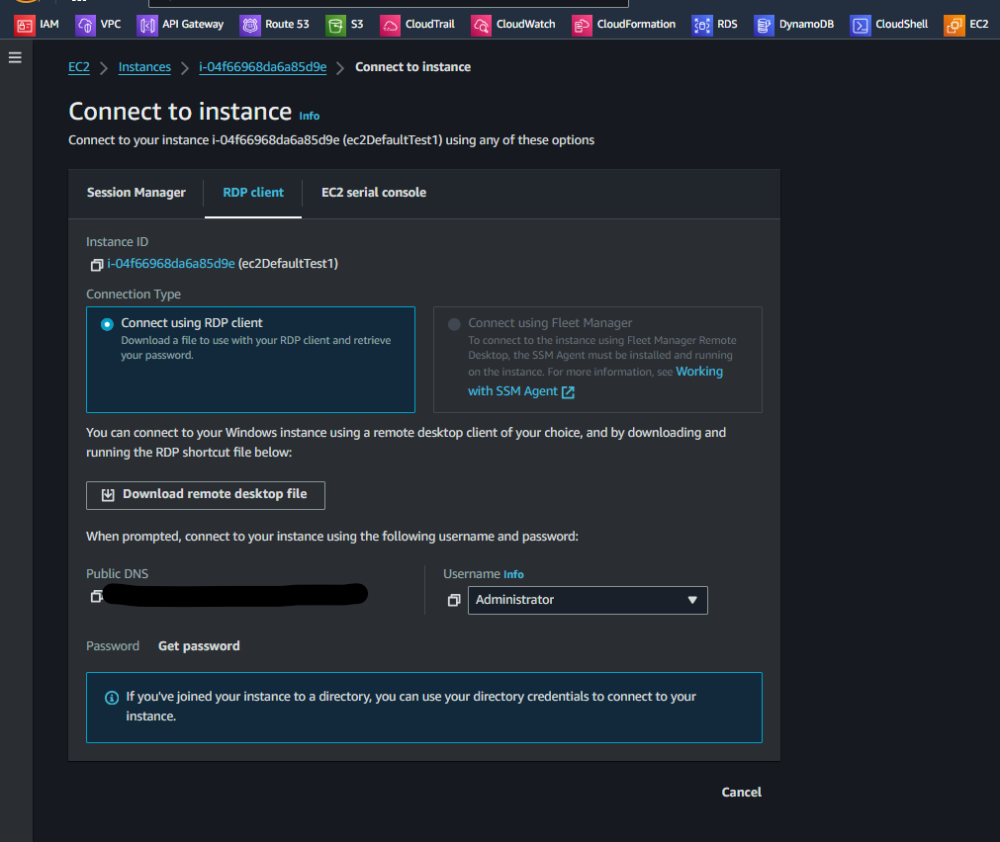 
    <figcaption>Imagem 02.</figcaption>
</figure>
 

<figure>
    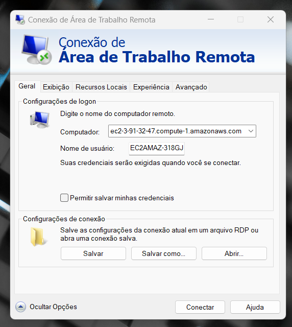 
    <figcaption>Imagem 03.</figcaption>
</figure>
 

<figure>
    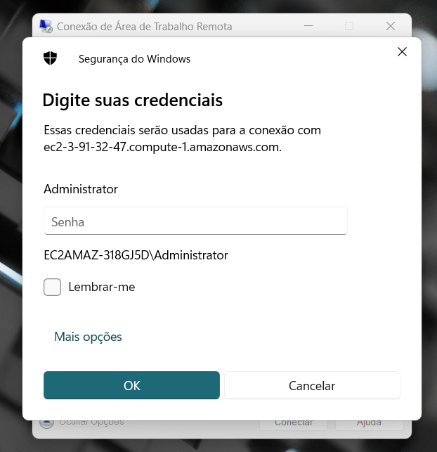 
    <figcaption>Imagem 04.</figcaption>
</figure>
 

<figure>
    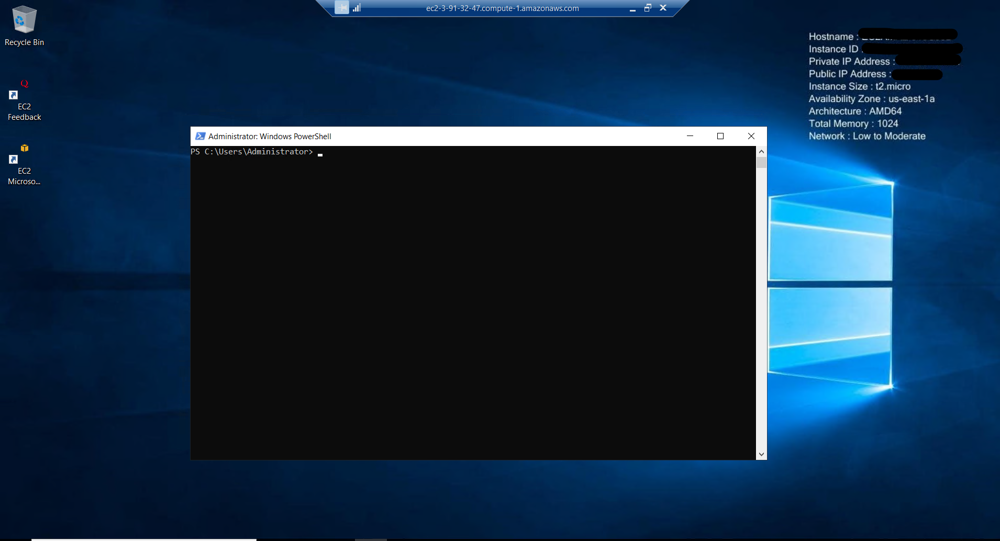 
    <figcaption>Imagem 05.</figcaption>
</figure>
 

##### Acesso Remoto - PowerShell

Com acesso remoto graficamente realizado na instância, agora foi o momento de executar o acesso remoto pelo **PowerShell** da maquina física. Na instância foi acessado o **PowerShell** e executado o comando `Enable-PSRemoting` para habilitar o acesso remoto. Em alguns casos, várias configurações eram feitas após confirmar todas elas com o `A`. Primeiro, ele iniciava ou reiniciava o *WinRM*, depois definia esse serviço como automático, em seguida criava um listener para aceitar requisições de qualquer endereço IP, e por fim criava duas regras de entrada no firewall com o mesmo nome (`Windows Remote Management (HTTP-In)`), permitindo acesso do tráfego na porta local `5985` do protocolo *WinRM*. Também foi questionado sobre uma operação do `Set-PSSessionConfiguration` que foi confirmada com `A`. Com o comando `Get-Item WSMan:\localhost\Service\AllowRemoteAccess` foi possível verificar o `PSRemoting` habilitado.

As diferenças entre essas duas regras era o `Profiles` que em uma era `Domain` e `Private` e o `Remote IP Address` em `Scope` era liberado para todos os IPs, enquanto na outra o `Profiles` era `Public` e o `Remote IP Address` era aberto apenas para sub-redes locais. Esta última configuração, cujo `Profiles` era `Public`, teve que ser alterada modificando o `Remote IP Address` para qualquer IP, sendo executado com o comando `Get-NetFirewallRule -DisplayName "Windows Remote Management (HTTP-In)" | Where-Object { $_.Profile -contains "Public" } | Set-NetFirewallRule -RemoteAddress Any`. Isso poderia ser feito via interface gráfica abrindo o software **Windows Defender Firewall** com segurança avançada através do comando `mstsc` e fazendo essa modificação manualmente.

Ainda assim foi necessário verificar se existia uma regra no firewall do **Windows Server** da instância com o comando `Get-NetFirewallRule -DisplayName Windows Remote Management (HTTP-In)`. Neste caso, era melhor conferir via interface gráfica, pois o nome de display da regra poderia ser outro. Caso não houvesse uma regra, era preciso criá-la com o comando `New-NetFirewallRule -Name winrm-http -DisplayName 'Allow WinRM HTTP' -Enabled True -Direction Inbound -Protocol TCP -Action Allow -LocalPort 5985`. Este comando definia a regra como habilitada, com um nome, um nome de display (nome visualizado na interface gráfica), uma direção que no caso era uma regra de entrada, o protocolo como `TCP`, a ação como `permitir` e a porta local como `5985`, porta padrão do *WinRM* no protocolo `HTTP`. A porta padrão do *WinRM* para o protocolo `HTTPS` era a porta `5986`. Como nessa regra nenhuma definição de faixa de IP era determinada, significava que o `Remote IP Address` estaria habilitado para qualquer IP e o `Profiles` seria para as três opções (`Domain`, `Private` e `Public`), já que não foi realizada nenuma especificação. Uma regra de entrada teve que ser criada também no grupo de segurança vinculado a instância. A imagem 06 evidencia a criação da regra no firewall do **Windows Server** e o `PSRemoting` habilitado para acesso remoto, ambos executados no **PowerShell** da instância do EC2, através do acesso remoto da maquina física **Windows** via **RDP Client**.

<figure>
    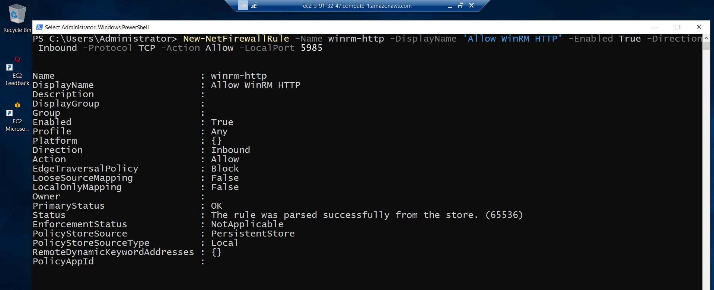 
    <figcaption>Imagem 06.</figcaption>
</figure>
 

Na maquina local **Windows** foi necessário adicionar a instância ao arquivos de hosts confiáveis e isso foi feito com o comando `Set-Item WSMan:\localhost\Client\TrustedHosts -Value "3.91.32.47"`, passando como valor o IP ou DNS público da instância, em outros casos poderia ser até o nome da maquina, mas como estava sendo realizada com instâncias EC2 tinha que ser o IP ou DNS público. Ao executar esse comando, o arquivo era sempre substituído, para que fosse adicionado, mantendo o que já existia no arquivo, tinha que ser acrescentado ao comando o parâmetro `-Concatenate`, ficando da seguinte forma `Set-Item WSMan:\localhost\Client\TrustedHosts -Value "3.91.32.47" -Concatenate`. Com o comando `Get-Item WSMan:\localhost\Client\TrustedHosts` os hosts confiáveis definidos no arquivo eram listados. Em seguida, foi realizado um teste de conexão para verificar se a maquina local conseguia se comunicar com a instância e isso foi feito com o comando `Test-NetConnection -ComputerName 3.91.32.47 -Port 5985` passando o IP público da instância e a porta `5985`, porta padrão do *WinRM* para o protocolo `HTTP`. Essa porta já estava liberada tanto no grupo de segurança da instância como no firewall do **Windows Server** dessa mesma instância, que era o **Windows Defender Firewall**. A imagem 07 lista as maquinas no arquivo de hosts confiáveis e mostra a conexão bem sucedida da maquina física com a instância.

<figure>
    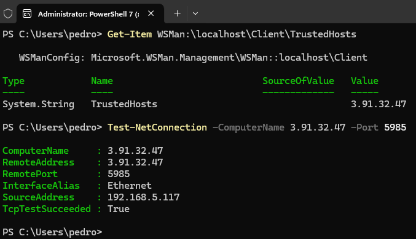 
    <figcaption>Imagem 07.</figcaption>
</figure>
 

Agora foi só executar o comando `Invoke-Command -ComputerName 3.91.32.47 -Credential administrator -ScriptBlock { Get-HotFix -Id KB5012170 }` para executar o comando `Get-HotFix -Id KB5012170` dentro da instância pelo **PowerShell** da maquina física. Como eram duas maquinas de domínios diferentes, inclusive nenhuma delas tinham um domínio, foi necessário passar o parâmetro `-Credential administrator` informando o nome de domínio concatenado com `/` e o nome de usuário. Como neste caso, a instância não possuía um domínio, foi passado direto o nome de usuário. Em ambos os casos, uma senha era solicitada que era a mesma senha gerada lá no console da **AWS** pelo navegador da maquina física originado da desemcriptação do arquivo par de chaves `keyPairUniversal`. Esta senha tinha sido utilizada para realizar o acesso remoto gráfico. Se as maquinas fossem do mesmo domínio, não era necessário o parâmetro `-Credential`. A imagem 08 exibe a execução do comando dentro da instância pelo **PowerShell** da maquina física.

<figure>
    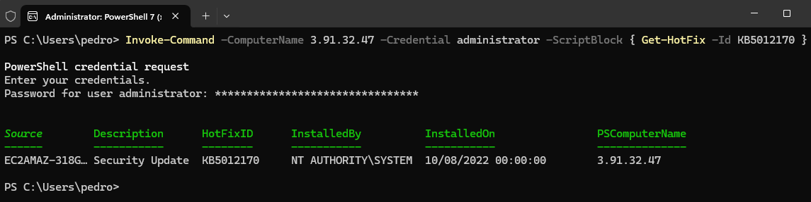 
    <figcaption>Imagem 08.</figcaption>
</figure>
 

Com o comando `Enter-PSSession -ComputerName 3.91.32.47 -Credential administrator` ao invés de executar um comando na instância, foi iniciada uma sessão nela pelo **PowerShell** da maquina física. O parâmetro `-Credential` funciona da mesma forma do comando anterior, se fossem maquinas do mesmo domínio não era necessário usar. Também foi necessário informar a senha para credenciamento deste usuário que foi a mesma senha gerada no console da **AWS** em `RDP Client`. Na imagem 09 é exibido essa conexão da maquina física com a instância do EC2.

<figure>
    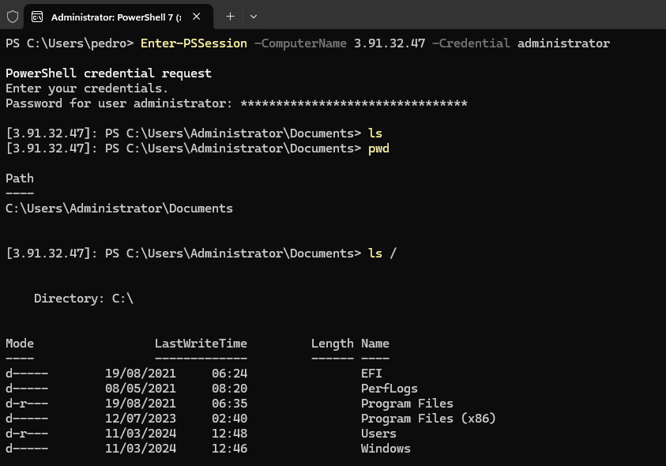 
    <figcaption>Imagem 09.</figcaption>
</figure>
 

Para não ter que informar a senha toda hora ao entrar em uma sessão, pode ser criada uma sessão já com uma configuração determinada através do comando `New-PSSession -ComputerName 3.91.32.47 -Credential administrator`. Isso que é chamado de sessão persistente, que são sessões pré-configuradas e que podem ser utilizadas para realizar tanto o acesso remoto como a execução de comandos remotos com o `Invoke-Command`. Então com o comando `Get-PSSession` todas as sessões já configuradas são listadas e o acesso remoto pode ser executado com o comando `Enter-PSSession -Id` passando o Id da sessão nessa lista. O parâmetro `-Credential` funciona da mesma maneira que os comandos anteriores, ele é sempre utilizado quando as maquinas forem de domínios diferentes ou não tiverem domínios, para autenticar o usuário que está realizando o acesso remoto. Para excluir da lista uma sessão configurada foi só utilizar o comando `Remove-PSSession -Id` com o Id dessa sessão na lista. Já para sair de uma sessão, o comando era `Exit-PSSession`. Na imagem 10 é possível visualizar algumas dessas execuções.

<figure>
    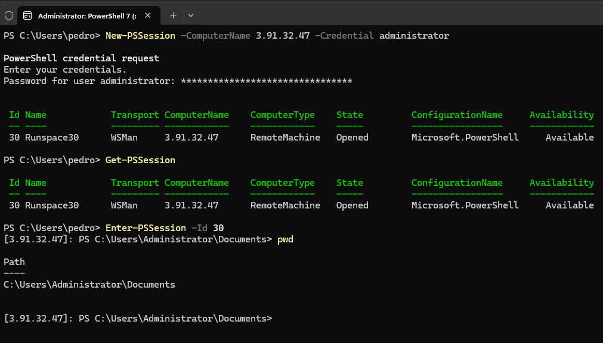 
    <figcaption>Imagem 10.</figcaption>
</figure>
 

Também foi possível criar uma sessão no **Windows PowerShell ISE**, clicando na opção `Nova Guia do PowerShell Remota`. Uma caixa era aberta solicitando o computador e o nome de usuário que eram o IP ou DNS público da instância e `administrator`. Ao confirmar, a mesma senha gerada no console da **AWS** pelo arquivo par de chaves `.pem` era solicitada. Após isso, o terminal do ISE era aberto na sessão remota. A imagem 11 ilustra essa etapa.

<figure>
    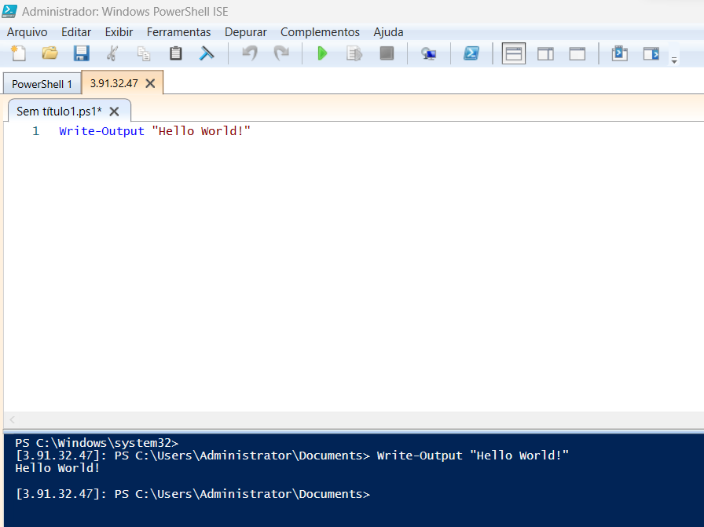 
    <figcaption>Imagem 11.</figcaption>
</figure>
 

Também tem o software **Server Manager**, exclusivo do **Windows Server**, que possui interface gráfica e serve para gerenciar servidores, possibilitando realizar acessos remotos via **PowerShell**.

<a name="item04.02"><h4>4.2 Sessão persistente usando PSSession, Invoke-Command e Jobs</h4></a>[Back to summary](#item04)

Nesta aula foi construído um arquivo de script de nome [persistent_session.ps1](./resources/persistent_session.ps1), dentro da sub-pasta `resources`. Neste arquivo foi criada uma sessão com a instância para funcionar como sessão persistente. As sessões persistentes são importantes na execução de scripts de longa duração, é possível manter as sessões em execução mesmo com falhas na rede. Em seguida, foi invocado um comando para que a sessão executasse. Esse comando foi definido como um job de nome `LongoTrabalho`. Ainda no script, alguns comandos foram executados para realizar ações na instância do EC2. O primeiro deles foi o `Get-PSSession` para listar as sessões existentes. Em seguida foram executados os comandos `Get-Job -Name LongoTrabalho` para exibir o job que estava em execução na instância e `Get-Job -Name LongoTrabalho | Receive-Job -Keep` para receber os resultados desse job. Após isso, a sessão foi desconectada com o comando `Disconnect-PSSession $s`, onde `$s` era definido no início do script como a sessão criada (`$s = New-PSSession -ComputerName 3.91.32.47 -Credential administrator`). Depois foi executado o comando `Receive-PSSession -Session $s` para visualizar que mesmo desconectado da sessão, o job continuava trabalhando. O job foi interrompido com o comando `Get-Job -Name LongoTrabalho | Stop-Job`, removido com o comando `Remove-Job -Name LongoTrabalho` e a sessão removida com o comando `Remove-PSSession $s`. Esse arquivo foi executado no **Visual Studio Code (VS Code)** e a execução dele é mostrada nas imagens 12 e 13 abaixo. Não consegui compreender porque não conseguia visualizar o job em execução nos outros acessos remotos pelo **PowerShell** da maquina física e pelo **RDP Client**.

<figure>
    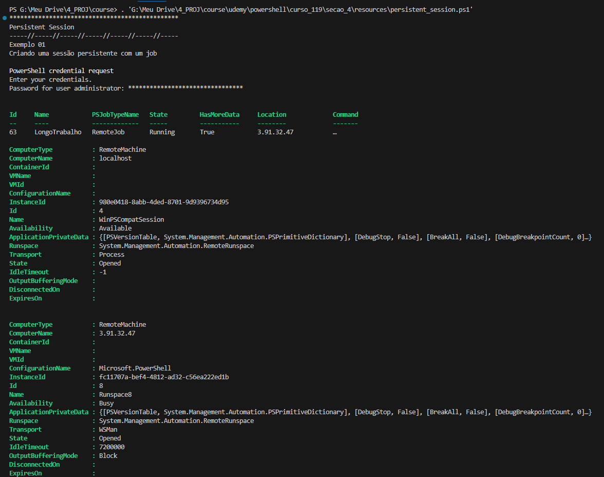 
    <figcaption>Imagem 12.</figcaption>
</figure>
 

<figure>
    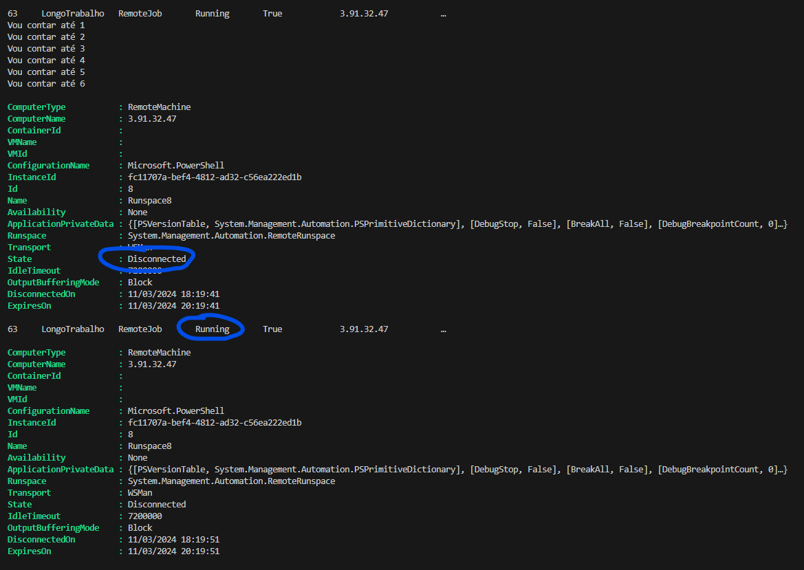 
    <figcaption>Imagem 13.</figcaption>
</figure>
 

<a name="item04.03"><h4>4.3 PowerShell Remoto usando maquina fora do Domínio</h4></a>[Back to summary](#item04)

Na aula 1 deste módulo foi explicado como realizar o acesso remoto em maquinas de domínios diferentes. Mas para recapitular, foi preciso habilitar o `PSRemoting` nas duas maquinas, criar as regras no firewall e no grupo de segurança liberando a porta `5985`, adicionar a maquina de destino ao arquivo de hosts confiáveis na maquina local, testar a conexão entre as maquinas e se tiver tudo certo, executar o comando o `Invoke-Command` para executar um comando ou criar uma sessão com o `PSSession`.

A grande diferença em relação ao acesso remoto de maquinas de mesmo domínio para maquinas de domínios diferentes é a autenticação. Quando elas são do mesmo domínio não é necessário informar credenciais, pois são maquinas confiáveis e que fazem parte do mesmo grupo de maquinas. Já quando são de domínios diferentes ou não possuem domínio, são maquinas desconhecidas e é necessário autenticar através de credenciais. A autenticação é feita adicionando o parâmetro `-Credential domain/user` passando o nome de domínio e usuário da maquina que deseja-se acessar remotamente. Caso essa maquina não possua domínio, pode ser informado o nome de usuário direto. Neste dois casos, será solicitado uma senha referente a esse usuário.

A obtenção da senha é realizada no **AWS Console Management**, no serviço **Amazon Elastic Compute Cloud (EC2)**, selecionando a instância que deseja-se conectar e clicando na opção `Connect to instance` ou `Connect`. Uma nova página será aberta com três abas cada uma com uma forma de conexão. A utilizada neste caso foi a opção `RDP client` que serve tanto para acesso remoto via software **Remote Desktop Protocol client (RDP client)** como também para acesso via **PowerShell**. Nesta aba, foi clicado na opção `Get password` para ir para uma outra página. Na opção `Browse` foi aberto uma janela do **Windows** para selecionar um arquivo par de chaves `.pem`, a chave escolhida foi a padrão utilizada em meus projetos (`keyPairUniversal`). Após confirmar a **AWS** converte essa chave em uma senha que é utilizada para autenticar o usuário.

<a name="item04.04"><h4>4.4 Salvando credenciais para scripts de acesso remoto</h4></a>[Back to summary](#item04)

O foco desta aula foi mostrar a utilização do comando `Get-Credential administrator` que uma vez executado, pôde ser comentado. Na primeira execução ele solicitava a senha que era armazenada em uma variável e utilizada no parâmetro `-Credential`. Assim, evitava ter que informar toda hora a senha. Para evidenciar a execução foi construído o arquivo [credential.ps1](./resources/credential.ps1) que criava uma sessão com a variável de credencial, executava um comando e após isso removia a sessão. Na imagem 14 é mostrado o output desse arquivo. Observe que a senha não foi solicitada, pois já tinha sido informada na primeira vez, por isso que o comando estava até comentado, para que não fosse solicitada a senha novamente. Note também que o parâmetro `-ComputerName` trouxe o Ip público da instância a partir do arquivo [servers.txt](./resources/servers.txt) que tinha apenas um IP, mas se houvesse várias maquinas, várias conexões a maquinas diferentes seriam realizadas e o mesmo comando seria executado, uma ótima forma de automatizar os processos.

<figure>
    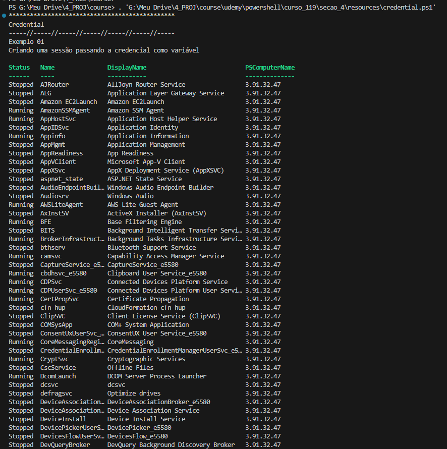 
    <figcaption>Imagem 14.</figcaption>
</figure>
 

<a name="item04.05"><h4>4.5 Acessando o PowerShell através da WEB com o PSWA</h4></a>[Back to summary](#item04)

Nesta aula foi realizado alguns procedimentos para conseguir acessar remotamente com o **PowerShell Web Access** a maquina instanciada na cloud da **AWS**. Para isso, dentro do acesso remoto gráfico realizado da maquina física na instância, foi executado alguns comandos no **PowerShell**. O primeiro deles foi o `Install-WindowsFeature -Name WindowsPowerShellWebAccess -IncludeManagementTools` que instalou a feature `WindowsPowerShellWebAccess` junto com as ferramentas de gerenciamento associadas a essa funcionalidade. Para confirmar que foi instalado, foi executado o comando `Get-WindowsFeature -Name WindowsPowerShellWebAccess`. Em seguida, foi utilizado o comando `Install-PswaWebApplication -WebApplicationName PSWA -UseTestCertificate` que instalou uma aplicação web para o **Windows PowerShell Web Access (PSWA)**, indicando um nome para essa aplicação e um certificado de teste que deveria ser utilizado. Após isso, ainda na instância, foi aberto o software **Internet Information Services (IIS) Manager** e verificado a aplicação web desenvolvida, conforme visualizado na imagem 15.

<figure>
    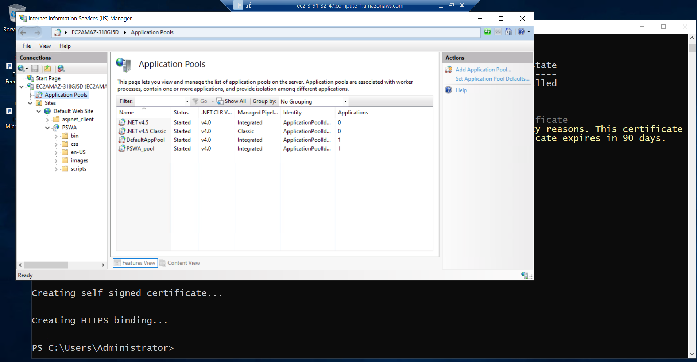 
    <figcaption>Imagem 15.</figcaption>
</figure>
 

Com o comando `Add-PswaAuthorizationRule -ComputerGroupName * -ConfigurationName * -UserGroupName *` uma regra era elaborada para permitir que qualquer pessoa acessasse o **PowerShell** com o **PWSA**. Essa regra foi exibida com o comando `Get-PswaAuthorizationRule` que listava todas as regras referentes ao **PWSA**. A imagem 16 evidencia a criação da aplicação web e da regra de acesso. Também foi preciso criar uma regra de entrada no grupo de segurança vinculado a essa instância do EC2, permitindo acesso na porta `443` que é referente ao protocolo `HTTPS`, utilizado pelo **PWSA**. Após isso, foi acessado no navegador da maquina física a seguinte URL `https://107.21.78.102/PSWA`. Infelizmente não foi possível acessar, pois a aplicação web no **IIS Manager** utilizava um certificado de teste para permitir a conexão no protocolo `HTTPS`, contudo os navegadores atuais não conseguem certificar esse tipo de certificado. Neste caso seria necessário criar um certificado real para a aplicação. Mesmo tentando realizar o acesso pelo `HTTP`, construindo uma outra regra liberando a porta `80` no security group da instância, e configurando para que a aplicação funcione pelo `HTTP`. A janela com o login até abria, mas não permitia interagir com o formulário, informando que a aplicação requer o protocolo SSL e conexão `HTTPS`, conforme mostrado na imagem 17.

<figure>
    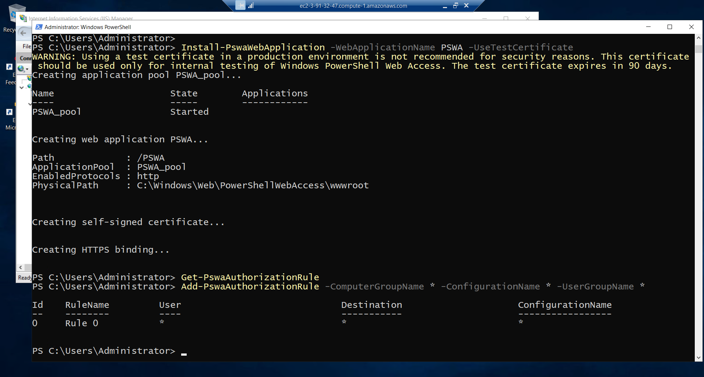 
    <figcaption>Imagem 16.</figcaption>
</figure>
 

<figure>
    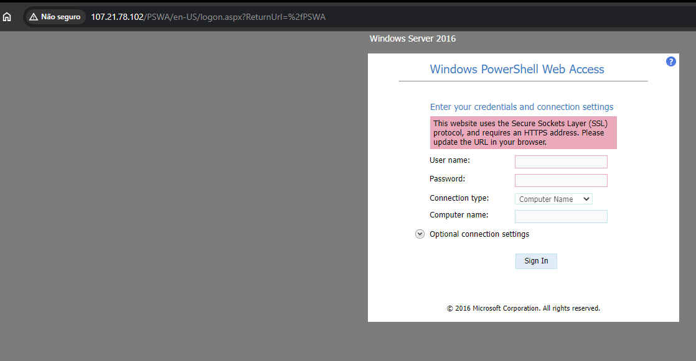 
    <figcaption>Imagem 17.</figcaption>
</figure>
 

<a name="item04.06"><h4>4.6 Renomear Computador</h4></a>[Back to summary](#item04)

O `Get-WmiObject` é utilizado para recuperar informações de classes do **Windows Management Instrumentation (WMI)**. O **Windows Management Instrumentation (WMI)** é uma infraestrutura da **Microsoft** para gerenciamento de sistemas operacionais **Windows**. Ele fornece uma interface padrão para acessar e manipular informações sobre o estado e configuração do sistema operacional, hardware, redes e outros recursos do **Windows**. O WMI permite que administradores de sistemas e desenvolvedores obtenham dados, configurem configurações e realizem tarefas administrativas remotamente em máquinas **Windows**. 

Com o comando `Get-WmiObject -Class Win32_ComputerSystem` foi utilizado a classe `Win32_ComputerSystem` que mostrava as informações do computador, sendo uma delas o nome da maquina. Para armazenar essas informações poderiam ser utilizado uma variável, ficando da seguinte forma `$info = Get-WmiObject -Class Win32_ComputerSystem`. Então, com essa variável era possível consultar as propriedades dessa classe, para verificar o nome da maquina por exemplo, o comando era o `$info.Name`. Já para renomear a maquina, o comando foi o `$info.Rename("WSPOSH")`. Neste caso, foi preciso reiniciar o computador com o comando `Restart-Computer`. O nome do computador também pode ser exibido com o comando `Hostname`. A imagem 18 ilustra a renomeação da maquina **Windows Server** na instância do EC2. Aqui tem que ter atenção, pois ao reiniciar, a conexão do **RDP Client** foi perdida e ao tentar se conectar novamente, o nome do host, que tem o nome da maquina na frente, teve que ser alterado para `WSPOSH\Administrator`. Acredito que quando a maquina não está em um domínio, no lugar do nome de domínio é o nome da maquina concatenando com o nome do usuário que no caso era `Administrator`.

<figure>
    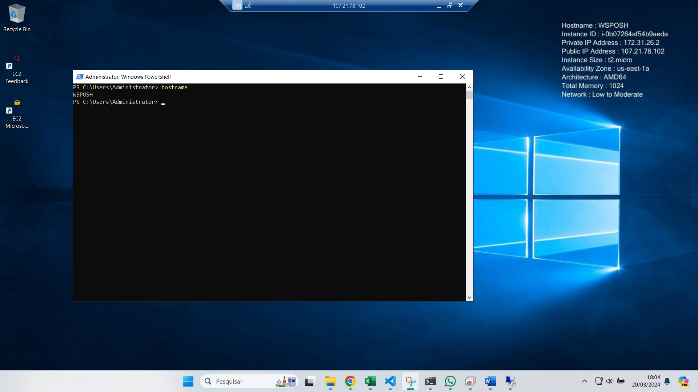 
    <figcaption>Imagem 18.</figcaption>
</figure>
 

<a name="item04.07"><h4>4.7 Alterar endereço IP e adicionar computador ao domínio do Active Directory</h4></a>[Back to summary](#item04)

O comando `Get-NetIPConfiguration` exibiu as configurações de todas interfaces de rede da maquina, é similar ao comando `ipconfig`. Já com o comando `Get-NetIPAddress` foi mostrado todos os endereços de IPs das interfaces de rede e suas configurações. Para criar uma nova interface de rede foi utilizado o comando `New-NetIPAddress 192.168.1.102 -InterfaceAlias Ethernet1 -DefaultGateway 192.168.1.1 -AddressFamily IPv4 -PrefixLength 24` informando o novo endereço IP, um apelido para interface que no caso foi `Ethernet`, o gateway padrão, a família de endereços IP e o comprimento do prefixo de máscara de sub-rede para o endereço de IP configurado. Em seguida, foi utilizado o comando `Set-DnsClientServerAddress -InterfaceAlias Ethernet -ServerAddresses 192.168.1.123` que configurou o endereço do servidor DNS na interface de rede construída.

Após isso, foi preciso habilitar o DHCP que foi realizado com o comando `Set-NetIPInterface -InterfaceAlias Ethernet -Dhcp Enabled`. Já o comando `Set-DnsClientServerAddress -InterfaceAlias Ethernet -ResetServerAddresses` foi utilizado para redefinir os servidores DNS configurados da interface de rede determinada, no caso a `Ethernet` que tinha sido criada. Por fim, para adicionar a maquina ao domínio, foi utilizado o comando `Add-Computer -ComputerName WSPOSH -DomainName "Mcsesolution.local" -Restart`, passando o nome de usuário (`Administrator`) e a senha gerada no console da **AWS**. Para adicionar um computador ao domínio era necessário que o **Active Directory Domain Server (ADDS)** estivesse instalado.

<a name="item04.08"><h4>4.8 Gerenciando o Active Directory</h4></a>[Back to summary](#item04)

Neste curso foi explicado alguns comandos básicos do **PowerShell** para o software **Active Directory Domain Server (ADDS)**. O principal deles foi o `Get-Command -Module ActiveDirectory` que listou todos os comandos do módulo do ADDS para **PowerShell**. Foi necessário ter instalado este módulo. Com o comando `New-ADUser Curso.POSH` um usuário de nome determinado era criado, enquanto com o comando `Get-ADUser Curso.POSH`, as informações desse usuário eram exibidas. Já com o comando `Get-ADUser Curso.POSH -Properties LastLogonDate`, era exibida apenas a propriedade de última data de logon do usuário criado.

Para realizar filtros foi utilizado o comando `Get-ADUser -Filter * | Where {$_.Enabled -eq $false}` que listava todos os usuários, exibindo apenas os não habilitados. Com o comando `Get-ADUser -Filter * | Export-Csv c:\User\Administrator`, a lista com todos os usuários foi exportada para um arquivo **CSV**. Com o comando `Get-ADUser -Filter * -Properties * | Select -Property DisplayName` foi extraído de todos os usuários todas suas propriedades, selecionando apenas a propriedade `DisplayName`. Por fim, o usuário foi removido com o comando `Remove-ADUser Curso.POSH`.

Esse curso forneceu informações bem básicas sobre essas configurações de rede e sobre o ADDS, como o foco principal era o **PowerShell** decidi não aprofundar muito e por tanto esses comandos, dessas duas últimas aulas não foram totalmente executados. Deixei para abordar esse assunto do Active Directory em um curso específico dele.