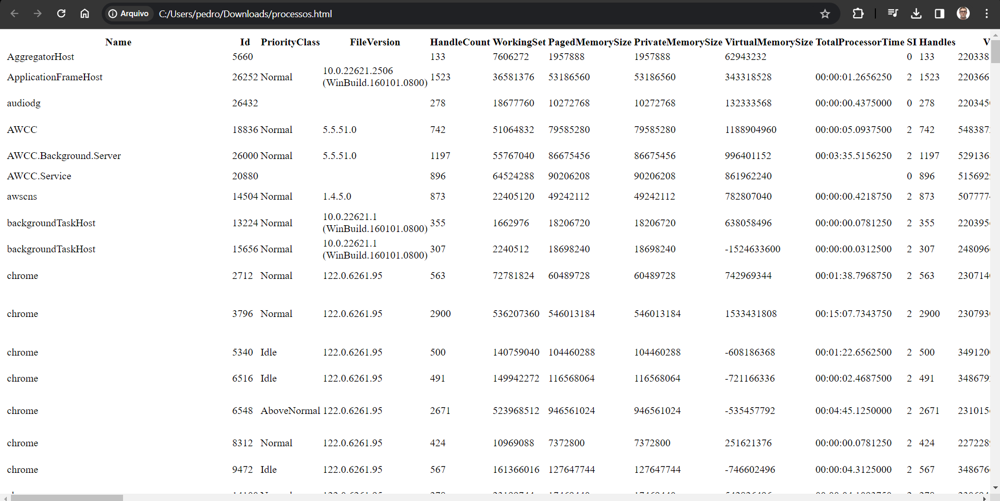

# Aprenda PowerShell do zero - Módulo 4   

### Repository: [course](../../../)
### Platform: <a href="../../">udemy   </a>
### Software/Subject: <a href="../">powershell   </a>
### Course: <a href="./">curso_119 (Aprenda PowerShell do zero)   </a>
### Module: 4. Seção 4: Gerenciamento com PowerShell

---

### Theme:
- Programming
- Shell Script

### Used Tools:
- Operating System (OS): 
  - Windows 11 
- Cloud:
  - Amazon Web Services (AWS)   
- Cloud Services:
  - Amazon Elastic Compute Cloud (EC2)   
  - Google Drive 
- Language:
  - HTML   
  - Markdown   
- Integrated Development Environment (IDE) and Text Editor:
  - Visual Studio Code (VS Code)   
  - Windows PowerShell ISE   
- Versioning: 
  - Git   
- Repository:
  - GitHub   
- Command Line Interpreter (CLI):
  - AWS Command Line Interface (CLI)   
  - Windows PowerShell   

---

### Course Module 4 Strcuture:
4. <a href="#item04">Seção 4: Gerenciamento com PowerShell</a> 
  4.1 <a href="#item04.01">Executando o PowerShell remotamente</a> 
  4.2 <a href="#item04.02">Sessão persistente usando PSSession, Invoke-Command e Jobs</a> 
  4.3 <a href="#item04.03">PowerShell Remoto usando maquina fora do Domínio</a> 
  4.4 <a href="#item04.04">Salvando credenciais para scripts de acesso remoto</a> 
  4.5 <a href="#item04.05">Acessando o PowerShell através da WEB com o PSWA</a> 
  4.6 <a href="#item04.06">Renomear Computador</a> 
  4.7 <a href="#item04.07">Alterar endereço IP e adicionar computador ao domínio do Active Directory</a> 
  4.8 <a href="#item04.08">Gerenciando o Active Directory</a> 
  4.9 Módulos do PowerShell 

---

### Objective:
O objetivo desse primeiro módulo do curso foi apresentar o essencial do **Windows PowerShell**, explicando alguns conceitos básicos e mostrando alguns comandos. Também foi apresentado o **Windows PowerShell ISE** que é uma Interface Development Environment (IDE) para construção de scripts em **PowerShell**.

### Structure:
A estrutura deste módulo é formada por:
- Este arquivo de README.md.

<figure>
     
    <figcaption>Imagem 01.</figcaption>
</figure>
 

### Development:
O desenvolvimento deste módulo do curso foi dividido em oito aulas. Abaixo é explicado o que foi desenvolvido em cada uma dessas aulas.

<a name="item04.01"><h4>4.1 Executando o PowerShell remotamente</h4></a>[Back to summary](#item04)

<a name="item04.02"><h4>4.2 Sessão persistente usando PSSession, Invoke-Command e Jobs</h4></a>[Back to summary](#item04)

<a name="item04.03"><h4>4.3 PowerShell Remoto usando maquina fora do Domínio</h4></a>[Back to summary](#item04)

<a name="item04.04"><h4>4.4 Salvando credenciais para scripts de acesso remoto</h4></a>[Back to summary](#item04)

<a name="item04.05"><h4>4.5 Acessando o PowerShell através da WEB com o PSWA</h4></a>[Back to summary](#item04)

<figure>
     
    <figcaption>Imagem 02.</figcaption>
</figure>
 

<a name="item04.06"><h4>4.6 Renomear Computador</h4></a>[Back to summary](#item04)

<a name="item04.07"><h4>4.7 Alterar endereço IP e adicionar computador ao domínio do Active Directory</h4></a>[Back to summary](#item04)

<a name="item04.08"><h4>4.8 Gerenciando o Active Directory</h4></a>[Back to summary](#item04)