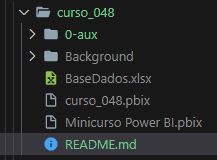
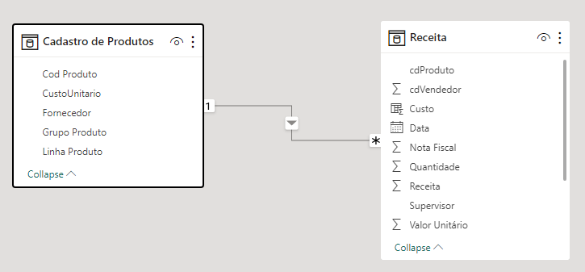
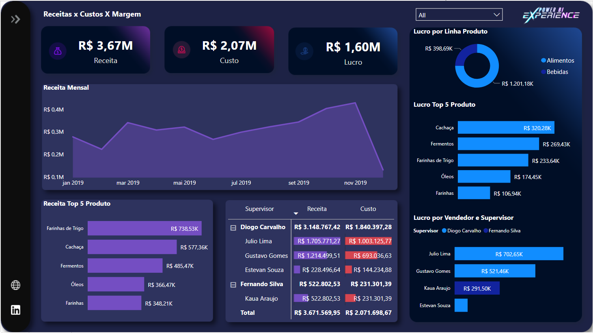

# Minicurso Power BI Experience   

### Repository: [course](../../../)   
### Platform: <a href="../../">xperiun   </a>   
### Software/Subject: <a href="../">power_bi   </a>
### Course: <a href="./">curso_048 (Minicurso Power BI Experience)   </a>

#### <a href="https://app.powerbi.com/view?r=eyJrIjoiMTRkM2IyZmMtYmE4Ni00MGZmLWFkNmQtZDMwYzNmNzk3OGRjIiwidCI6ImI1NTJmZWJlLWFkMjgtNGI4Ny1iZjI5LTFlODhiYmZkY2I4ZiJ9">Power BI Report</a>
##### Para conferir outros reports e dashboards de outros projetos consulte meu repositório principal na sub-pasta de report clicando [aqui](https://github.com/PedroHeeger/main/tree/main/report).

---

### Theme:
- Data Analysis
- Business Intelligence (BI)

### Used Tools:
- BI Tool: 
  - Power BI   
  - Power Query 
- Integrated Development Environment (IDE):
  - VS Code   
- Versioning: 
  - Git   
- Repository:
  - GitHub   
- Others:
  - Google Drive 
  - Excel 
  - Looka 
  - PowerPoint 
  - Linguagem M e Expressões DAX

---

### Objective:
O objetivo desse projeto prático foi construir um report em **Power BI**, com modo dark e light, para análises das **vendas** de uma empresa em um cenário hipotético.

### Structure:
A estrutura (Imagem 01) desse projeto é formada por:
- Uma arquivo em **Power BI** para construção do report.
- Um arquivo em **Excel** com a base de dados em duas abas (**Receita** e **Cadastro de Produtos**).
- Uma pasta (**Background**) com um arquivo de **PowerPoint** para construção do layout,  imagens de plano de fundo em **PNG** para os dois modos (dark e light) .
- A pasta **0-aux**, pasta auxiliar com imagens utilizadas na construção desse arquivo de README. 
- Obs.: A logomarca do curso foi criada apenas para fins didáticos, utilizando o site de inteligência artificial **Looka**.

<div align="Center"><figure>
    <br>
    <figcaption>Imagem 01.</figcaption>
</figure></div><br>

### Development:
O projeto foi realizado em formato de minicurso com oito aulas. As estruturas de dados da aba **Receita** era formada pelas colunas: **Data**, **Nota Fiscal**, **cdProduto**, **Vendedor**, **Supervisor**, **Quantidade** e **Valor Unitário**. Já a aba **Cadastro de Produtos** continha: **Cod Produto**, **Grupo Produto**, **Linha Produto**, **Fornecedor** e **CustoUnitario**. Essas duas abas da base de dados originaram duas Queries, de mesmo nome das abas em **Excel**, no **Power Query** em um processo de **ETL** (Extração, Transformação e Carregamento).

A consulta **Receita** iniciou a etapa de transformação com a promoção da primeira linha como cabeçalho, porém não era a linha correta para o cabeçalho, então teve que remover a as linhas 2 e 3 e promover novamente, para que a quarta linha tornasse o cabeçalho da Query. Durante toda essa etapa foram realizados definições dos tipos de dados das colunas para que eles representassem exatamente o que eram. Linhas e colunas em branco foram excluídas. Na coluna **Data** foi extraído apenas a data descartando o horário. Foi adicionado uma nova coluna de nome **Receita** que calculava a multiplicação da coluna **Quantidade** pelo **Valor Unitário** obtendo o valor faturado em cada venda. Por fim, a consulta foi ordenada pela coluna de **Data**. Já na Query **Cadastro de Produtos** só foi realizado a promoção da primeira linha como cabeçalho e a definição dos tipos de dados das colunas.

Com as transformações finalizadas, os dados foram carregados para suas respectivas tabelas no **Power BI**. Essas tabelas possuíam os mesmos nomes das Queries, sendo **Receita** uma **tabela fato** e **Cadastro de Produtos** uma **tabela dimensão**. Como as colunas **cdProduto** da tabela fato e **Cod Produto** da tabela dimensão não foram relacionadas automaticamente, foi necessário relacioná-las. A modelagem de dados é apresentada na imagem 02 abaixo.

<div align="Center"><figure>
    <br>
    <figcaption>Imagem 02.</figcaption>
</figure></div><br>

Ainda na etapa de modelagem dos dados, foram criadas três medidas e uma coluna calculada com o uso das **Expressões DAX**. A nova coluna (**Custo**) operava uma multiplicação entre as colunas **CustoUnitario** da tabela dimensão e **Quantidade** da tabela fato. A seguir é exibida a expressão de origem desta coluna.

```
Custo = RELATED('Cadastro de Produtos'[CustoUnitario]) * Receita[Quantidade]
```

A medida **Total Notas** contabiliza a quantidade de notas fiscais diferentes na tabela **Receita**. Já a medida **Lucro** subtraí a coluna **Receita** pela coluna **Custo**. Com o lucro, é determinado a margem bruta (**% Margem**), ou seja, quanto o lucro representa da receita. Essas três medidas e a coluna calculada são armazenadas na pasta **Calculations** dentro da tabela fato.

```
Total Notas = DISTINCTCOUNT(Receita[Nota Fiscal])
```

```
Lucro = sum(Receita[Receita]) - sum(Receita[Custo])
```

```
Margem % = DIVIDE([Margem], sum(Receita[Receita]), 0)
```

Na elaboração do report foram criadas duas páginas, uma para o modo **Dark** e outra para o modo **Light**. O layout dessas páginas foi desenvolvido no **PowerPoint**, sendo exportado como imagem e aplicado para cada uma delas. A montagem dos visuais e recursos são idênticas entre os dois modos. A página do relatório é composta por três visuas de cartão exibindo a **Receita**, o **Custo** e o **Lucro**. Foram inseridos também, cinco gráficos, para realização das seguintes análises: **Análise da Receita Mensal** (Gráfico de Área), **Análise da Receita dos 5 Primeiros Produtos** (Gráfico de Barra), **Análise da Receita e Custo por Vendedor e Supervisor** (Visual de Matriz), **Análise do Lucro por Linha de Produto** (Gráfico de Rosca), **Análise do Lucro dos 5 Primeiros Produtos** (Gráfico de Barra) e **Análise da Lucro por Vendedor e Supervisor**. Além dos visuais, foi adicionado uma segmentação de dados para filtragem por **Mês**. Três botões em branco foram criados em cima dos ícones da painel lateral esquerdo do report, os dois últimos para acesso via web das minhas redes sociais (**GitHub** e **Linkedin**), e o botão superior para alternar o modo de exibição entre **Dark** e **Light**. Os modos de exibição deste report é ilustrado abaixo, através das imagens 03 (**Dark**) e 04 (**Light**).

<div align="Center"><figure>
    <a href="https://app.powerbi.com/view?r=eyJrIjoiMTRkM2IyZmMtYmE4Ni00MGZmLWFkNmQtZDMwYzNmNzk3OGRjIiwidCI6ImI1NTJmZWJlLWFkMjgtNGI4Ny1iZjI5LTFlODhiYmZkY2I4ZiJ9"><br>
    <figcaption>Imagem 03: Report Vendas Modo Dark.</figcaption></a>
</figure></div><br>

<div align="Center"><figure>
    <a href="https://app.powerbi.com/view?r=eyJrIjoiMTRkM2IyZmMtYmE4Ni00MGZmLWFkNmQtZDMwYzNmNzk3OGRjIiwidCI6ImI1NTJmZWJlLWFkMjgtNGI4Ny1iZjI5LTFlODhiYmZkY2I4ZiJ9"><br>
    <figcaption>Imagem 04: Report Vendas Modo Light.</figcaption></a>
</figure></div><br>