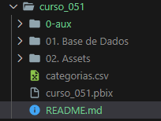
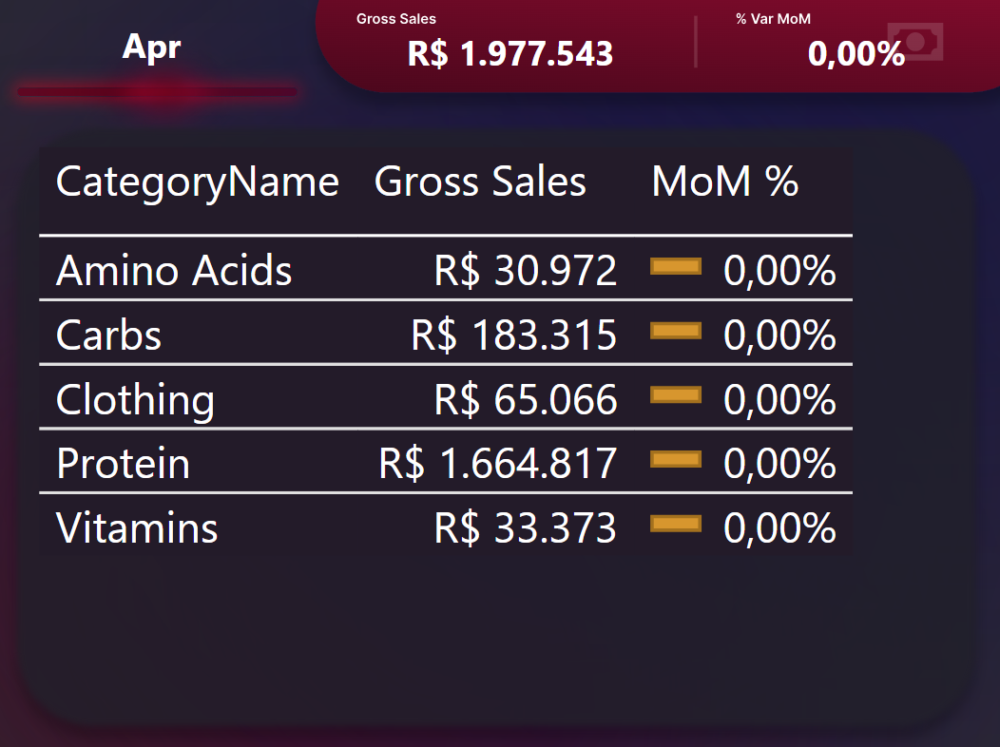
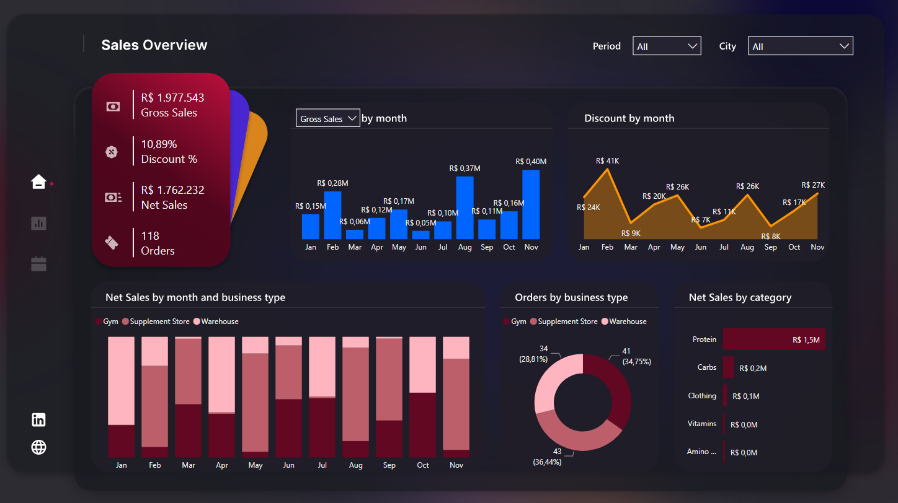

# Desafio Missão ZERO - Bootcamp HPN   

### Repository: [course](../../../)   
### Platform: <a href="../../">xperiun   </a>   
### Software/Subject: <a href="../">power_bi   </a>
### Course: <a href="./">curso_051 (Desafio Missão ZERO - Bootcamp HPN)   </a>

#### <a href="https://app.powerbi.com/view?r=eyJrIjoiNTM1OGExYTItMjYwNi00ZWY1LThiMTAtODYyMmJlNWY2NDU3IiwidCI6ImI1NTJmZWJlLWFkMjgtNGI4Ny1iZjI5LTFlODhiYmZkY2I4ZiJ9">Power BI Report</a>
##### Para conferir outros reports e dashboards de outros projetos consulte meu repositório principal na sub-pasta de report clicando [aqui](https://github.com/PedroHeeger/main/tree/main/report).

---

### Theme:
- Data Analysis

### Used Tools:
- BI Tool: 
  - Power BI   
  - Power Query 
- Integrated Development Environment (IDE):
  - VS Code   
- Versioning: 
  - Git   
- Repository:
  - GitHub   
- Others:
  - Google Drive 
  - Excel 
  - Looka 
  - Linguagem M e Expressões DAX

---

### Objective:
O objetivo desse projeto prático foi construir um report em **Power BI** para análises das **vendas** da empresa **Heavy Power Nutrition (HPN)**.

### Structure:
A estrutura (Imagem 01) desse projeto é formada por:
- Uma arquivo em **Power BI** para construção do report.
- Um arquivo em **Excel** com as **URLs** de imagens dos produtos da empresa que foram utilizadas no desenvolvimento do report.
- Uma pasta (**01. Base de Dados**) com dois arquivos de **Excel** que são a base de dados desse projeto.
- Uma pasta (**02. Assets**) com as imagens de plano de fundo em **SVG** desenvolvidas no **Figma**, um arquivo txt com link do projeto de plano de fundo no **Figma**, a logomarca da empresa e um arquivo **JSON** com o tema utilizado no **Power BI**.
- A pasta **0-aux**, pasta auxiliar com imagens utilizadas na construção desse arquivo de README. 
- Obs.: A logomarca do curso foi criada apenas para fins didáticos, utilizando o site de inteligência artificial **Looka**.

<div align="Center"><figure>
    <br>
    <figcaption>Imagem 01.</figcaption>
</figure></div><br>

### Development:
Este projeto foi desenvolvido em apenas uma aula e teve início com a extração dos dados do arquivo de base de dados pelo **Power Query**. Na base de dados tinha uma aba para cada mês do ano, logo doze abas com a mesma estrutura de dados. Os dados dessas abas originaram uma única Query chamada de **Sales**. Nesta consulta, os dados foram tratados no **Power Query** antes de serem enviados para o **Power BI**.

Também foi criado uma outra Query (**CategoryImage**) que recebeu as **URLs** de imagens dos produtos da empresa. Uma consulta vazia foi gerada para elaboração da tabela **Calendário** através da **Expressões DAX** `Calendar = CALENDARAUTO()`. Essas duas novas Queries, que são tabelas dimensão, foram relacionadas com a consulta **Sales** que é a tabela fato. Na imagem 02 a seguir, é apresentado a modelagem dos dados.

<div align="Center"><figure>
    <br>
    <figcaption>Imagem 02.</figcaption>
</figure></div><br>

As medidas foram calculadas, também em uma Query vazia, para servir como **tabela de Medidas**. As primeiras medidas criadas foram as cinco utilizadas na construção dos visuais de cartão, estas foram agrupadas em uma **pasta nomeada Main**. Nesta primeira medida abaixo, foi calculado da tabela **Sales** o total de receita bruta.

```
Gross Sales = SUMX(Sales, Sales[OrderQuantity]*Sales[UnitPrice])
```

A medida **Discount** foi criada para calcular o total de disconto realizado nos produtos e em seguida, foi executado o cálculo do percentual de desconto na medida **Discount %** em relação a receita bruta.

```
Discount = //Shift + Enter = Quebra Linha
SUMX(
    Sales,
    Sales[OrderQuantity] * Sales[UnitPrice] * Sales[Discount %]
)
```

```
Discount % = DIVIDE([Discount], [Gross Sales], 0)
```

O total de receita líquida (**Net Sales**) foi calculada com a subtração do total de receita bruta pelo total de desconto. Já a quantidade de pedidos (**Orders**) foi determinado pela quantidade de número de pedidos diferentes na tabela **Sales**.

```
Net Sales = [Gross Sales] - [Discount]
```

```
Orders = DISTINCTCOUNT(Sales[SalesOrderNumber])
```

Os dois primeiros gráficos construídos foram de linha do tempo, um de **Desconto por Mês** (Gráfico de Área) e outro com cinco métricas (**Receita Bruta**, **Receita Líquida**, **Número de Pedidos**, **Média do Preço Unitário** e **Volume de Pedidos**) por mês (Gráfico de Coluna), sendo possível alterar essas métricas por meio de uma segmentação de dados que funciona apenas para esse gráfico. A medida média do preço unitário (**Av. Unit Price**) foi calculada simplesmente com a média da coluna do preço unitário da tabela **Sales**. Já a medida de volume de pedidos (**Volume**) foi determinada pelo somatório da coluna quantidade de pedidos. Essas duas medidas também foram armazenadas na **pasta Main**

```
Av. Unit Price = AVERAGE(Sales[UnitPrice])
```

```
Volume = SUM(Sales[OrderQuantity])
```

Os outros três gráficos desenvolvidos foram **Receita Líquida por Mês e Tipo de Negócio** (Gráfico de Colunas Empilhadas), **Número de Pedidos por Tipo de Negócio** (Gráfico de Rosca) e **Receita Líquida por Categoria** (Gráfico de Barra). Foram inseridas duas segmentações de dados, uma para o **período** e outra para a **cidade**. 

O plano de fundo, que foi fornecido pela própria plataforma, foi desenvolvido no **Figma** e exportado para imagem em **SVG** sendo utilizado neste report. Este foi construído com um painel lateral para servir de menu contendo cinco icones para navegação entre as páginas do report e, também, para direcionar para sites na web. Para navegação na web foram inseridos dois butões um para direcionar para o linkedin e outro para o site da empresa, porém ao invés da empresa, coloquei meu **GitHub** pessoal. Já em relação a navegação entre as páginas do report, foram inseridos três botões para alternar entre as três páginas do report, as outras duas páginas (Page 1 e 2) são iguais a página atual (Page 3) só tem o layout diferente. 

Também foram elaboradas duas páginas para a construção do **Tooltip**. A primeira página de **Tooltip**, fez a utilização do visual de cartão e de tabela, exibindo as categorias de produtos por receita total e porcentagem da receita líquida em relação ao mês anterior. Para criação desta última medida, foi necessário criar outras duas medidas, essas foram armazenadas na pasta **Net Sales Specific**. A primeira a ser criada dessas três, foi **Net Sales PM** (receita líquida do mês anterior) que calculava o total da receita líquida do mês anterior em relação ao atual. A **Net Sales Dif** foi a segunda medida a ser elaborada, que calculava a diferença entre o total da receita líquida do mês atual e o total da receita líquida do mês anterior. Por fim, a medida que foi utilizada neste **Tooltip**, a **Net Sales Dif %**, que realizava o cálculo do percentual da diferença entre as receitas líquidas de um mês para o outro. 

```
Net Sales PM = 
CALCULATE(
    [Net Sales],
    PREVIOUSMONTH('Calendar'[Date])
)
```

```
Net Sales Dif = [Net Sales] - [Net Sales PM]
```

```
Net Sales Dif % = DIVIDE([Net Sales Dif], [Net Sales PM], 0)
```

O segundo **Tooltip** desenvolvido foi semelhante ao primeiro, porém ao invés do visual de tabela, neste foi utilizado o visual de **Simple Image**, onde utilizamos a **URL** das imagens dos produtos da empresa para exibi-lás. Abaixo é apresentado como ficou os dois **Tooltips**.

<div align="Center"><figure>
    
    
    <figcaption>Imagem 03 e 04: ToolTip 01 e 02.</figcaption>
</figure></div><br>

Na imagem 05, abaixo, é possível visualizar como ficou a página 3 do report.

<div align="Center"><figure>
    <a href="https://app.powerbi.com/view?r=eyJrIjoiNTM1OGExYTItMjYwNi00ZWY1LThiMTAtODYyMmJlNWY2NDU3IiwidCI6ImI1NTJmZWJlLWFkMjgtNGI4Ny1iZjI5LTFlODhiYmZkY2I4ZiJ9"><br>
    <figcaption>Imagem 05: Report Vendas.</figcaption></a>
</figure></div><br>