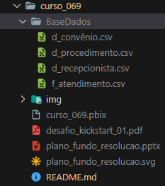
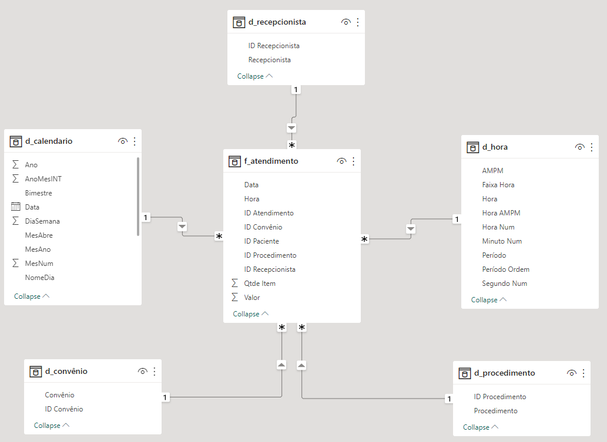
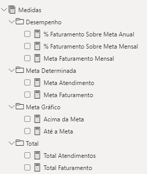

# Desafio Kickstart 1  | Atendimento Laboratorial   

### Repository: [course](../../../)   
### Platform: <a href="../../">xperiun   </a>   
### Software/Subject: <a href="../">power_bi   </a>
### Course: <a href="./">curso_069 (Desafio Kickstart 1  | Atendimento Laboratorial)   </a>

#### <a href="https://app.powerbi.com/view?r=eyJrIjoiOGUyZjM5ZmQtYzE4Yy00YTYxLTg0YzMtMjgzMTYyN2U0MDhiIiwidCI6ImI1NTJmZWJlLWFkMjgtNGI4Ny1iZjI5LTFlODhiYmZkY2I4ZiJ9">Power BI Report</a>
##### Para conferir outros reports e dashboards de outros projetos, consulte meu repositório principal na sub-pasta de report clicando [aqui](https://github.com/PedroHeeger/main/tree/main/report).

---

### Theme:
- Data Analysis

### Used Tools:
- BI Tool: 
  - Power BI   
  - Power Query 
- Integrated Development Environment (IDE):
  - VS Code   
- Versioning: 
  - Git   
- Repository:
  - GitHub   
- Others:
  - Google Drive 
  - Excel 
  - Brandmark 
  - Looka 
  - Linguagem M e Expressões DAX

---

### Objective:
- O objetivo desse projeto prático foi construir um report em **Power BI** para análises de dados de **atendimentos** de uma empresa fictícia de **laboratório**, chamada **HealthLab Laboratório**. Para essa análise foi levada em consideração duas metas determinadas, uma para faturamento (R$ 500 mil/mês) e outra para quantidade de atendimentos (3.000 /mês), de forma que fosse possível perceber rapidamente o desempenho do setor de atendimento do laboratório.

### Structure:
- A estrutura (Imagem 01) é composta por:
  -  Uma pasta com a base de dados que são quatro arquivos de **Excel** em CSV;
  -  Um arquivo em **PowerPoint** para criação do layout do report;
  -  Um arquivo de imagem **SVG** que é o layout do PowerPoint exportado;
  -  Um arquivo **PDF** com as instruções do Desafio;
  -  Uma pasta de imagens contendo dois arquivos de imagens, criados através de dois sites de IA para geração de logomarcas (**Brandmark** e **Looka**), além de imagens auxiliares na construção desse arquivo de README;
  -  Um arquivo de **Power BI** para construção do report.

<div align="Center"><figure>
    <br>
    <figcaption>Imagem 01.</figcaption>
</figure></div><br>

### Development:
Este projeto foi desenvolvido em apenas uma aula e iniciou com um pequeno processo de **ETL** (Extração, Transformação e Carregamento) dos dados no **Power Query**, dentro do Power BI. Foi realizado o carregamento dos quatros arquivos de **Excel** em CSV, que formam a base de dados no **Power Query**. Cada arquivo representando uma tabela, sendo três tabelas **dimensões** (d_convênio, d_procedimento, d_recepcionista) e uma tabela **fato** (f_atendimentos). Para as tabelas dimensões não foi necessário nenhuma transformação, enquanto na tabela fato a coluna **Data/Hora** foi dividida em duas, uma para **Data** e outro para **Hora**, para facilitar o trabalho durante a construção dos gráficos.

Ainda no editor do **Power Query**, foi construído duas consultas vazias para elaboração das tabelas dimensões **Calendário** e **Hora**. Essas tabelas foram criadas através de arquivos padrões de scritps em **Linguagem M**, sendo que esses arquivos não fazem parte do material do curso, foram utilizado apenas para copiar e colar o código. Finalizado o processo de transformação, as Queries foram carregadas para dentro do **Power BI** e em seguida foi realizado o relacionamento entre as tabelas em que o relacionamento não foi indentificado automaticamente pelo **Power BI**. Neste caso foram as tabelas dimensões criadas **Calendário** (d_calendario) e **Hora** (d_hora) que se relacionaram com a tabela fato através das colunas **Data** e **Hora**. A imagem 02 a seguir ilustra como ficou a modelagem dos dados.

<div align="Center"><figure>
    <br>
    <figcaption>Imagem 02.</figcaption>
</figure></div><br>

#### Creation of Measures:
  A próxima etapa foi a criação de uma tabela vazia para servir como tabela de medidas, onde foram armazenados todos os cálculos realizados através das **Expressões DAX** e separadas por pastas para melhorar a organização da tabela. As duas primeiras medidas criadas foram as metas determinadas, **Meta Faturamento** (R$ 500 mil/mês) e **Meta Atendimentos** (3.000 /mês), ambas dentro da pasta **Meta Determinada**.

    ```
    Meta Atendimento = 3000
    ```
         
    ```
    Meta Faturamento = 500000
    ```

  Dentro da pasta **Total** foi armazenada duas outras medidas, uma para o total de faturamento (**Total Faturamento**) e outra para o total de atendimentos (**Total Atendimentos**). No Total de Atendimentos foi utilizado o **DISTINCTCOUNT**, pois um mesmo atendimento a um mesmo paciente pode ter diversos procedimentos, porém é apenas um atendimento. O resultado de **Total Faturamento** foi apresentado no novo visual de cartão do Power BI.

    ```
    Total Faturamento = Sum(f_atendimento[Valor])
    ```
        
    ```
    Total Atendimentos = DISTINCTCOUNT(f_atendimento[ID Atendimento])
    ```

  Outra medida criada foi a **Meta Faturamento Mensal** que conta a quantidade diferente de **MesAno** (quantidade de meses em cada ano) da tabela **d_calendario** que está contida na tabela fato (**f_atendimento**). Com a quantidade de meses determinada, foi multiplicado pela medida **Meta Faturamento** que contém a meta de faturamento (R$ 500 mil/mês). Qualquer filtro em relação ao ano e mês vai interferir no cálculo da quantidade de meses e consequentemente na **Meta Faturamento Mensal**. Esta medida foi armazenada na pasta **Desempenho** da tabela de medidas e a exibição do resultado foi mostrado no novo visual de cartão do Power BI.

    ```
    Meta Faturamento Mensal = 
    VAR vQtdMeses =
    CALCULATE(
        DISTINCTCOUNT(d_calendario[MesAno]),
        f_atendimento
    )
    Return
    vQtdMeses * [Meta Faturamento]
    ```
  A medida **% Faturamento Sobre Meta Mensal**, que está também na pasta **Desempenho**, calcula o percentual do **Total Faturamento** sobre a medida **Meta Faturamento Mensal**, formatando para percentual e determinando se está abaixo ou acima da meta. O resultado foi exibido em visual de cartão.

    ```
    % Faturamento Sobre Meta Mensal = 
    VAR vPercentual = DIVIDE([Total Faturamento], [Meta Faturamento Mensal]) -1
    Return

    IF(
        vPercentual < 0,
        "🔽" & FORMAT(vPercentual, "0%") & " abaixo da meta de faturamento mensal.",
        "🔼" & FORMAT(vPercentual, "0%") & " acima da meta de faturamento mensal."
    )
    ```

  A medida **% Faturamento Sobre Meta Anual**, armazenada na pasta **Desempenho**, realiza o mesmo cálculo da medida anterior, porém ao invés de ser mensal, é calculado o percentual do **Total Faturamento** sobre a medida **Meta Faturamento** vezes 12 meses, para determinar o anual. O resultado foi apresentado em porcentagem em um gráfico de velocímetro.

    ```
    % Faturamento Sobre Meta Anual = DIVIDE([Total Faturamento], [Meta Faturamento] * 12)
    ```

  Nesta próxima medida **Até a Meta** foi criado uma condicional para determinar se a medida **Total Atendimentos** é maior que a medida **Meta Atendimento** que contém a meta de atendimento determinada (3.000 /mês), ou seja, se a quantidad de atendimentos atingiu a meta. Caso seja verdadeiro, é utilizado a medida **Meta Atendimento**, caso contrário utiliza a medida **Total Atendimentos**. O Objetivo foi dividir em um gráfico de colunas empilhadas a parte da coluna que está abaixo da linha da meta para formatar com uma cor referente a meta de atendimentos. Essa medida foi armazenada na pasta **Meta Gráfico** na tabela de medidas e a exibição foi apresentada no gráfico de coluna empilhada.

    ```
    Até a Meta = 
    IF(
        [Total Atendimentos] > [Meta Atendimento],
        [Meta Atendimento],
        [Total Atendimentos])
    ```

  A última medida criada **Acima da Meta**, também na pasta **Meta Gráfico**, possui a mesma condicional da medida anterior, porém só tem valor para caso o resultado da condicional seja verdadeiro. Então a medida calcula a parte acima da meta, ou seja, a parte do gráfico de coluna empilhada que está acima da linha de meta. O resultado dessa medida foi apresentado no mesmo gráfico da medida anterior, já que as duas medidas serviram para dividir a coluna em duas partes.

    ```
    Acima da Meta = 
    IF(
        [Total Atendimentos] > [Meta Atendimento],
        [Total Atendimentos] - [Meta Atendimento])
    ```
  
  Abaixo está a imagem 03, exibindo como ficou a tabela **Medidas** com as suas respectivas pastas e medidas criadas.

  <div align="Center"><figure>
    <br>
    <figcaption>Imagem 03.</figcaption>
  </figure></div><br>
  
#### Report:
  O report (relatório) contém três visuais de cartões, um gráfico de velocímetro, dois gráficos de colunas empilhadas e um visual de matriz. Este último utilizado para a construção de um visual Heatmap (Mapa de Calor). Esse visual utiliza para as linhas, a coluna de **Faixa de Hora** da tabela dimensão **d_Hora**, nos valores utiliza o somatório de coluna **Qtde Item** e para as colunas, como na tabela dimensão **d_calendario** não tinha uma coluna de dia da semana abreviado (com três letras), foi necessário criar essa coluna (**NomeDiaAbrev**) com as Expressões DAX. Com isso, esse visual exibiu um mapa de calor entre os dias da semana e os horários que mais tiveram quantidade de procedimentos realizados (Um mesmo procedimento de um mesmo atendimento pode ter sido realizado várias vezes).

    ```
    NomeDiaAbrev = Left(d_calendario[NomeDia], 3)
    ```

  Na imagem 04, abaixo, é possível visualizar como ficou o report e acessar o relatório através de um link da web na legenda.

  <div align="Center"><figure>
      <br>
      <figcaption><a href="https://app.powerbi.com/view?r=eyJrIjoiOGUyZjM5ZmQtYzE4Yy00YTYxLTg0YzMtMjgzMTYyN2U0MDhiIiwidCI6ImI1NTJmZWJlLWFkMjgtNGI4Ny1iZjI5LTFlODhiYmZkY2I4ZiJ9">Imagem 03: Report.</a></figcaption>
  </figure></div><br>