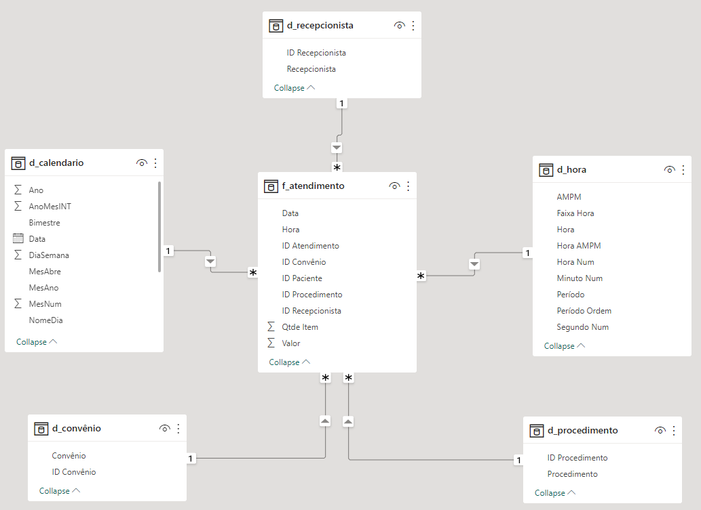

# Desafio Kickstart 1  | Atendimento Laboratorial   

#### Repositório: [course](../../../)   
#### Plataforma: <a href="../../">xperiun   </a>   
#### Software/Assunto: <a href="../">power_bi   </a>
#### Curso: <a href="./">curso_066 (Desafio Kickstart 1  | Atendimento Laboratorial)   </a>

---

#### Tema:
- Data Analysis

#### Ferramentas Utilizadas:
- Ferramenta de BI: 
  - Power BI   
  - Power Query 
- Ambiente de Desenvolvimento (IDE):
  - VS Code   
- Versionamento: 
  - Git   
- Repositório:
  - GitHub   
- Outros:
  - Google Drive 
  - Excel 
  - Brandmark 
  - Looka 
  - Linguagem M e Expressões DAX

---

#### Objetivo:
- O objetivo desse projeto prático foi construir um Report em **Power BI** para análises de dados de uma empresa fictícia de laboratório, chamada **HealthLab Laboratório**. Para essa análise foi levada em consideração duas metas determinadas, uma para faturamento (R$ 500 mil/mês) e outra para quantidade de atendimentos (3.000 /mês), de forma que seja possível perceber rapidamente o desempenho do setor de atendimento do laboratório.

#### Estrutura:
- A estrutura (imagem 01) é composta por:
  -  Uma pasta com a base de dados que são quatro arquivos de **Excel** em CSV;
  -  Um arquivo em **PowerPoint** para criação do layout do Report;
  -  Um arquivo **PDF** com as instruções do Desafio;
  -  Um arquivo de imagem **SVG** que é o layout do PowerPoint exportado;
  -  Uma pasta de imagens contendo dois arquivos de imagens, criados através de dois sites de IA para geração de Logomarcas (**Brandmark** e **Looka**), além de imagens auxiliares na construção desse arquivo de README;
  -  Um arquivo de **Power BI** para construção do Report.

<div align="Center"><figure>
    <br>
    <figcaption>Imagem 01.</figcaption>
</figure></div><br>

#### Desenvolvimento:
Este projeto foi desenvolvido em apenas uma aula e iniciou com um pequeno processo de **ETL** (Extração, Transformação e Carregamento) dos dados no **Power Query**, dentro do Power BI. Foi realizado o carregamento dos quatros arquivos de **Excel** em CSV, que formam a base de dados no **Power Query**. Cada arquivo representando uma tabela, sendo três tabelas dimensões e uma tabela fato. Para as tabelas dimensões não foi necessário nenhuma transformação, enquanto na tabela fato a coluna **Data/Hora** foi dividida em duas, uma para **Data** e outro para **Hora**, para facilitar o trabalho na hora de construir os gráficos.

Ainda no editor do **Power Query**, foi construído duas consultas vazias para elaboração das tabelas dimensões **Calendário** e **Hora**. Essas tabelas foram criadas através de arquivos padrões de scritps em **Linguagem M** para geração das mesmas. Finalizado o processo de transformação, as Queries foram carregadas para dentro do **Power BI** e em seguida, foi realizado o relacionamento entre as tabelas que o relacionamento não foi indentificado automaticamente pelo **Power BI**, que no caso foram as tabelas dimensões **Calendário** e **Hora** que se relacionaram com a tabela fato através das colunas Data e Hora. A imagem 02 a seguir ilustra como ficou a modelagem dos dados.

<div align="Center"><figure>
    <br>
    <figcaption>Imagem 02.</figcaption>
</figure></div><br>

A próxima etapa foi a criação de uma tabela vazia para servir como tabela de medidas, onde foram armazenados todos os cálculos realizados através das **Expressões DAX** e separadas por pastas para melhorar a organização da tabela. As duas primeiras medidas criadas foram as metas determinadas, **Meta Faturamento** (R$ 500 mil/mês) e **Meta Atendimentos** (3.000 /mês), ambas dentro da pasta **Metas Determinadas**.

```Meta Atendimento = 3000```

```
Meta Faturamento = 500000
```

Dentro da pasta **Principal** foi armazenada duas outras medidas, uma para o total de faturamento (**Faturamento**) e outra para o total de atendimentos (**Atendimentos**)

```
Faturamento = Sum(f_atendimento[Valor])
```

```
Total Atendimentos = DISTINCTCOUNT(f_atendimento[ID Atendimento])
```
