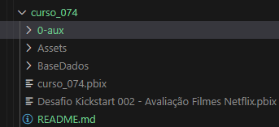
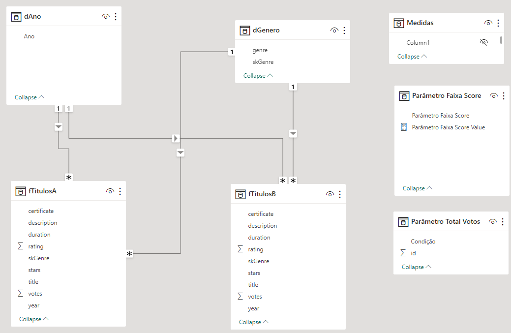

# 002 - Desafio Kickstart | Filmes Netflix   

### Repository: [course](../../../)   
### Platform: <a href="../../">xperiun   </a>   
### Software/Subject: <a href="../">power_bi   </a>
### Course: <a href="./">curso_074 (002 - Desafio Kickstart | Filmes Netflix)   </a>

#### <a href="https://app.powerbi.com/view?r=eyJrIjoiY2I3Mzg5YTEtYTM2Ni00MTllLThlNjQtZTc3NDkzZTFkZDU0IiwidCI6ImI1NTJmZWJlLWFkMjgtNGI4Ny1iZjI5LTFlODhiYmZkY2I4ZiJ9">Power BI Report</a>
##### Para conferir outros reports e dashboards de outros projetos consulte meu repositório principal na sub-pasta de report clicando [aqui](https://github.com/PedroHeeger/main/tree/main/report).

---

### Theme:
- Data Analysis
- Business Intelligence (BI)

### Used Tools:
- BI Tool: 
  - Power BI   
  - Power Query 
- Integrated Development Environment (IDE):
  - VS Code   
- Versioning: 
  - Git   
- Repository:
  - GitHub   
- Others:
  - Google Drive 
  - Excel 
  - PowerPoint 
  - Brandmark 
  - Linguagem M e Expressões DAX

---

### Objective:
O objetivo desse projeto prático foi construir um report em **Power BI** para análises de dados de **filmes e séries** de uma empresa fictícia.

### Structure:
A estrutura (Imagem 01) do projeto é composta por:
- Uma pasta com a base de dados que é um arquivo de **Excel** em **CSV** (valores separados por vírgulas).
- Uma pasta com as imagens em **PNG** utilizadas como plano de fundo nas páginas do report.
- A pasta **0-aux**, pasta auxiliar com imagens utilizadas na construção desse arquivo de README. 
- Obs.: A logomarca do curso foi criada apenas para fins didáticos, utilizando o site de inteligência artificial **Brandmark**.

<div align="Center"><figure>
    <br>
    <figcaption>Imagem 01.</figcaption>
</figure></div><br>

### Development:
Este projeto foi desenvolvido em apenas uma aula e iniciou com um processo de **ETL** (Extração, Transformação e Carregamento) dos dados no **Power Query**, dentro do **Power BI**. Foi realizado o carregamento do arquivo de base de dados de **Excel** em formato **CSV** (valores separados por vírgulas) e gerado uma consulta de nome **n_movies**. Esta consulta era composta pelas seguintes colunas: **title**, **year**, **certificate**, **duration**, **genre**, **rating**, **description**, **start** e **votes**.

Na etapa de transformação, ainda no **Power Query**, foi excluído a modificação automática dos tipos de dados, em seguida, foi alterado o tipo de dado das colunas **rating** e **votes** para decimal usando a localidade dos Estados Unidos (EUA). Na coluna **duration** foi extraído apenas o tempo, ignorando o texto. Após isso, foi criado uma coluna de exemplo da coluna **year** e escrito alguns exemplos só com os números do ano até que o **Power Query** entendesse o exemplo. Esta coluna foi renomeada para **year** e foi desmarcado as opções que fossem vazio ou com erro. Também foi desmarcado as opções com avaliações vazias na coluna **rating** e excluída a coluna **year** original. Na coluna **genre** foi extraído apenas o primeiro gênero dos títulos e em **title** foi realizado o corte e limpeza dos espaços vazios. Por fim, foi alterado o nome da Query para **fTitulos** já que, em seguida, foi carregada em uma **tabela fato** de mesmo nome.

No **Power BI** foi criado uma outra consulta, só que vazia, para servir como tabela de **medidas**. A primeira medida criada foi o **Total de Títulos** que contabilizou a quantidade de linhas diferentes da coluna de títulos. A medida **Total Votos** somou a quantidade total de votos, enquanto o **Score Médio** calculou a média das notas dos títulos.

```
Total Titulos = DISTINCTCOUNT(fTitulos[title])
```

```
Total Votos = sum(fTitulos[votes])
```

```
Score Médio = AVERAGE(fTitulos[rating])
```

A medida **Total Gêneros** contou a quantidade de linhas diferentes da coluna de gênero. Já a medida **Votos por Titulo** dividiu a medida **Total Votos** por **Total de Titulos**, para saber a quantidade de votos por título.
```
Total Gêneros = DISTINCTCOUNT(fTitulos[genre])
```

```
Votos por Titulo = DIVIDE([Total Votos],[Total Titulos],0)
```

Nesta etapa, foram criadas quatro medidas para formatação de medidas já existente com adição de textos e visualização nos cartões. A medida **Card Titulos** utiliza a medida **Total Titulos** e formatou para texto, pois foi usada como subtítulo em um visual de cartão. Outra medida similar foi a **Card Gêneros** que concatenou a medida **Total Gêneros** com um texto. A medida **Card Votos por Titulo** formatou a medida **Votos por Titulo** e concatenou em uma string. Enquanto a medida **Card Votos** apenas formatou a medida **Total Votos**. 

```
Card Titulos = FORMAT([Total Titulos], "#,0")
```

```
Card Gêneros = [Total Gêneros] & " Gêneros"
```

```
Card Votos por Titulo = FORMAT([Votos por Titulo], "#,0") & " votos por título"
```

```
Card Votos = FORMAT([Total Votos], "#,0")
```

Dois visuais de cartões foram inseridos um com as medidas **Card Titulos** e **Card Gêneros** e a outra com **Card Votos por Titulo** e **Card Votos**. Essas quatro medidas que foram utilizadas nos cartões foram armazenadas em uma pasta de nome **Card**, enquanto as medidas que realizaram os cálculos foram agrupadas na pasta **Total**.

Dando continuidade, foi criado uma outra consulta para criação da tabela **dimensão** **dAno** através do comando abaixo. Neste comando, foram criadas duas variáveis que extraíram o valor mínimo e máximo da coluna **year** da tabela fato e geraram uma série dos anos, do mínimo ao máximo de um em um, inserindo em uma coluna. Esta coluna foi renomeada para **Ano** e foi relacionada com a coluna **year** da tabela fato.

```
dAno =
VAR vAnoMin = min(fTitulos[year])
VAR vAnoMax = max(fTitulos[year])
RETURN
GENERATESERIES(vAnoMin, vAnoMax, 1)
```

Para inserção do visual de dispersão, foi necessário abrir o **Power Query** novamente, criar uma referência da Query **fTitulos**, nomeando a cópia para **fTitulosB** e a original para **fTitulosA**. Foi criada também uma outra consulta a partir da coluna **genre** da Query **fTitulosA**, convertendo para tabela. A única coluna existente foi renomeada para **genre** e nela, foram excluídos os valores duplicatos ou vazios. Essa consulta que se chamou **dGenero** foi utilizada como tabela **dimensão**, portanto foi criado uma coluna de índice começando do 1. Em seguida, foi realizado um merge da coluna **genre** da tabela fato com a coluna **genre** da tabela dimensão para trazer essa coluna de índice que foi nomeada como **skGenre** para a tabela **fTitulosA**. Assim, não foi mais necessário a coluna **genre** nesta tabela, sendo então, excluída. Devido a referência criada, tudo que ocorreu na Query **fTitulosA** foi replicado para **fTitulosB**.

Com os dados atualizados no **Power BI** foi necessário alterar a medida **Total Gêneros**, pois não existia mais a coluna **genre**, que foi substituída por **skGenre**. O relacionamento entre as colunas das tabelas dimensão **dGenereo** e **fTitulosA** foi identificada automaticamente. Porém foi necessário relacionar a coluna **Ano** da tabela **dAno** com a coluna **year** na tabela **fTitulosB**. Abaixo na imagem 02, é ilustrado como ficou a modelagem dos dados.

```
Total Gêneros = DISTINCTCOUNT(fTitulosA[skGenre])
```

<div align="Center"><figure>
    <br>
    <figcaption>Imagem 02.</figcaption>
</figure></div><br>

O objetivo da criação de uma Query de referência a outra Query, é que a original foi utilizada no gráfico e a outra foi utilizada no filtros (segmentações de dados). Também foi utilizado a medida **Condição** que criou duas variáveis que extraíram os nomes dos títulos das duas consultas **fTitulosA** e **fTitulosB**, e em outra variável realizou a comparação entre elas, se fossem iguais, a cor selecionada seria o vermelho, e se fossem diferentes, a cor selecionada seria o branco. Esta medida foi utilizada no marcador do gráfico de dispersão para determinar a cor das bolhas, ou seja, quando uma bolha (um título) fosse selecionado ficaria colorido de branco, enquanto as demais bolhas (títulos) ficariam vermelho.

```
Condição = 
VAR vFilmeSelecionado = SELECTEDVALUE(fTitulosB[title], "NADA SELECIONADO")
VAR vFilmeVisual = SELECTEDVALUE(fTitulosA[title])
VAR vCompare =
IF(
    vFilmeSelecionado = vFilmeVisual,
    "#ECE8E8",
    "#EF444D70"
)
RETURN
vCompare
```

Este gráfico foi utilizado para demonstrar o desempenho de cada título por ano e avaliação (score). Em relação ao tamanho da bolha, representava o total de votos que determinado título recebeu, quanto maior a bolha, maior a quantidade de votos. Duas segmentações de dados foram inseridas na parte superior do report, uma para filtragem por **Ano** e a outra para filtragem por **Título**.

Também foi criado um parâmetro de intervalo numérico e este foi utilizado na medida **Condição** que foi alterada. Duas novas variáveis foram adicionadas para extrairem o valor máximo e mínimo desse parâmetro. A estrutura de condição foi modificada para **Switch**, onde foi passado mais duas condições referente a medida **Score Médio**, ou seja, quando o **Score Médio** tivesse foram do intervalo do parâmetro, as bolhas do gráfico seriam coloridas de transparentes, tornando-se invisíveis.

```
Condição = 
VAR vFilmeSelecionado = SELECTEDVALUE(fTitulosB[title], "NADA SELECIONADO")
VAR vFilmeVisual = SELECTEDVALUE(fTitulosA[title])
VAR vMaxFaixa = MAX('Parâmetro Faixa Score'[Parâmetro Faixa Score])
VAR vMinFaixa = MIN('Parâmetro Faixa Score'[Parâmetro Faixa Score])
VAR vCompare =
SWITCH(
    TRUE(),
    [Score Médio] > vMaxFaixa, "#0000",
    [Score Médio] < vMinFaixa, "#0000",
    vFilmeSelecionado = vFilmeVisual,
    "#ECE8E8",
    "#EF444D70"
)
RETURN
vCompare
```

Um outro parâmetro foi criado, porém este foi realizado em uma consulta vazia, onde foi elaborado duas colunas, sendo uma de índice e a outra com a condição. Esta consulta só teve três linhas, pois as condições possíveis eram: **Todos**, **Acima da Média** e **Abaixo da Média**. O objetivo aqui, foi filtrar as bolhas (títulos) que estavam acima ou abaixo em relação ao média de votos (**Votos por Titulo**). Para isso, foi necessário alterar mais uma vez a medida **Condição**. Desta vez, foi criada outras duas variáveis, uma com a função calculate da medida **Votos por Titulo** (média de votos) na tabela **fTitulosA**, e outra com o índice da condição selecionada no filtro. Assim duas novas condições foram criadas, para quando as opções **Acima da Média** e **Abaixo da Média** fossem selecionadas e a quantidade de votos fosse menor ou maior que a média, as bolhas (títulos) fossem coloridas de transparente, tornando-se invisíveis.

```
Condição = 
VAR vFilmeSelecionado = SELECTEDVALUE(fTitulosB[title], "NADA SELECIONADO")
VAR vFilmeVisual = SELECTEDVALUE(fTitulosA[title])
VAR vMaxFaixa = MAX('Parâmetro Faixa Score'[Parâmetro Faixa Score])
VAR vMinFaixa = MIN('Parâmetro Faixa Score'[Parâmetro Faixa Score])
VAR vMediaVotos =
CALCULATE(
    [Votos por Titulo],
    ALL(fTitulosA)
)
VAR vCondicaoSelecionada = SELECTEDVALUE('Parâmetro Total Votos'[id])
VAR vCompare =
SWITCH(
    TRUE(),
    [Score Médio] > vMaxFaixa, "#0000", //deixa tranparente valores acima da faixa selecionada
    [Score Médio] < vMinFaixa, "#0000", //deixa tranparente valores abaixo da faixa selecionada
    vCondicaoSelecionada = 2 && [Total Votos] < vMediaVotos, "#0000", //deixa transparente valores abaixo da média
    vCondicaoSelecionada = 3 && [Total Votos] > vMediaVotos, "#0000", //deixa transparente valores acima da média
    vFilmeSelecionado = vFilmeVisual, "#ECE8E8", "#EF444D70"
)
RETURN
vCompare
```

Também foi necessário criar uma medida **Filtrar Titulos** para filtrar o visual de tabela elaborado no canto esquerdo, para que quando fosse selecionado algum dos dois parâmetros, os títulos fossem filtrados. A **expressão DAX** a seguir, executou isso. Na estrutura `IF` foi verificado o **Parâmetro Faixa Score**, enquanto no `SWITCH` foi analisado o **Parâmetro Total Votos**, ou seja, se o total de votos dos títulos estavam abaixo ou acima da média. Essa medida foi inserida no campo de filtro, realizando a filtragem dos dados, permanecendo os dados que tivessem especificados como **manter** (A palavra criada para utilização no filtro). Essa medida também foi adicionada a segmentação de dados de **Títulos** para que fossem filtrados os dados.

```
Filtra Titulos = 
VAR vMaxScore = MAX('Parâmetro Faixa Score'[Parâmetro Faixa Score])
VAR vMinScore = Min('Parâmetro Faixa Score'[Parâmetro Faixa Score])
VAR vScoreB = AVERAGE(fTitulosB[rating])
VAR vCondicaoSelecionada = SELECTEDVALUE('Parâmetro Total Votos'[id])
VAR vMedia = 
CALCULATE(
    SUM(fTitulosB[votes]) / DISTINCTCOUNT(fTitulosB[title]),
    ALL(fTitulosB)
)
VAR vTotalVotos = SUM(fTitulosB[votes])
RETURN
IF(
    vScoreB <= vMaxScore && vScoreB >= vMinScore,
    SWITCH( //verifica quem está acima ou abaixo da média de acordo com a escolha do filtro
        TRUE(),
        vCondicaoSelecionada = 1, "manter", 
        vCondicaoSelecionada = 2 && vTotalVotos > vMedia, "manter",
        vCondicaoSelecionada = 3 && vTotalVotos < vMedia, "manter",
        "remover"   
    ),
    "remover"
)
```

Uma página de **Tooltip** foi construída exibindo o nome do título, a quantidade de votos e o score, sendo vinculado no gráfico de dispersão. Além disso, foi desenvolvido uma capa para o report com um botão **Avançar** direcionando para página principal do report. Todos os planos de fundos utilizados foram fornecidos pela plataforma do curso.

Na imagem 03, abaixo, é possível visualizar a página principal do report.

<div align="Center"><figure>
    <a href="https://app.powerbi.com/view?r=eyJrIjoiY2I3Mzg5YTEtYTM2Ni00MTllLThlNjQtZTc3NDkzZTFkZDU0IiwidCI6ImI1NTJmZWJlLWFkMjgtNGI4Ny1iZjI5LTFlODhiYmZkY2I4ZiJ9"><br>
    <figcaption>Imagem 03: Report Avaliação de Títulos.</figcaption></a>
</figure></div><br>